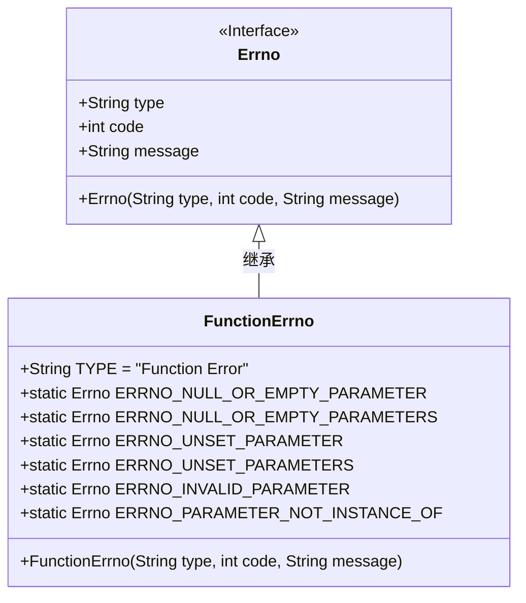
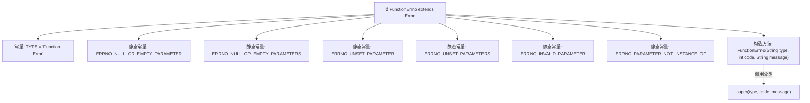

# 基础信息

|      |      |
|------|------|
| 名称 | FunctionErrno |
| 编码语言 | .java |
| 代码路径 | termux-app/termux-shared/src/main/java/com/termux/shared/errors/FunctionErrno.java |
| 包名 | com.termux.shared.errors |
| 依赖项 | [] |
| 概述说明 | 定义函数错误类，包含空或无效参数等错误码及描述。 |

# 说明

该内容定义了一个名为FunctionErrno的Java类，继承自Errno类，用于处理函数相关的错误。类中定义了类型常量TYPE为"Function Error"，并包含多个静态Errno实例，用于表示不同类型的参数错误，如空参数、未设置参数、无效参数等。每个Errno实例包含错误类型、代码和格式化错误消息。构造函数接收类型、代码和消息参数，并调用父类构造函数。

# 类列表 Class Summary

| 名称   | 类型  | 说明 |
|-------|------|-------------|
| FunctionErrno | class | 函数错误码类，定义空或无效参数相关错误。 |

## 类 FunctionErrno

|      |      |
|------|------|
| 访问范围 | public |
| 类型 | class |
| 名称 | FunctionErrno |
| 说明 | 函数错误码类，定义空或无效参数相关错误。 |

### UML类图

这段代码展示了一个错误码处理系统，其中FunctionErrno类继承自Errno接口。FunctionErrno专门用于处理函数调用相关的错误，定义了6种静态错误码常量，涵盖空参数、未设置参数和无效参数等常见场景。每个错误码都包含类型标识、错误代码和格式化消息模板，通过构造函数初始化父类的错误信息。类图清晰地展示了继承关系和类的静态/实例成员结构。

### 内部方法调用关系图

这段代码定义了一个继承自Errno的FunctionErrno类，主要用于处理函数调用时的错误类型。类中包含多个静态常量错误码，分别对应不同的参数错误情况（如空参数、未设置参数、无效参数等），并通过构造函数初始化这些错误码。每个错误码都包含类型、代码和描述信息，构造函数通过调用父类Errno的构造方法完成初始化。流程图清晰地展示了类的结构和常量定义，以及构造函数的继承关系。

### 字段列表 Field List

| 名称  | 类型  | 说明 |
|-------|-------|------|
| ERRNO_NULL_OR_EMPTY_PARAMETER = new Errno(TYPE, 100, "The %1$s parameter passed to \"%2$s\" is null or empty.") | Errno | 参数为空或无效错误码100 |
| TYPE = "Function Error" | String | 静态常量字符串，值为"Function Error"。 |
| ERRNO_NULL_OR_EMPTY_PARAMETERS = new Errno(TYPE, 101, "The %1$s parameters passed to \"%2$s\" are null or empty.") | Errno | 参数为空或无效的错误码101。 |
| ERRNO_UNSET_PARAMETERS = new Errno(TYPE, 103, "The %1$s parameters passed to \"%2$s\" must be set.") | Errno | 未设置参数：传递给“%2$s”的%1$s参数必须设置。 |
| ERRNO_UNSET_PARAMETER = new Errno(TYPE, 102, "The %1$s parameter passed to \"%2$s\" must be set.") | Errno | 未设置参数：传递给“%2$s”的%1$s参数必须设置。 |
| ERRNO_INVALID_PARAMETER = new Errno(TYPE, 104, "The %1$s parameter passed to \"%2$s\" is invalid.\"%3$s\"") | Errno | 无效参数错误：参数%1$s在调用%2$s时无效，详情%3$s。 |
| ERRNO_PARAMETER_NOT_INSTANCE_OF = new Errno(TYPE, 104, "The %1$s parameter passed to \"%2$s\" is not an instance of %3$s.") | Errno | 参数非指定类型实例错误 |

### 方法列表 Method List

| 名称  | 类型  | 说明 |
|-------|-------|------|

