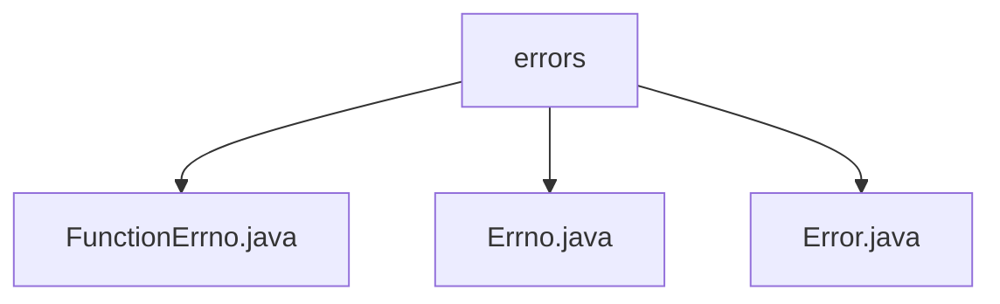

# 基础信息

|      |      |
|------|------|
| 名称 | errors |
| 编码语言 | .java |
| 代码路径 | termux-app/termux-shared/src/main/java/com/termux/shared/errors |
| 包名 | termux-app.termux-shared.src.main.java.com.termux.shared.errors |
| 概述说明 | FunctionErrno继承Errno处理函数错误，定义参数错误类型。Errno管理错误码和消息。Error封装错误信息，支持日志和通知。 |

# 说明

## 概述

该代码模块是一个用于管理和处理错误信息的Java工具集，主要包含三个核心类：`Errno`、`FunctionErrno`和`Error`。这些类协同工作，提供了一套完整的错误码管理、错误信息封装和错误处理机制。模块支持错误状态的分类、格式化消息生成、异常处理以及日志记录等功能，适用于需要精细化错误管理的业务场景。

## 主要业务场景

1. **错误码管理**  
   - `Errno`类作为基类，定义了通用的错误码（如`ERRNO_SUCCESS`、`ERRNO_FAILED`等），并通过`HashMap`存储和检索错误信息。  
   - `FunctionErrno`继承`Errno`，专门处理函数调用相关的错误（如空参数、无效参数等），通过静态`Errno`实例提供标准化的错误类型。

2. **错误信息封装与传递**  
   - `Error`类封装错误的详细信息（如标签、类型、代码、消息和异常列表），支持通过多种构造函数和`InitError`方法灵活初始化。  
   - 提供错误状态管理方法（如`setStateFailed`、`isStateFailed`），便于业务逻辑中判断和处理错误。

3. **异常处理与日志记录**  
   - 支持将`Errno`转换为`Error`对象，并集成异常堆栈信息（`throwablesList`）。  
   - 提供日志格式化方法（如`getErrorLogString`）和最小化错误字符串输出（`getMinimalErrorString`），便于调试和监控。

4. **用户通知与格式化输出**  
   - 支持将错误信息转换为Markdown格式，适用于文档生成或界面展示。  
   - 提供Toast通知功能，便于在移动端（如Termux应用）向用户直观反馈错误。

5. **模块化错误分类**  
   - 通过继承`Errno`（如`FunctionErrno`）实现不同业务场景的错误分类，确保错误类型和代码的可扩展性和一致性。

### 包内部结构视图

该流程图展示了termux-shared项目中errors目录下的文件结构关系。errors作为父节点，包含三个子节点：FunctionErrno.java、Errno.java和Error.java。这三个Java文件都位于errors目录下，属于同一层级，没有更深层次的嵌套关系。这种结构常用于存放错误处理相关的类文件，便于统一管理和维护错误代码定义。

# 文件列表 File List

| 名称   | 类型  | 说明 |
|-------|------|-------------|
| [Error.java](Error.md) | file | 错误处理类，包含类型、代码、消息和异常列表，支持多种构造和状态设置方法。 |
| [Errno.java](Errno.md) | file | Errno类定义错误码，含类型、代码和消息，提供格式化错误和异常处理功能。 |
| [FunctionErrno.java](FunctionErrno.md) | file | 定义函数错误类，包含空或无效参数等错误码及描述。 |

