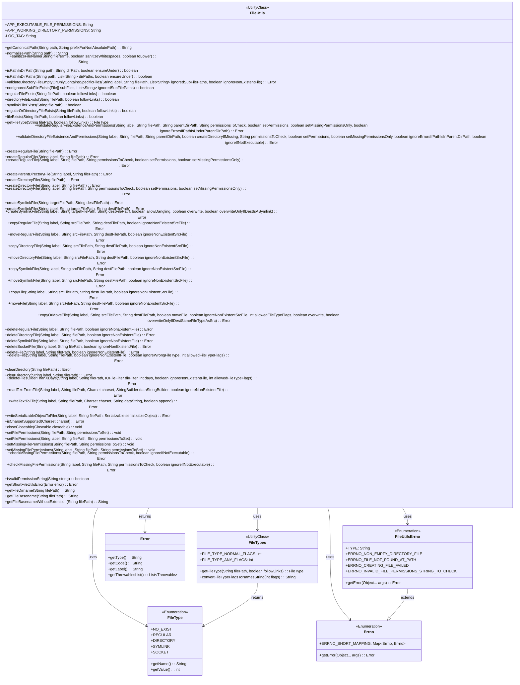

# 基础信息

|      |      |
|------|------|
| 名称 | FileUtils |
| 编码语言 | .java |
| 代码路径 | termux-app/termux-shared/src/main/java/com/termux/shared/file/FileUtils.java |
| 包名 | com.termux.shared.file |
| 依赖项 | ['android.os.Build', 'android.system.Os', 'androidx.annotation.NonNull', 'androidx.annotation.Nullable', 'com.google.common.io.RecursiveDeleteOption', 'com.termux.shared.file.filesystem.FileType', 'com.termux.shared.file.filesystem.FileTypes', 'com.termux.shared.data.DataUtils', 'com.termux.shared.logger.Logger', 'com.termux.shared.errors.Errno', 'com.termux.shared.errors.Error', 'com.termux.shared.errors.FunctionErrno', 'org.apache.commons.io.filefilter.AgeFileFilter', 'org.apache.commons.io.filefilter.IOFileFilter', 'java.io.BufferedReader', 'java.io.BufferedWriter', 'java.io.Closeable', 'java.io.File', 'java.io.FileInputStream', 'java.io.FileOutputStream', 'java.io.IOException', 'java.io.InputStreamReader', 'java.io.ObjectInputStream', 'java.io.ObjectOutputStream', 'java.io.OutputStreamWriter', 'java.io.Serializable', 'java.nio.charset.Charset', 'java.nio.file.LinkOption', 'java.nio.file.StandardCopyOption', 'java.util.Arrays', 'java.util.Calendar', 'java.util.Collections', 'java.util.Iterator', 'java.util.List', 'java.util.regex.Pattern'] |
| 概述说明 | FileUtils类提供文件操作功能，包括权限管理、路径处理、文件创建/删除/读写、类型检查等。关键点：支持正则、符号链接、权限设置、错误处理，兼容多种文件类型和字符集。 |

# 说明

FileUtils类是一个功能全面的文件操作工具类，提供文件路径处理、权限管理、文件类型检查、创建/删除/复制/移动文件、读写文本及序列化对象等核心功能。关键特性包括：支持规范化路径处理（getCanonicalPath/normalizePath）、文件权限控制（setFilePermissions）、多种文件类型检查（regularFileExists等）、安全删除机制（deleteFile）、递归目录操作（clearDirectory）以及字符集敏感的文本读写。所有方法均包含错误处理逻辑，通过Error对象返回执行状态，并支持日志记录。常量定义如APP_EXECUTABLE_FILE_PERMISSIONS明确了不同场景的默认权限要求。

# 类列表 Class Summary

| 名称   | 类型  | 说明 |
|-------|------|-------------|
| FileUtils | class | FileUtils类提供文件操作功能，包括路径处理、权限管理、文件创建/删除/复制/移动、文本读写及序列化对象处理。支持正则表达式校验、错误处理及日志记录。 |

## 类 FileUtils

|      |      |
|------|------|
| 访问范围 | public |
| 类型 | class |
| 名称 | FileUtils |
| 说明 | FileUtils类提供文件操作功能，包括路径处理、权限管理、文件创建/删除/复制/移动、文本读写及序列化对象处理。支持正则表达式校验、错误处理及日志记录。 |

### UML类图

这段代码展示了一个功能全面的文件工具类FileUtils，提供了文件路径处理、权限管理、文件操作（创建/删除/复制/移动）、目录验证等丰富功能。类图中包含了核心类FileUtils及其辅助类FileType（枚举文件类型）、FileTypes（文件类型工具）、Error（错误处理）和Errno体系（错误码枚举）。FileUtils通过静态方法提供原子化文件操作，支持权限检查、路径规范化、文件类型判断等，并具有完善的错误处理机制。整个设计体现了高内聚低耦合原则，各模块职责明确，通过枚举和工具类有效组织了相关功能。

### 内部方法调用关系图

这段代码实现了一个功能全面的文件工具类FileUtils，包含文件路径处理、权限管理、文件操作（创建/删除/复制/移动）、目录验证、文件读写等功能。通过常量定义默认权限，提供静态方法处理各种文件系统操作，包括规范化路径、检查文件类型、设置权限、验证目录内容等。类结构清晰，方法按功能分组，包含详细的错误处理和日志记录，支持多种文件类型（常规文件/目录/符号链接）的操作，并提供了完善的权限管理机制。

### 字段列表 Field List

| 名称  | 类型  | 说明 |
|-------|-------|------|
| APP_EXECUTABLE_FILE_PERMISSIONS = "r-x" | String | 应用可执行文件权限为只读和执行。 |
| APP_WORKING_DIRECTORY_PERMISSIONS = "rwx" | String | 应用工作目录权限设为读写执行 |
| LOG_TAG = "FileUtils" | String | 私有静态常量LOG_TAG值为FileUtils |

### 方法列表 Method List

| 名称  | 类型  | 说明 |
|-------|-------|------|
| copyOrMoveFile | Error | 文件操作函数，处理复制或移动文件，检查路径、类型、覆盖条件，支持目录和符号链接，兼容不同Android版本。 |
| clearDirectory | Error | 静态方法clearDirectory清空指定路径目录，调用重载方法处理。 |
| createRegularFile | Error | 静态方法创建常规文件错误，参数为文件路径。 |
| deleteSocketFile | Error | 静态方法删除指定路径的socket文件，忽略不存在文件选项。 |
| isPathInDirPath | boolean | 检查路径是否在指定目录下，可控制是否严格包含。 |
| createDirectoryFile | Error | 静态方法创建目录文件错误，参数为文件路径。 |
| moveDirectoryFile | Error | 移动目录文件方法：调用copyOrMoveFile处理目录移动，支持忽略不存在的源文件。 |
| createParentDirectoryFile | Error | 静态方法检查文件路径非空后创建父目录，失败返回错误。 |
| validateDirectoryFileExistenceAndPermissions | Error | 验证目录存在性及权限，支持创建目录和设置权限，检查路径有效性。 |
| createDirectoryFile | Error | 静态方法检查目录文件存在性和权限，可设置权限。 |
| deleteFile | Error | 删除文件方法，检查文件类型和存在性，处理异常，支持不同Android版本。 |
| createRegularFile | Error | 创建常规文件错误方法，含标签和路径参数。 |
| validateRegularFileExistenceAndPermissions | Error | 验证文件存在性及权限，设置权限并处理错误。 |
| symlinkFileExists | boolean | 检查文件路径是否为符号链接。 |
| sanitizeFileName | String | 清理文件名：替换非法字符，可选去空格和转小写。 |
| isCharsetSupported | Error | 检查字符集是否支持，返回错误或null。 |
| validateDirectoryFileEmptyOrOnlyContainsSpecificFiles | Error | 验证目录是否为空或仅含特定文件，处理路径异常及忽略选项。 |
| clearDirectory | Error | 静态方法清除目录，检查路径有效性，处理异常，兼容不同安卓版本。 |
| moveSymlinkFile | Error | 移动符号链接文件的方法，调用copyOrMoveFile处理，支持忽略不存在的源文件。 |
| regularOrDirectoryFileExists | boolean | 检查文件路径是否存在且为常规文件或目录。 |
| getFileType | FileType | 获取文件类型方法，根据路径和链接参数返回类型。 |
| closeCloseable | void | 静态方法安全关闭可关闭对象，忽略异常。 |
| directoryFileExists | boolean | 检查路径是否为目录 |
| regularFileExists | boolean | 检查文件路径是否为常规文件。 |
| fileExists | boolean | 检查文件是否存在，支持符号链接。 |
| setFilePermissions | void | 静态方法设置文件权限，参数为文件路径和权限值。 |
| deleteFile | Error | 静态方法deleteFile用于删除文件，参数包括标签、路径、是否忽略不存在文件等。 |
| copyRegularFile | Error | 静态方法：复制常规文件，调用copyOrMoveFile实现。 |
| getCanonicalPath | String | 将相对路径转为绝对路径，处理空值和异常，返回规范路径。 |
| deleteSymlinkFile | Error | 静态方法删除符号链接文件，调用deleteFile处理，参数含标签、路径、忽略不存在标志及文件类型。 |
| createDirectoryFile | Error | 静态方法创建目录文件错误，参数含标签和路径。 |
| isPathInDirPaths | boolean | 检查路径是否在目录列表中，支持严格子路径匹配。 |
| deleteFilesOlderThanXDays | Error | 删除指定路径下超过X天的文件，检查参数有效性及文件类型，处理异常。 |
| writeSerializableObjectToFile | Error | 将可序列化对象写入文件，检查路径有效性，处理异常并关闭流。 |
| copyFile | Error | 静态方法copyFile复制文件，返回错误信息，参数包括标签、源路径、目标路径及是否忽略不存在的源文件。 |
| nonIgnoredSubFileExists | boolean | 检查子文件是否存在非忽略项 |
| normalizePath | String | 规范化路径：去多余斜杠和"./"，末尾斜杠也去除。 |
| deleteDirectoryFile | Error | 静态方法删除目录文件，参数包括标签、路径、忽略不存在文件选项。 |
| copySymlinkFile | Error | 静态方法复制符号链接文件，调用底层文件操作函数处理。 |
| moveFile | Error | 移动文件方法，调用copyOrMoveFile实现，支持忽略不存在的源文件。 |
| deleteRegularFile | Error | 静态方法删除常规文件，忽略不存在文件选项。 |
| readSerializableObjectFromFile | ReadSerializableObjectResult | 从文件读取序列化对象，处理路径检查、异常及非正常文件情况。 |
| createSymlinkFile | Error | 创建符号链接文件方法：检查路径有效性，处理目标文件不存在或目标路径为相对路径情况，根据参数决定是否覆盖目标文件或仅覆盖符号链接，最终创建符号链接。 |
| createSymlinkFile | Error | 静态方法创建符号链接文件，返回错误对象，含标签、目标路径和目的路径参数。 |
| createSymlinkFile | Error | 创建符号链接文件的静态方法，接受目标路径和目的路径参数。 |
| readTextFromFile | Error | 读取文件文本到字符串，处理路径、字符集及异常，支持忽略不存在的文件。 |
| copyDirectoryFile | Error | 静态方法：复制目录文件，参数包括标签、源路径、目标路径及忽略不存在源文件选项。 |
| moveRegularFile | Error | 移动常规文件方法：调用copyOrMoveFile执行移动操作，支持忽略不存在的源文件。 |
| preWriteToFile | Error | 检查文件类型并创建父目录，若非普通文件则报错。 |
| createRegularFile | Error | 创建常规文件方法，检查路径、类型、权限，处理异常。 |
| writeTextToFile | Error | 静态方法将文本写入文件，处理路径、字符集校验及异常，返回错误或成功。 |
| setFilePermissions | void | 静态方法设置文件权限，检查路径和权限有效性，按需修改读写执行权限并记录日志。 |
| setMissingFilePermissions | void | 静态方法设置缺失文件权限，参数为文件路径和权限值。 |
| setMissingFilePermissions | void | 设置文件缺失权限：检查并补充读、写、执行权限。 |
| checkMissingFilePermissions | Error | 检查文件权限缺失，忽略不可执行文件。 |
| checkMissingFilePermissions | Error | 检查文件权限缺失，返回错误码。 |
| isValidPermissionString | boolean | 检查字符串是否为合法权限格式，非空且匹配正则"^([r-])[w-][x-]$"。 |
| getShortFileUtilsError | Error | 静态方法getShortFileUtilsError处理文件错误，返回简化错误信息。 |
| getFileDirname | String | 静态方法获取文件路径的目录部分，空或无效路径返回null。 |
| getFileBasename | String | 静态方法获取文件路径的基名，空路径返回null。 |
| getFileBasenameWithoutExtension | String | 获取无扩展名的文件名 |

