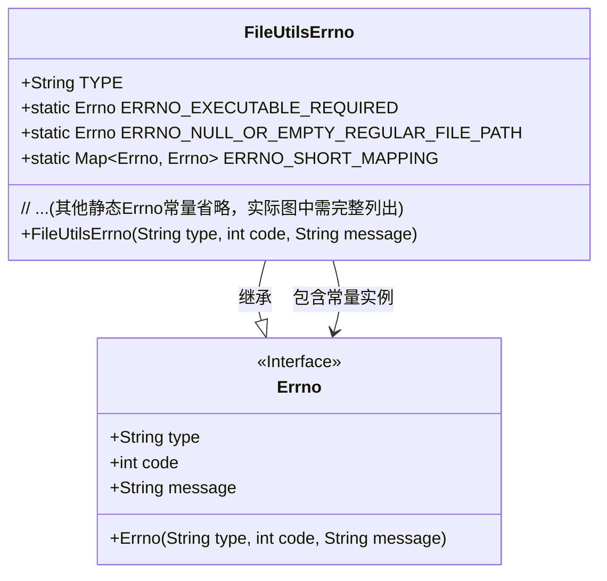
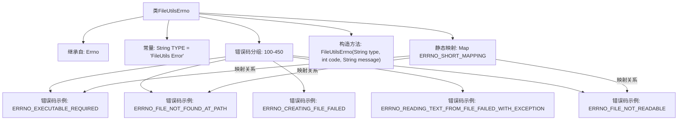

# 基础信息

|      |      |
|------|------|
| 名称 | FileUtilsErrno |
| 编码语言 | .java |
| 代码路径 | termux-app/termux-shared/src/main/java/com/termux/shared/file/FileUtilsErrno.java |
| 包名 | com.termux.shared.file |
| 依赖项 | ['com.termux.shared.errors.Errno', 'java.util.HashMap', 'java.util.Map'] |
| 概述说明 | FileUtilsErrno类定义了文件操作相关错误码，包括路径无效、文件不存在、创建删除失败、读写异常等。 |

# 说明

FileUtilsErrno类是一个错误码集合，专门用于处理文件操作相关的错误。它定义了多种错误类型，包括空或无效路径错误（100-150）、文件未找到或类型不匹配错误（150-200）、文件创建失败错误（200-250）、文件复制或移动错误（250-300）、文件删除错误（300-350）、文件读写错误（350-400）以及文件权限错误（400-450）。每个错误码包含类型、代码和详细描述，部分错误还提供简短版本。此外，类中还定义了一个映射表ERRNO_SHORT_MAPPING，用于将详细错误码映射到对应的简短版本。

# 类列表 Class Summary

| 名称   | 类型  | 说明 |
|-------|------|-------------|
| FileUtilsErrno | class | FileUtilsErrno类定义了文件操作错误码，包括路径无效、文件类型不符、创建删除失败、读写异常及权限问题等。 |

## 类 FileUtilsErrno

|      |      |
|------|------|
| 访问范围 | public |
| 类型 | class |
| 名称 | FileUtilsErrno |
| 说明 | FileUtilsErrno类定义了文件操作错误码，包括路径无效、文件类型不符、创建删除失败、读写异常及权限问题等。 |

### UML类图

这段代码定义了一个`FileUtilsErrno`类，继承自`Errno`接口，用于集中管理文件操作相关的错误码和错误信息。该类包含6大类错误常量（路径空值、文件无效、创建失败、复制移动失败、删除失败、读写权限问题），每个错误码都有详细描述和简短版本，并通过`ERRNO_SHORT_MAPPING`映射关联完整版和简短版错误信息。类图展示了继承关系和静态常量的组合模式，体现了错误码管理的集中化设计。

### 内部方法调用关系图

该流程图展示了FileUtilsErrno类的核心结构，这是一个继承自Errno的错误码专用类。类中包含6个主要模块：继承关系、类型常量、按功能分组的错误码（覆盖100-450范围）、构造方法、错误码缩写映射表以及典型错误码示例。特别值得注意的是ERRNO_SHORT_MAPPING实现了详细错误与简短版本的映射关系，图中用特殊箭头标注了这种转换关系。所有错误码按操作类型分为文件路径校验、创建/删除、读写、权限等7个逻辑组，每个分组在流程图中都有代表性示例展示。

### 字段列表 Field List

| 名称  | 类型  | 说明 |
|-------|-------|------|
| ERRNO_WRITING_SERIALIZABLE_OBJECT_TO_FILE_FAILED_WITH_EXCEPTION = new Errno(TYPE, 356, "Writing serializable object to %1$s at path \"%2$s\" failed.\nException: %3$s") | Errno | 写入可序列化对象到文件失败，异常信息：%3$s |
| ERRNO_CREATING_FILE_FAILED_WITH_EXCEPTION = new Errno(TYPE, 201, "Creating %1$s at path \"%2$s\" failed.\nException: %3$s") | Errno | 创建文件失败，异常信息：%3$s |
| ERRNO_NULL_OR_EMPTY_REGULAR_FILE = new Errno(TYPE, 102, "The regular file is null or empty.") | Errno | 常规文件为空或无效 |
| TYPE = "FileUtils Error" | String | 文件工具错误类型常量 |
| ERRNO_COPYING_OR_MOVING_FILE_FAILED_WITH_EXCEPTION = new Errno(TYPE, 250, "%1$s from \"%2$s\" to \"%3$s\" failed.\nException: %4$s") | Errno | 文件复制或移动失败，异常信息包含源路径、目标路径及异常详情。 |
| ERRNO_NULL_OR_EMPTY_DIRECTORY_FILE = new Errno(TYPE, 106, "The directory file is null or empty.") | Errno | 空或无效目录文件错误代码106。 |
| ERRNO_EXECUTABLE_REQUIRED = new Errno(TYPE, 100, "Executable required.") | Errno | 可执行文件必需 |
| ERRNO_FILE_NOT_READABLE_SHORT = new Errno(TYPE, 402, "The %1$s at path is not readable. Permission Denied.") | Errno | 文件不可读，权限不足。 |
| ERRNO_NON_REGULAR_FILE_FOUND = new Errno(TYPE, 152, "Non-regular file found at %1$s path \"%2$s\".") | Errno | 发现非普通文件于路径"%2$s"。 |
| ERRNO_NON_REGULAR_FILE_FOUND_SHORT = new Errno(TYPE, 153, "Non-regular file found at %1$s path.") | Errno | 非正则文件位于指定路径。 |
| ERRNO_UNSUPPORTED_CHARSET = new Errno(TYPE, 352, "Unsupported charset \"%1$s\"") | Errno | 不支持字符集"%1$s"的错误码352 |
| ERRNO_DELETING_FILE_FAILED = new Errno(TYPE, 300, "Deleting %1$s at path \"%2$s\" failed.") | Errno | 删除文件失败，错误码300。 |
| ERRNO_FILE_NOT_WRITABLE = new Errno(TYPE, 403, "The %1$s at path \"%2$s\" is not writable. Permission Denied.") | Errno | 文件不可写，权限拒绝。 |
| ERRNO_FILE_NOT_WRITABLE_SHORT = new Errno(TYPE, 404, "The %1$s at path is not writable. Permission Denied.") | Errno | 文件不可写，权限拒绝。 |
| ERRNO_FILE_NOT_EXECUTABLE = new Errno(TYPE, 405, "The %1$s at path \"%2$s\" is not executable. Permission Denied.") | Errno | 
错误码405表示路径文件不可执行，权限被拒绝。 |
| ERRNO_FILE_NOT_EXECUTABLE_SHORT = new Errno(TYPE, 406, "The %1$s at path is not executable. Permission Denied.") | Errno | 文件不可执行，权限被拒绝。 |
| ERRNO_DELETING_FILES_OLDER_THAN_X_DAYS_FAILED_WITH_EXCEPTION = new Errno(TYPE, 304, "Deleting %1$s under directory at path \"%2$s\" old than %3$s days failed.\nException: %4$s") | Errno | 删除超过X天的文件失败，异常信息：%4$s |
| ERRNO_CREATING_SYMLINK_FILE_FAILED_WITH_EXCEPTION = new Errno(TYPE, 203, "Creating %1$s at path \"%2$s\" to \"%3$s\" failed.\nException: %4$s") | Errno | 
创建符号链接失败，异常信息：%4$s |
| ERRNO_NON_DIRECTORY_FILE_FOUND = new Errno(TYPE, 154, "Non-directory file found at %1$s path \"%2$s\".") | Errno | 非目录文件出现在路径"%2$s"。 |
| ERRNO_READING_SERIALIZABLE_OBJECT_TO_FILE_FAILED_WITH_EXCEPTION = new Errno(TYPE, 355, "Reading serializable object from %1$s at path \"%2$s\" failed.\nException: %3$s") | Errno | 读取可序列化对象失败，路径异常。 |
| ERRNO_NON_SYMLINK_FILE_FOUND_SHORT = new Errno(TYPE, 157, "Non-symlink file found at %1$s path.") | Errno | 发现非符号链接文件于%1$s路径。 |
| ERRNO_VALIDATE_DIRECTORY_EXISTENCE_AND_PERMISSIONS_FAILED_WITH_EXCEPTION = new Errno(TYPE, 161, "Validating directory existence and permissions of %1$s at path \"%2$s\" failed.\nException: %3$s") | Errno | 验证目录存在及权限失败，异常：%3$s |
| ERRNO_READING_TEXT_FROM_FILE_FAILED_WITH_EXCEPTION = new Errno(TYPE, 350, "Reading text from %1$s at path \"%2$s\" failed.\nException: %3$s") | Errno | 读取文件文本失败，路径和异常信息已记录。 |
| ERRNO_VALIDATE_DIRECTORY_EMPTY_OR_ONLY_CONTAINS_SPECIFIC_FILES_FAILED_WITH_EXCEPTION = new Errno(TYPE, 162, "Validating directory is empty or only contains specific files of %1$s at path \"%2$s\" failed.\nException: %3$s") | Errno | 验证目录为空或仅含特定文件失败，异常：%3$s |
| ERRNO_WRITING_TEXT_TO_FILE_FAILED_WITH_EXCEPTION = new Errno(TYPE, 351, "Writing text to %1$s at path \"%2$s\" failed.\nException: %3$s") | Errno | 写入文件失败，异常：%3$s |
| ERRNO_CANNOT_MOVE_DIRECTORY_TO_SUB_DIRECTORY_OF_ITSELF = new Errno(TYPE, 253, "Cannot move %1$s from \"%2$s\" to \"%3$s\" since destination is a subdirectory of the source.") | Errno | 无法移动目录到其子目录中 |
| ERRNO_NON_DIRECTORY_FILE_FOUND_SHORT = new Errno(TYPE, 155, "Non-directory file found at %1$s path.") | Errno | 非目录文件存在于路径%1$s。 |
| ERRNO_DELETING_FILE_FAILED_WITH_EXCEPTION = new Errno(TYPE, 301, "Deleting %1$s at path \"%2$s\" failed.\nException: %3$s") | Errno | 删除文件失败，异常信息：%3$s |
| ERRNO_NON_SYMLINK_FILE_FOUND = new Errno(TYPE, 156, "Non-symlink file found at %1$s path \"%2$s\".") | Errno | 发现非符号链接文件于路径"%2$s"。 |
| ERRNO_FILE_NOT_AN_ALLOWED_FILE_TYPE = new Errno(TYPE, 158, "The %1$s found at path \"%2$s\" of type \"%3$s\" is not one of allowed file types \"%4$s\".") | Errno | 文件类型不在允许范围内。 |
| ERRNO_NULL_OR_EMPTY_REGULAR_FILE_PATH = new Errno(TYPE, 101, "The regular file path is null or empty.") | Errno | 静态常量ERRNO_NULL_OR_EMPTY_REGULAR_FILE_PATH表示文件路径为空或无效，错误码101。 |
| ERRNO_CLEARING_DIRECTORY_FAILED_WITH_EXCEPTION = new Errno(TYPE, 302, "Clearing %1$s at path \"%2$s\" failed.\nException: %3$s") | Errno | 清理目录失败，异常信息：%3$s。 |
| ERRNO_FILE_NOT_FOUND_AT_PATH = new Errno(TYPE, 150, "The %1$s not found at path \"%2$s\".") | Errno | 文件未找到错误，路径不存在。 |
| ERRNO_FILE_NOT_FOUND_AT_PATH_SHORT = new Errno(TYPE, 151, "The %1$s not found at path.") | Errno | 文件未找到错误，代码151，提示路径不存在。 |
| ERRNO_INVALID_FILE_PERMISSIONS_STRING_TO_CHECK = new Errno(TYPE, 400, "The file permission string to check is invalid.") | Errno | 无效文件权限字符串检查错误 |
| ERRNO_COPYING_OR_MOVING_FILE_TO_SAME_PATH = new Errno(TYPE, 251, "%1$s from \"%2$s\" to \"%3$s\" cannot be done since they point to the same path.") | Errno | 静态错误码251：禁止同路径文件复制或移动。 |
| ERRNO_CANNOT_OVERWRITE_A_DIFFERENT_FILE_TYPE = new Errno(TYPE, 252, "Cannot overwrite %1$s while %2$s it from \"%3$s\" to \"%4$s\" since destination file type \"%5$s\" is different from source file type \"%6$s\".") | Errno | 无法覆盖不同类型文件：源类型%6$s与目标%5$s不符 |
| ERRNO_NON_EMPTY_DIRECTORY_FILE = new Errno(TYPE, 159, "The %1$s directory at path \"%2$s\" is not empty.") | Errno | 非空目录文件错误代码159，提示路径非空。 |
| ERRNO_FILE_STILL_EXISTS_AFTER_DELETING = new Errno(TYPE, 303, "The %1$s still exists after deleting it from \"%2$s\".") | Errno | 删除文件后仍存在，路径为"%2$s"。 |
| ERRNO_FILE_NOT_READABLE = new Errno(TYPE, 401, "The %1$s at path \"%2$s\" is not readable. Permission Denied.") | Errno | 文件不可读，权限拒绝。 |
| ERRNO_CHECKING_IF_CHARSET_SUPPORTED_FAILED = new Errno(TYPE, 353, "Checking if charset \"%1$s\" is supported failed.\nException: %2$s") | Errno | 检查字符集支持失败，异常信息：%2$s |
| ERRNO_GET_CHARSET_FOR_NAME_FAILED = new Errno(TYPE, 354, "The \"%1$s\" charset is not supported.\nException: %2$s") | Errno | 获取字符集名称失败，错误码354，不支持该字符集。 |
| ERRNO_CANNOT_OVERWRITE_A_NON_SYMLINK_FILE_TYPE = new Errno(TYPE, 202, "Cannot overwrite %1$s while creating symlink at \"%2$s\" to \"%3$s\" since destination file type \"%4$s\" is not a symlink.") | Errno | 创建符号链接时目标文件非符号链接无法覆盖 |
| ERRNO_NULL_OR_EMPTY_DIRECTORY_FILE_PATH = new Errno(TYPE, 105, "The directory file path is null or empty.") | Errno | 目录文件路径为空或无效 |
| ERRNO_CREATING_FILE_FAILED = new Errno(TYPE, 200, "Creating %1$s at path \"%2$s\" failed.") | Errno | 创建文件失败错误码200，路径占位符%2$s。 |
| ERRNO_NULL_OR_EMPTY_EXECUTABLE_FILE_PATH = new Errno(TYPE, 103, "The executable file path is null or empty.") | Errno | 可执行文件路径为空错误码103 |
| ERRNO_VALIDATE_FILE_EXISTENCE_AND_PERMISSIONS_FAILED_WITH_EXCEPTION = new Errno(TYPE, 160, "Validating file existence and permissions of %1$s at path \"%2$s\" failed.\nException: %3$s") | Errno | 验证文件存在及权限失败，异常：%3$s |
| ERRNO_NULL_OR_EMPTY_EXECUTABLE_FILE = new Errno(TYPE, 104, "The executable file is null or empty.") | Errno | 可执行文件为空或无效的错误码104。 |
| ERRNO_SHORT_MAPPING = new HashMap<Errno, Errno>() {{        put(ERRNO_FILE_NOT_FOUND_AT_PATH, ERRNO_FILE_NOT_FOUND_AT_PATH_SHORT);        put(ERRNO_NON_REGULAR_FILE_FOUND, ERRNO_NON_REGULAR_FILE_FOUND_SHORT);        put(ERRNO_NON_DIRECTORY_FILE_FOUND, ERRNO_NON_DIRECTORY_FILE_FOUND_SHORT);        put(ERRNO_NON_SYMLINK_FILE_FOUND, ERRNO_NON_SYMLINK_FILE_FOUND_SHORT);        put(ERRNO_FILE_NOT_READABLE, ERRNO_FILE_NOT_READABLE_SHORT);        put(ERRNO_FILE_NOT_WRITABLE, ERRNO_FILE_NOT_WRITABLE_SHORT);        put(ERRNO_FILE_NOT_EXECUTABLE, ERRNO_FILE_NOT_EXECUTABLE_SHORT);    }} | Map<Errno, Errno> | 定义错误码映射表，将详细错误码对应到简短错误码。 |

### 方法列表 Method List

| 名称  | 类型  | 说明 |
|-------|-------|------|

