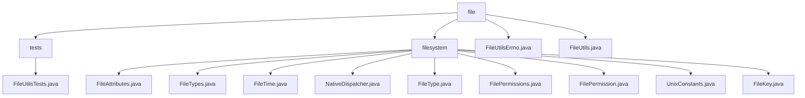

# 基础信息

|      |      |
|------|------|
| 名称 | file |
| 编码语言 | .java |
| 代码路径 | termux-app/termux-shared/src/main/java/com/termux/shared/file |
| 包名 | termux-app.termux-shared.src.main.java.com.termux.shared.file |
| 概述说明 | FileUtils测试类验证文件操作功能，包括创建、复制、移动、删除及符号链接处理。 |

# 说明

## 概述

该代码模块是一个面向Unix-like系统（特别是Android环境）设计的综合性文件系统操作工具集，主要服务于Termux终端模拟环境。模块采用分层架构设计，包含核心文件操作（FileUtils）、错误处理（FileUtilsErrno）、元数据管理（FileAttributes）以及系统调用交互层（NativeDispatcher）。整体设计强调不可变性、线程安全和严格的参数校验，同时通过详尽的测试套件（FileUtilsTests）确保各组件在复杂文件系统场景下的可靠性。

## 主要业务场景

1. **基础文件操作**
   - 路径规范化处理（`normalizePath`）和符号链接解析（`getCanonicalPath`）
   - 跨平台文件创建/删除（支持递归目录操作和特殊文件类型处理）
   - 原子性文件复制/移动操作（含权限保留机制）
   - 安全文件读写（支持多种字符集和序列化对象）

2. **权限管理系统**
   - 动态权限控制（`setFilePermissions`）与预设权限模板（`APP_EXECUTABLE_FILE_PERMISSIONS`）
   - 权限字符串双向转换（`rwxr-xr--` ↔ 权限标志位）
   - 权限错误检测（`EACCES`等错误码映射到400-450系列错误）

3. **错误处理体系**
   - 分级错误编码（100-450对应不同操作阶段错误）
   - 详细/简版错误映射（`ERRNO_SHORT_MAPPING`）
   - 错误上下文记录（包含路径、操作类型等元数据）

4. **元数据与类型系统**
   - 文件属性全生命周期管理（inode、时间戳、设备号等）
   - 7种标准文件类型检测（常规文件/目录/符号链接等）
   - 文件唯一标识生成（基于`FileKey`的dev+inode组合）

5. **Android特定适配**
   - 规避Android 5+系统调用缺陷（如O_DSYNC崩溃）
   - 处理Termux特有的存储沙箱限制
   - 适配不同Android版本的文件系统特性

典型应用场景包括：
- 终端命令行工具开发（如rm/cp/mv命令实现）
- 文件管理器核心功能（属性展示、批量操作）
- 系统维护脚本（权限修复、日志轮转）
- 开发工具链（构建系统文件操作）
- 文件系统监控程序（通过inode追踪变化）

测试体系通过模拟复杂场景（嵌套符号链接、权限受限目录等）验证模块在边界条件下的行为，确保其在Android特殊环境下的稳定性。

### 包内部结构视图

该流程图展示了Termux共享文件模块的层级结构，根目录"file"下包含"tests"、"filesystem"两个子目录及两个工具类文件。"tests"目录仅包含一个测试类，而"filesystem"目录则包含10个与文件系统操作相关的核心类文件，涉及文件属性、类型、权限等基础功能实现。所有节点均严格对应原始路径的末端元素，无冗余信息。

# 文件列表 File List

| 名称   | 类型  | 说明 |
|-------|------|-------------|
| [FileUtils.java](FileUtils.md) | file | FileUtils类提供文件操作功能，包括权限管理、路径处理、文件创建/删除/读写、类型检查等。关键点：支持正则、符号链接、权限设置、错误处理，兼容多种文件类型和字符集。 |
| [FileUtilsErrno.java](FileUtilsErrno.md) | file | FileUtilsErrno类定义了文件操作相关错误码，包括路径无效、文件不存在、创建删除失败、读写异常等。 |
| [filesystem](filesystem/_module.md) | package | 文件系统元数据、类型、权限、时间、常量等工具类集合。 |
| [tests](tests/_module.md) | package | FileUtilsTests类测试文件操作功能，包括创建、复制、移动、删除文件和目录，以及验证目录内容。 |

