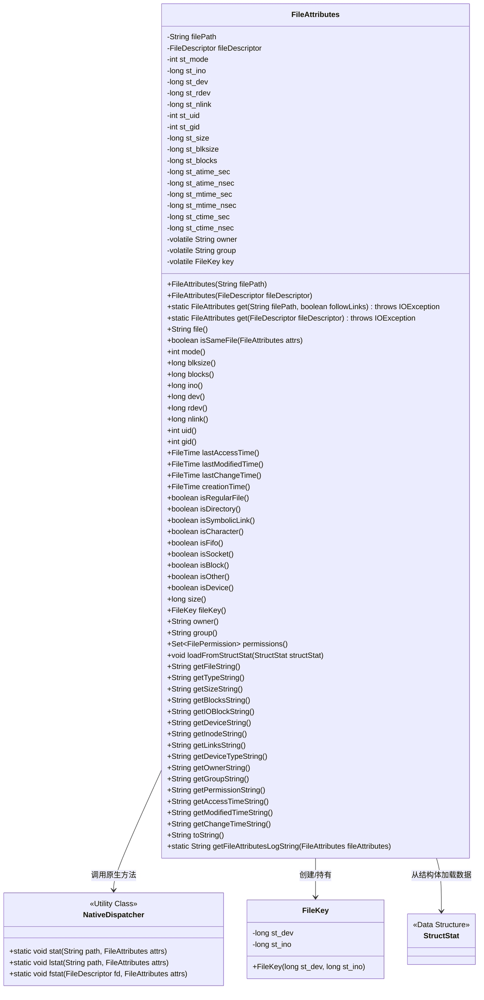
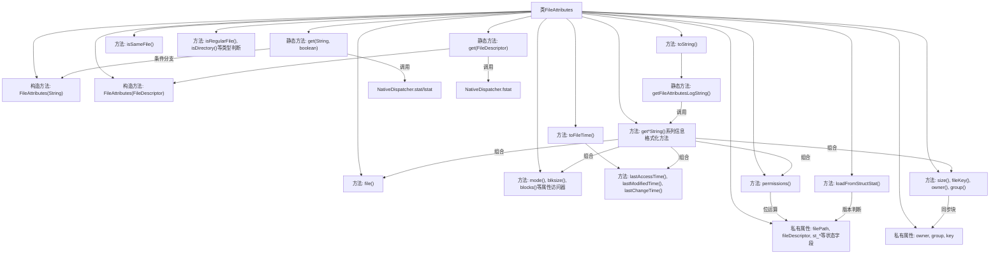

# 基础信息

|      |      |
|------|------|
| 名称 | FileAttributes |
| 编码语言 | .java |
| 代码路径 | termux-app/termux-shared/src/main/java/com/termux/shared/file/filesystem/FileAttributes.java |
| 包名 | com.termux.shared.file.filesystem |
| 依赖项 | ['android.os.Build', 'android.system.StructStat', 'androidx.annotation.NonNull', 'java.io.File', 'java.io.FileDescriptor', 'java.io.IOException', 'java.util.concurrent.TimeUnit', 'java.util.Set', 'java.util.HashSet'] |
| 概述说明 | FileAttributes类封装文件属性信息，提供获取和操作方法。 |

# 说明

FileAttributes类封装了文件系统对象的元数据信息，包括路径、文件描述符、权限模式、设备号、inode号、硬链接数、用户组ID、文件大小、块信息、访问修改时间等属性。提供静态方法获取文件或已打开文件的属性，支持符号链接跟踪。包含判断文件类型的方法（常规文件、目录、符号链接等），以及获取权限、所有者、时间戳等详细信息的工具方法。通过StructStat结构加载系统调用返回的属性数据，并实现格式化输出所有属性的toString方法。

# 类列表 Class Summary

| 名称   | 类型  | 说明 |
|-------|------|-------------|
| FileAttributes | class | 文件属性类，包含路径、权限、时间等元数据。 |

## 类 FileAttributes

|      |      |
|------|------|
| 访问范围 | public |
| 类型 | class |
| 名称 | FileAttributes |
| 说明 | 文件属性类，包含路径、权限、时间等元数据。 |

### UML类图

该代码实现了一个文件属性类`FileAttributes`，用于封装Unix/Linux系统的文件元数据（如inode、权限、时间戳等）。通过私有构造器和静态工厂方法`get()`获取实例，支持通过文件路径或文件描述符两种方式初始化。核心功能包括：文件类型判断（常规文件/目录/符号链接等）、权限管理、时间戳转换、惰性初始化所有者信息，并通过`NativeDispatcher`调用本地方法获取系统级文件属性。类设计采用线程安全的双重检查锁定模式初始化`FileKey`等字段，提供丰富的格式化输出方法生成可读性强的属性报告。

### 内部方法调用关系图

该流程图展示了FileAttributes类的完整结构，包含属性定义、构造方法、核心功能方法和信息格式化方法。类主要通过两种构造方式获取文件属性：文件路径或文件描述符，并通过NativeDispatcher与系统交互。核心功能包括文件类型判断、权限管理、时间转换等，最后通过toString()和getFileAttributesLogString()方法提供格式化输出能力。流程特别强调了条件分支、同步块和版本判断等关键逻辑点。

### 字段列表 Field List

| 名称  | 类型  | 说明 |
|-------|-------|------|
| st_atime_nsec | long | 私有长整型纳秒级访问时间。 |
| st_gid | int | 私有整型变量st_gid |
| st_mtime_nsec | long | 长整型变量，存储文件修改时间的纳秒部分。 |
| st_nlink | long | 私有长整型链接计数 |
| st_size | long | 私有长整型变量st_size |
| owner | String | 私有可变字符串变量owner |
| st_ctime_sec | long | 私有长整型变量，存储秒级创建时间。 |
| st_rdev | long | 私有长整型设备号变量。 |
| fileDescriptor | FileDescriptor | 私有文件描述符变量fileDescriptor。 |
| key | FileKey | 私有易变文件键 |
| filePath | String | 私有文件路径变量。 |
| st_atime_sec | long | 存储文件最后访问时间的秒数。 |
| st_blocks | long | 私有长整型变量st_blocks |
| st_blksize | long | 块大小字段 |
| st_mode | int | 私有整型变量st_mode |
| st_ctime_nsec | long | 私有长整型变量，存储文件状态变更时间的纳秒部分。 |
| st_uid | int | 私有整型变量st_uid |
| st_mtime_sec | long | 私有长整型变量，存储秒级修改时间。 |
| st_dev | long | 存储设备ID的长整型变量。 |
| st_ino | long | 私有长整型变量st_ino |
| group | String | 私有可变字符串变量group |

### 方法列表 Method List

| 名称  | 类型  | 说明 |
|-------|-------|------|
| getOwnerString | String | 方法返回字符串"Owner: "加上owner()方法的值。 |
| blksize | long | 返回文件块大小。 |
| file | String | 检查文件路径或描述符，返回有效值或null。 |
| isCharacter | boolean | 检查文件是否为字符设备。 |
| creationTime | FileTime | 方法返回文件最后修改时间作为创建时间。 |
| ino | long | 返回文件索引节点号。 |
| getLinksString | String | 方法返回字符串"Links: `"加nlink()结果。 |
| lastModifiedTime | FileTime | 方法返回文件最后修改时间，转换为FileTime格式。 |
| getGroupString | String | 方法返回字符串"Group: "加上group()的值。 |
| gid | int | 获取组ID的公共方法，返回st_gid值。 |
| group | String | 双重检查锁实现线程安全的懒加载，返回字符串格式的group值。 |
| getSizeString | String | 方法返回字符串"Size: "加上size()的值。 |
| getPermissionString | String | 方法返回文件权限字符串，格式为"Permissions: [权限值]"。 |
| getAccessTimeString | String | 方法返回最后访问时间字符串，格式为"Access Time: [时间]"。 |
| getModifiedTimeString | String | 方法返回最后修改时间字符串，格式为"Modified Time: [时间]"。 |
| getChangeTimeString | String | 方法返回最后修改时间的字符串格式。 |
| toString | String | 非空toString方法，返回文件属性日志字符串。 |
| getFileAttributesLogString | String | 生成文件属性日志字符串，包含类型、大小、权限等详细信息。 |
| isSymbolicLink | boolean | 检查文件是否为符号链接。 |
| isDirectory | boolean | 检查是否为目录：比较st_mode与S_IFDIR是否相等。 |
| isFifo | boolean | 检查文件是否为FIFO类型。 |
| get | FileAttributes | 获取文件属性，支持符号链接跟踪，处理空路径，调用底层系统接口。 |
| lastChangeTime | FileTime | 返回文件最后修改时间。 |
| isDevice | boolean | 检查文件类型是否为字符设备、块设备或FIFO。 |
| isBlock | boolean | 检查文件是否为块设备。 |
| toFileTime | FileTime | 将秒和纳秒转换为FileTime，无纳秒时用秒，否则转为微秒防溢出。 |
| getTypeString | String | 方法返回文件类型字符串，格式为"Type: `类型名`"。 |
| isRegularFile | boolean | 检查文件是否为常规文件。 |
| getFileString | String | 方法返回文件字符串，格式为"File: `文件名`"。 |
| owner | String | 双重检查锁定获取owner，若空则初始化为st_uid字符串并返回。 |
| loadFromStructStat | void | 方法从StructStat复制属性，包括权限、大小等，适配不同安卓版本的时间处理。 |
| dev | long | 返回设备ID。 |
| isSocket | boolean | 检查文件是否为套接字类型。 |
| blocks | long | 返回存储块数量 |
| size | long | 方法返回文件大小值。 |
| isOther | boolean | 检查文件类型是否为非普通文件、目录或链接。 |
| mode | int | 返回文件模式值。 |
| permissions | Set<FilePermission> | 解析Unix文件权限位，返回所有者、组和其他用户的读写执行权限集合。 |
| getDeviceString | String | 方法返回设备字符串，格式为"Device: `十六进制设备号`"。 |
| nlink | long | 方法返回长整型链接数st_nlink。 |
| uid | int | 方法返回用户ID st_uid。 |
| isSameFile | boolean | 比较文件属性是否相同，依据inode和设备号。 |
| get | FileAttributes | 获取文件属性，通过文件描述符调用系统fstat方法填充属性对象并返回。 |
| lastAccessTime | FileTime | 返回文件最后访问时间的FileTime对象。 |
| fileKey | FileKey | 双重检查锁定创建文件键对象 |
| getIOBlockString | String | 方法返回IO块大小字符串，格式为"IO Block: `大小值`"。 |
| getInodeString | String | 方法返回包含Inode编号的字符串。 |
| getDeviceTypeString | String | 方法返回设备类型字符串，格式为"Device Type: `设备名`"。 |
| getBlocksString | String | 方法返回字符串"Blocks: "加上blocks()的结果。 |
| rdev | long | 返回设备文件的特殊设备号。 |

