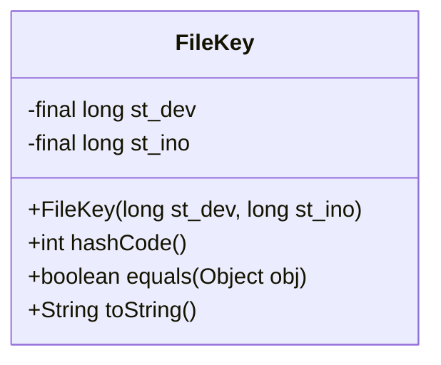
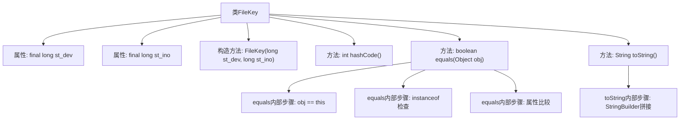

# 基础信息

|      |      |
|------|------|
| 名称 | FileKey |
| 编码语言 | .java |
| 代码路径 | termux-app/termux-shared/src/main/java/com/termux/shared/file/filesystem/FileKey.java |
| 包名 | com.termux.shared.file.filesystem |
| 依赖项 | [] |
| 概述说明 | FileKey类存储设备号和inode号，实现hashCode、equals和toString方法。 |

# 说明

FileKey类是一个用于标识文件的键类，包含两个私有final字段st_dev和st_ino，分别表示设备号和inode号。构造函数接收这两个参数进行初始化。类重写了hashCode方法，通过异或运算计算哈希值。equals方法比较两个FileKey对象的st_dev和st_ino是否相同来判断相等性。toString方法返回包含设备号和inode号的格式化字符串，设备号以十六进制表示。该类主要用于文件唯一标识和比较。

# 类列表 Class Summary

| 名称   | 类型  | 说明 |
|-------|------|-------------|
| FileKey | class | FileKey类封装设备号和inode号，实现hashCode、equals和toString方法。 |

## 类 FileKey

|      |      |
|------|------|
| 访问范围 | public |
| 类型 | class |
| 名称 | FileKey |
| 说明 | FileKey类封装设备号和inode号，实现hashCode、equals和toString方法。 |

### UML类图

这段代码定义了一个不可变的`FileKey`类，用于唯一标识文件系统对象。该类通过设备号(`st_dev`)和inode号(`st_ino`)组合作为文件标识，实现了`hashCode()`、`equals()`和`toString()`方法。`hashCode()`使用位运算混合两个长整型值，`equals()`严格比较两个文件键是否指向同一物理文件，`toString()`生成可读的设备号和inode号组合表示。该类适合作为哈希表的键，能有效区分不同文件系统对象。

### 内部方法调用关系图

该流程图展示了FileKey类的完整结构，包含两个final属性、构造方法和三个核心方法。hashCode()通过位运算生成哈希值，equals()实现三步验证逻辑（自引用检查、类型检查、属性比较），toString()使用StringBuilder构建格式化的设备号和inode字符串。类设计重点处理文件系统唯一标识的存储和比较，适用于需要精确匹配文件元数据的场景。

### 字段列表 Field List

| 名称  | 类型  | 说明 |
|-------|-------|------|
| st_dev | long | 私有长整型变量st_dev。 |
| st_ino | long | 私有长整型变量st_ino |

### 方法列表 Method List

| 名称  | 类型  | 说明 |
|-------|-------|------|
| equals | boolean | 重写equals方法，比较FileKey对象的st_dev和st_ino属性是否相等。 |
| hashCode | int | 重写hashCode方法，结合st_dev和st_ino生成哈希值。 |
| toString | String | 重写toString方法，返回设备号和inode号的字符串。 |

