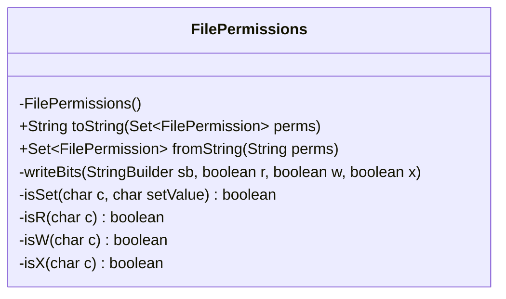
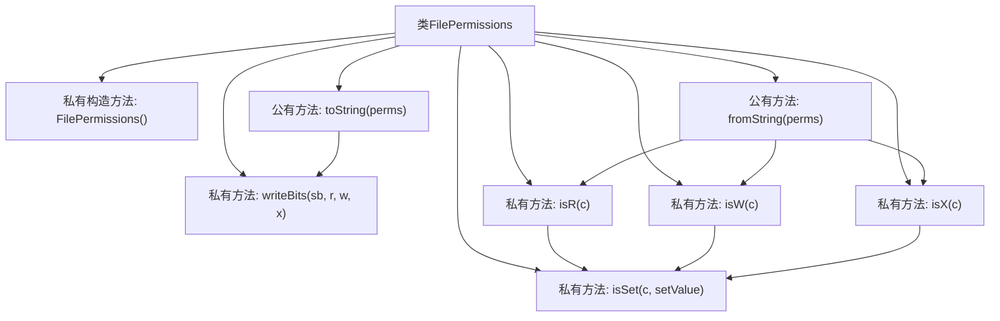

# 基础信息

|      |      |
|------|------|
| 名称 | FilePermissions |
| 编码语言 | .java |
| 代码路径 | termux-app/termux-shared/src/main/java/com/termux/shared/file/filesystem/FilePermissions.java |
| 包名 | com.termux.shared.file.filesystem |
| 依赖项 | ['com.termux.shared.file.filesystem.FilePermission', 'java.util'] |
| 概述说明 | FilePermissions类提供文件权限字符串与集合的转换功能。 |

# 说明

FilePermissions类提供文件权限的字符串表示与解析功能。toString方法将FilePermission集合转换为9字符字符串，分别表示所有者、组和其他用户的读写执行权限（如rwxr-x---）。fromString方法执行反向操作，解析9字符权限字符串为FilePermission集合，非法格式会抛出异常。权限字符为r、w、x或-，类包含私有方法校验字符有效性并构建权限标识。

# 类列表 Class Summary

| 名称   | 类型  | 说明 |
|-------|------|-------------|
| FilePermissions | class | FilePermissions类提供文件权限字符串与集合的互转功能，支持读写执行权限的解析与生成。 |

## 类 FilePermissions

|      |      |
|------|------|
| 访问范围 | public final |
| 类型 | class |
| 名称 | FilePermissions |
| 说明 | FilePermissions类提供文件权限字符串与集合的互转功能，支持读写执行权限的解析与生成。 |

### UML类图

这段代码展示了一个`FilePermissions`工具类，用于处理文件权限的字符串表示与`FilePermission`枚举集合之间的转换。该类包含私有构造方法防止实例化，提供两个核心静态方法：`toString`将权限集合转换为9字符的字符串（如"rwxr-x---"），`fromString`执行反向转换。辅助方法包括权限位写入逻辑`writeBits`和字符验证方法`isSet/isR/isW/isX`。该类严格遵循UNIX文件权限表示规范，支持所有者、组和其他三组读(r)、写(w)、执行(x)权限的编码/解码，并包含完善的输入验证机制。

### 内部方法调用关系图

该流程图展示了FilePermissions类的完整结构，重点突出了权限字符串的生成(toString)和解析(fromString)两大核心功能。toString方法通过writeBits辅助方法构建权限字符串，而fromString方法则依赖isR/isW/isX三个校验方法，这三个方法又都基于isSet方法实现字符验证。整个设计采用工具类的典型模式，所有方法均为静态，并通过私有构造方法防止实例化，体现了对文件权限字符串处理的完整封装。

### 字段列表 Field List

| 名称  | 类型  | 说明 |
|-------|-------|------|

### 方法列表 Method List

| 名称  | 类型  | 说明 |
|-------|-------|------|
| isSet | boolean | 检查字符c是否为setValue，是返回true，是'-'返回false，否则报错。 |
| isW | boolean | 检查字符c是否为'w'。 |
| toString | String | 将文件权限集合转换为9位字符串，依次表示所有者、组和其他用户的读写执行权限。 |
| isX | boolean | 检查字符c是否为'x'。 |
| isR | boolean | 检查字符c是否为'r' |
| writeBits | void | 私有方法根据读写执行权限生成字符串，无权限用-表示。 |
| fromString | Set<FilePermission> | 将9字符权限字符串转换为文件权限集合。 |

