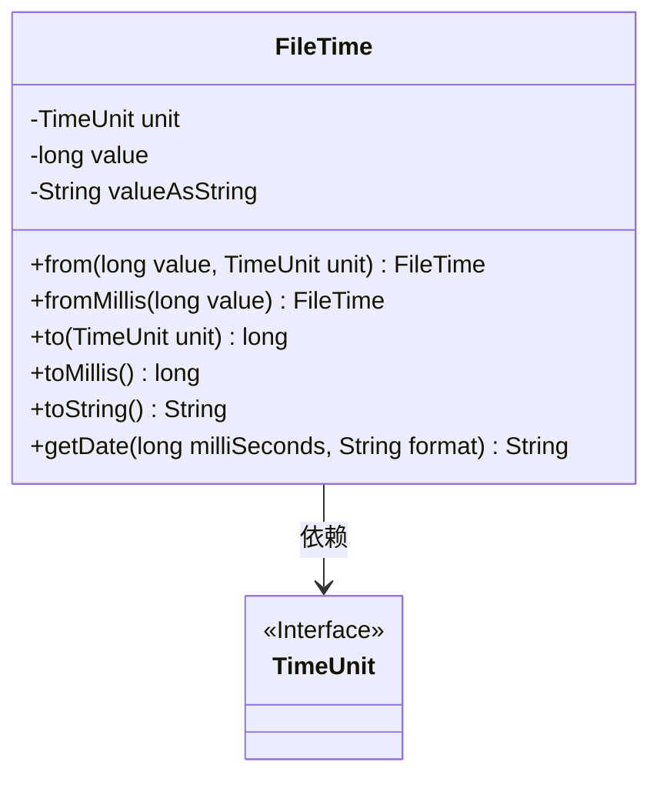
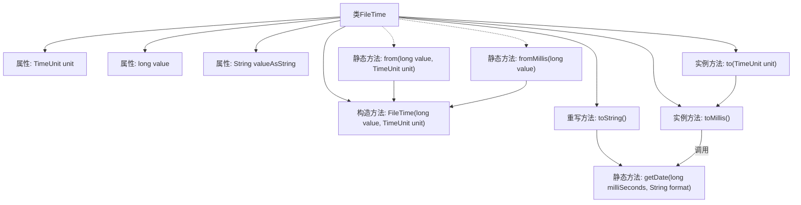

# 基础信息

|      |      |
|------|------|
| 名称 | FileTime |
| 编码语言 | .java |
| 代码路径 | termux-app/termux-shared/src/main/java/com/termux/shared/file/filesystem/FileTime.java |
| 包名 | com.termux.shared.file.filesystem |
| 依赖项 | ['androidx.annotation.NonNull', 'java.text.SimpleDateFormat', 'java.util.Calendar', 'java.util.Objects', 'java.util.concurrent.TimeUnit'] |
| 概述说明 | FileTime类表示文件时间，含时间值和单位，支持转换和格式化。 |

# 说明

FileTime类是一个不可变的最终类，用于表示基于时间单位的时间值。它包含三个私有字段：unit表示时间单位，value表示自纪元以来的长整型值，valueAsString存储字符串表示。构造函数私有化，提供静态工厂方法from和fromMillis创建实例。to方法将时间值转换为指定单位，toMillis转换为毫秒。toString方法调用getDate将毫秒值格式化为指定日期字符串，异常时返回原始毫秒值。类设计确保时间单位转换时的数值溢出处理。

# 类列表 Class Summary

| 名称   | 类型  | 说明 |
|-------|------|-------------|
| FileTime | class | FileTime类表示文件时间，含时间值和单位，支持转换和格式化。 |

## 类 FileTime

|      |      |
|------|------|
| 访问范围 | public final |
| 类型 | class |
| 名称 | FileTime |
| 说明 | FileTime类表示文件时间，含时间值和单位，支持转换和格式化。 |

### UML类图

这段代码定义了一个不可变的`FileTime`类，用于表示文件时间戳，支持从不同时间单位创建和转换时间值。类中包含三个私有字段：`unit`表示时间单位，`value`存储时间值，`valueAsString`缓存字符串表示。提供了静态工厂方法`from()`和`fromMillis()`来创建实例，以及`to()`和`toMillis()`进行时间单位转换。`toString()`方法通过`getDate()`辅助方法将时间格式化为可读字符串，若格式化失败则返回原始毫秒值。该类与`TimeUnit`接口存在依赖关系，用于处理时间单位转换。

### 内部方法调用关系图

流程图描述：该流程图展示了FileTime类的结构和主要方法调用关系。核心属性包括unit、value和valueAsString，构造方法为私有。提供两个静态工厂方法from()和fromMillis()来创建实例，实例方法to()和toMillis()用于时间单位转换。toString()方法依赖getDate()辅助方法进行日期格式化，其中包含异常处理逻辑。箭头清晰地表示了方法间的调用链和参数传递路径。

### 字段列表 Field List

| 名称  | 类型  | 说明 |
|-------|-------|------|
| value | long | 私有长整型变量value |
| valueAsString | String | 私有字符串变量valueAsString。 |
| unit | TimeUnit | 私有final变量unit，类型为TimeUnit。 |

### 方法列表 Method List

| 名称  | 类型  | 说明 |
|-------|-------|------|
| toMillis | long | 将时间值转换为毫秒单位。 |
| from | FileTime | 静态方法，根据时间和单位创建FileTime对象。 |
| fromMillis | FileTime | 静态方法，从毫秒值创建FileTime对象。 |
| getDate | String | 将毫秒时间戳转为指定格式日期字符串，异常返回原时间戳。 |
| toString | String | 非空toString方法，返回格式化的日期时间字符串。 |
| to | long | 将时间值转换为指定单位。 |

