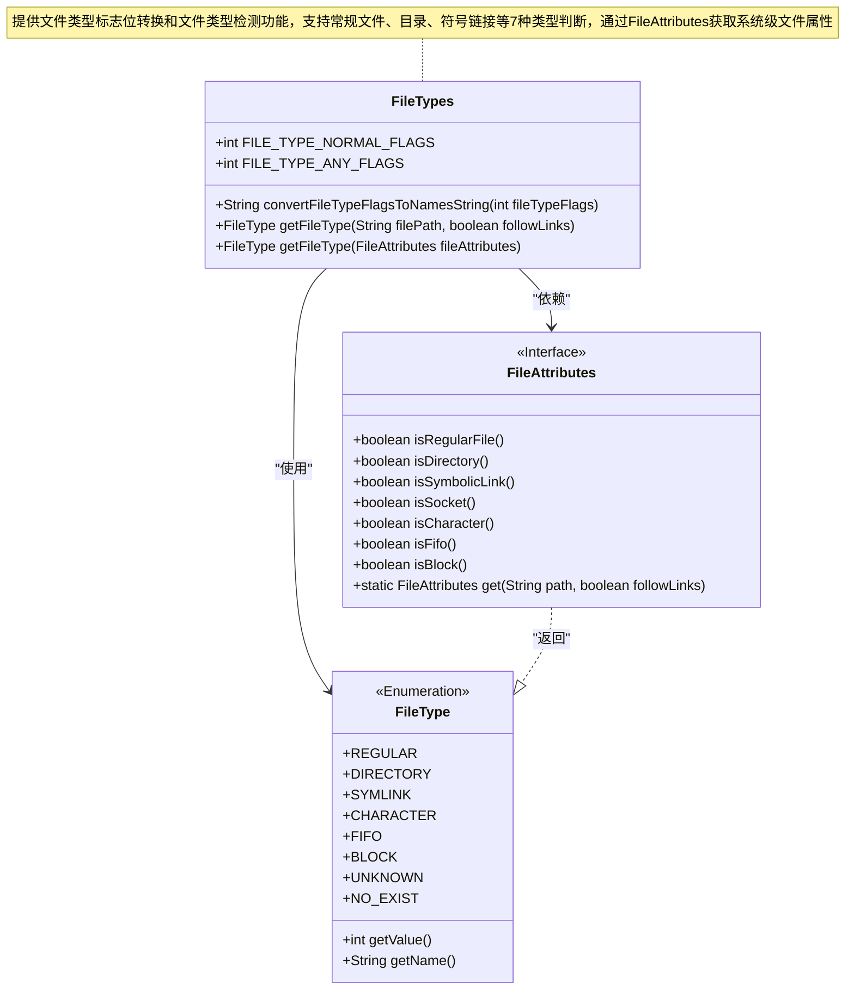

# 基础信息

|      |      |
|------|------|
| 名称 | FileTypes |
| 编码语言 | .java |
| 代码路径 | termux-app/termux-shared/src/main/java/com/termux/shared/file/filesystem/FileTypes.java |
| 包名 | com.termux.shared.file.filesystem |
| 依赖项 | ['android.system.Os', 'androidx.annotation.NonNull', 'com.termux.shared.logger.Logger', 'java.io.File'] |
| 概述说明 | 文件类型工具类，含标志转换和类型检查方法。 |

# 说明

该代码定义了一个FileTypes类，用于处理文件类型相关操作。包含两个常量：FILE_TYPE_NORMAL_FLAGS表示常规文件类型标志，FILE_TYPE_ANY_FLAGS表示所有文件类型标志。提供了convertFileTypeFlagsToNamesString方法将文件类型标志转换为名称字符串。核心功能是通过getFileType方法检测文件路径对应的文件类型，支持是否跟随符号链接的选项，并处理各种异常情况。该方法返回FileType枚举值，涵盖常规文件、目录、符号链接、字符设备、FIFO、块设备及未知类型等多种情况。

# 类列表 Class Summary

| 名称   | 类型  | 说明 |
|-------|------|-------------|
| FileTypes | class | 文件类型处理类，包含类型标志转换和获取方法。 |

## 类 FileTypes

|      |      |
|------|------|
| 访问范围 | public |
| 类型 | class |
| 名称 | FileTypes |
| 说明 | 文件类型处理类，包含类型标志转换和获取方法。 |

### UML类图

该类图展示了FileTypes工具类与FileType枚举、FileAttributes接口的关系。FileTypes包含两个常量标志位和三个核心方法：convertFileTypeFlagsToNamesString用于将位标志转换为类型名称字符串，两个getFileType方法分别通过文件路径或FileAttributes对象确定文件类型。FileType枚举定义了8种文件类型及其对应值，FileAttributes接口则声明了7个文件属性检测方法和一个工厂方法。整体设计实现了文件类型检测与标志位处理的解耦，支持符号链接跟踪等高级功能。

### 内部方法调用关系图

该流程图展示了FileTypes类的完整结构，包含两个常量定义和三个核心方法。convertFileTypeFlagsToNamesString方法通过位运算将文件类型标志转换为可读字符串，包含字符串构建、类型遍历和结果处理流程。getFileType方法分为两个重载版本：一个处理文件路径输入，包含路径验证、属性获取和异常处理；另一个直接分析FileAttributes对象，通过条件判断返回对应的文件类型枚举。整个设计体现了清晰的职责划分和稳健的错误处理机制，特别关注了符号链接和特殊文件类型的处理场景。

### 字段列表 Field List

| 名称  | 类型  | 说明 |
|-------|-------|------|
| FILE_TYPE_ANY_FLAGS = Integer.MAX_VALUE | int | 定义文件类型标志常量，值为最大整数值。 |
| FILE_TYPE_NORMAL_FLAGS = FileType.REGULAR.getValue() | FileType.DIRECTORY.getValue() | FileType.SYMLINK.getValue() | int | 定义文件类型常量，包含常规文件、目录和符号链接。 |

### 方法列表 Method List

| 名称  | 类型  | 说明 |
|-------|-------|------|
| getFileType | FileType | 获取文件类型方法：检查路径非空后读取属性，异常时记录非ENOENT错误并返回不存在。 |
| getFileType | FileType | 根据文件属性返回对应的文件类型枚举。 |
| convertFileTypeFlagsToNamesString | String | 将文件类型标志转换为逗号分隔的名称字符串。 |

