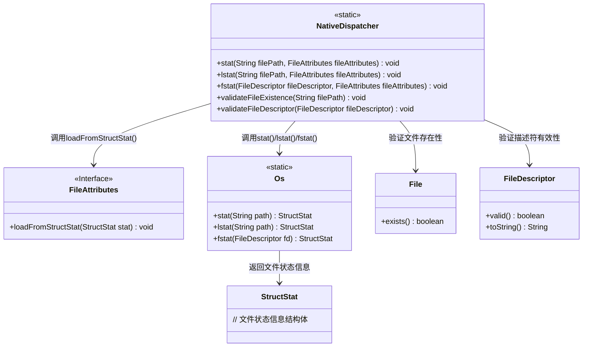
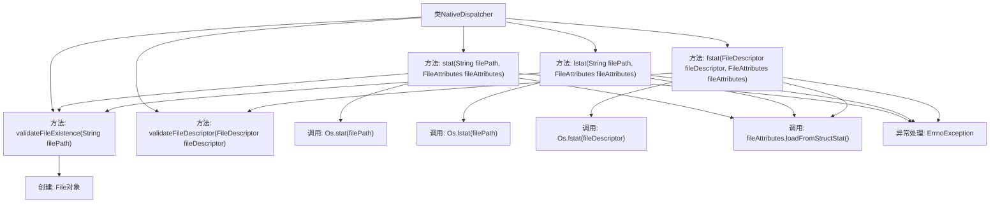

# 基础信息

|      |      |
|------|------|
| 名称 | NativeDispatcher |
| 编码语言 | .java |
| 代码路径 | termux-app/termux-shared/src/main/java/com/termux/shared/file/filesystem/NativeDispatcher.java |
| 包名 | com.termux.shared.file.filesystem |
| 依赖项 | ['android.system.ErrnoException', 'android.system.Os', 'java.io.File', 'java.io.FileDescriptor', 'java.io.IOException'] |
| 概述说明 | Java类NativeDispatcher提供文件状态查询方法，处理路径和描述符验证，异常封装为IOException。 |

# 说明

该代码定义了一个名为NativeDispatcher的公共类，包含处理文件属性的静态方法。主要功能包括：通过stat和lstat方法获取文件路径对应的属性并加载到FileAttributes对象，若失败则抛出带有详细错误信息的IOException；fstat方法类似但针对文件描述符操作。类中还包含validateFileExistence和validateFileDescriptor两个验证方法，分别检查文件路径非空和文件描述符有效性，验证失败时抛出异常。所有方法都进行参数校验并捕获底层系统调用错误。

# 类列表 Class Summary

| 名称   | 类型  | 说明 |
|-------|------|-------------|
| NativeDispatcher | class | NativeDispatcher类提供文件状态操作方法，包括stat、lstat、fstat，并验证路径和文件描述符有效性。 |

## 类 NativeDispatcher

|      |      |
|------|------|
| 访问范围 | public |
| 类型 | class |
| 名称 | NativeDispatcher |
| 说明 | NativeDispatcher类提供文件状态操作方法，包括stat、lstat、fstat，并验证路径和文件描述符有效性。 |

### UML类图

这段代码展示了一个NativeDispatcher工具类，它提供了三个核心静态方法(stat/lstat/fstat)来获取文件状态信息，并将结果加载到FileAttributes接口对象中。类图清晰地展示了NativeDispatcher与Os系统调用类、FileAttributes接口、File和FileDescriptor类之间的交互关系。所有方法都包含完善的错误处理机制，会验证输入参数的有效性，并将底层ErrnoException转换为更友好的IOException。注释掉的exists()检查表明开发者可能考虑过额外的文件存在性验证。

### 内部方法调用关系图

该流程图展示了NativeDispatcher类的核心结构和调用关系。类包含5个主要方法，其中stat/lstat/fstat是核心功能方法，均会调用验证方法（validateFileExistence或validateFileDescriptor）进行参数校验。核心方法通过调用Os类的stat/lstat/fstat获取文件信息，并通过loadFromStructStat方法填充FileAttributes对象。所有操作都包含ErrnoException异常处理，验证方法中会创建File对象或检查FileDescriptor有效性。流程清晰展现了从参数校验到系统调用再到属性加载的完整处理链。

### 字段列表 Field List

| 名称  | 类型  | 说明 |
|-------|-------|------|

### 方法列表 Method List

| 名称  | 类型  | 说明 |
|-------|-------|------|
| validateFileExistence | void | 检查文件路径非空并验证文件存在性，异常时抛出IO错误。 |
| fstat | void | Java方法：通过文件描述符获取属性，失败抛IO异常。 |
| stat | void | 静态方法stat获取文件属性，验证路径存在后调用系统Os.stat，异常转IO异常。 |
| lstat | void | 检查文件存在并获取属性，失败抛异常。 |
| validateFileDescriptor | void | 验证文件描述符非空且有效，否则抛出异常。 |

