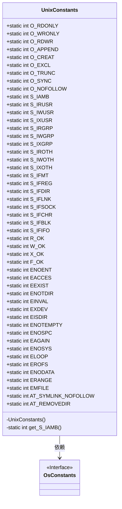
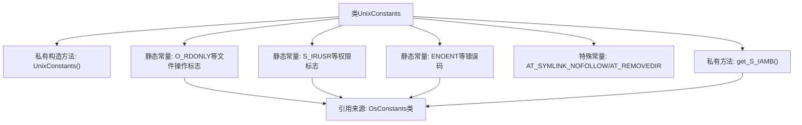

# 基础信息

|      |      |
|------|------|
| 名称 | UnixConstants |
| 编码语言 | .java |
| 代码路径 | termux-app/termux-shared/src/main/java/com/termux/shared/file/filesystem/UnixConstants.java |
| 包名 | com.termux.shared.file.filesystem |
| 依赖项 | ['android.os.Build', 'android.system.OsConstants', 'androidx.annotation.RequiresApi'] |
| 概述说明 | Unix系统常量类，包含文件操作标志、权限位和错误码。 |

# 说明

UnixConstants类定义了一系列Unix系统相关的常量，包括文件打开模式标志如O_RDONLY、O_WRONLY、O_RDWR等，文件权限标志如S_IRUSR、S_IWUSR、S_IXUSR等，文件类型标志如S_IFREG、S_IFDIR、S_IFLNK等，以及错误码如ENOENT、EACCES、EEXIST等。其中S_IAMB通过组合所有用户、组和其他用户的读写执行权限位计算得出。注释提到O_DSYNC在Android 5上会导致崩溃因此被注释掉。类中还包含AT_SYMLINK_NOFOLLOW和AT_REMOVEDIR两个额外常量。所有常量均从OsConstants类中引用或计算得出。

# 类列表 Class Summary

| 名称   | 类型  | 说明 |
|-------|------|-------------|
| UnixConstants | class | Unix系统常量类，包含文件操作标志、权限位和错误码。 |

## 类 UnixConstants

|      |      |
|------|------|
| 访问范围 | public |
| 类型 | class |
| 名称 | UnixConstants |
| 说明 | Unix系统常量类，包含文件操作标志、权限位和错误码。 |

### UML类图

这段代码定义了一个`UnixConstants`工具类，包含大量Unix系统调用相关的常量定义，主要用于文件操作和错误码。该类通过私有构造函数禁止实例化，所有字段均为静态常量。其中`S_IAMB`通过私有方法`get_S_IAMB()`动态计算权限掩码，其他常量直接引用自`OsConstants`接口。类图展示了`UnixConstants`对`OsConstants`的依赖关系，以及所有公开常量和私有方法的完整结构。

### 内部方法调用关系图

该流程图展示了UnixConstants工具类的结构，该类主要封装了三类UNIX系统常量：文件操作标志(O_*)、权限标志(S_*)和错误码(E*)。所有常量均从OsConstants类引用，其中S_IAMB通过get_S_IAMB()方法动态计算权限位组合。类采用私有构造方法禁止实例化，并包含两个特殊目录操作常量AT_SYMLINK_NOFOLLOW和AT_REMOVEDIR。流程图清晰呈现了常量的分类关系和外部依赖。

### 字段列表 Field List

| 名称  | 类型  | 说明 |
|-------|-------|------|
| W_OK = OsConstants.W_OK | int | 静态常量W_OK赋值为OsConstants.W_OK。 |
| S_IWUSR = OsConstants.S_IWUSR | int | 定义静态常量S_IWUSR，值为OsConstants.S_IWUSR。 |
| O_RDONLY = OsConstants.O_RDONLY | int | 定义只读文件访问常量O_RDONLY。 |
| ENOSYS = OsConstants.ENOSYS | int | 定义常量ENOSYS，值为OsConstants.ENOSYS。 |
| EISDIR = OsConstants.EISDIR | int | 静态常量EISDIR引用OsConstants.EISDIR。 |
| EACCES = OsConstants.EACCES | int | 定义静态常量EACCES，值为OsConstants.EACCES。 |
| ENOSPC = OsConstants.ENOSPC | int | 定义常量ENOSPC，值为OsConstants.ENOSPC。 |
| ELOOP = OsConstants.ELOOP | int | 静态常量ELOOP引用OsConstants.ELOOP值。 |
| F_OK = OsConstants.F_OK | int | 定义静态常量F_OK，值为OsConstants.F_OK。 |
| S_IFMT = OsConstants.S_IFMT | int | 定义静态常量S_IFMT，值为OsConstants.S_IFMT。 |
| O_SYNC = OsConstants.O_SYNC | int | 静态常量O_SYNC赋值为OsConstants.O_SYNC |
| EEXIST = OsConstants.EEXIST | int | 静态常量EEXIST引用OsConstants.EEXIST值 |
| ENOENT = OsConstants.ENOENT | int | 定义静态常量ENOENT，值为OsConstants.ENOENT。 |
| R_OK = OsConstants.R_OK | int | 定义静态常量R_OK，值为OsConstants.R_OK。 |
| X_OK = OsConstants.X_OK | int | 定义静态常量X_OK，值为OsConstants.X_OK。 |
| S_IFLNK = OsConstants.S_IFLNK | int | 定义静态常量S_IFLNK，值为OsConstants.S_IFLNK。 |
| O_WRONLY = OsConstants.O_WRONLY | int | 定义静态常量O_WRONLY，值为OsConstants.O_WRONLY。 |
| S_IXGRP = OsConstants.S_IXGRP | int | 静态常量S_IXGRP引用OsConstants的S_IXGRP值。 |
| S_IROTH = OsConstants.S_IROTH | int | 定义静态常量S_IROTH，值为OsConstants.S_IROTH。 |
| O_EXCL = OsConstants.O_EXCL | int | 定义常量O_EXCL，值为OsConstants.O_EXCL。 |
| S_IFBLK = OsConstants.S_IFBLK | int | 定义静态常量S_IFBLK，值为OsConstants.S_IFBLK。 |
| S_IRUSR = OsConstants.S_IRUSR | int | 定义静态常量S_IRUSR，值为OsConstants.S_IRUSR。 |
| O_NOFOLLOW = OsConstants.O_NOFOLLOW | int | 静态常量O_NOFOLLOW等于OsConstants.O_NOFOLLOW。 |
| S_IFDIR = OsConstants.S_IFDIR | int | 定义静态常量S_IFDIR，值为OsConstants.S_IFDIR。 |
| ENOTEMPTY = OsConstants.ENOTEMPTY | int | 定义常量ENOTEMPTY，值为OsConstants.ENOTEMPTY。 |
| S_IRGRP = OsConstants.S_IRGRP | int | 静态常量S_IRGRP引用OsConstants的组读权限值。 |
| EAGAIN = OsConstants.EAGAIN | int | 定义静态常量EAGAIN，值为OsConstants.EAGAIN。 |
| O_APPEND = OsConstants.O_APPEND | int | 静态常量O_APPEND引用OsConstants.O_APPEND |
| EINVAL = OsConstants.EINVAL | int | 定义静态常量EINVAL，值为OsConstants.EINVAL。 |
| S_IFSOCK = OsConstants.S_IFSOCK | int | 定义静态常量S_IFSOCK，值为OsConstants.S_IFSOCK。 |
| S_IAMB = get_S_IAMB() | int | 静态常量S_IAMB初始化为get_S_IAMB()返回值。 |
| S_IXOTH = OsConstants.S_IXOTH | int | 静态常量S_IXOTH引用OsConstants.S_IXOTH |
| O_TRUNC = OsConstants.O_TRUNC | int | 静态常量O_TRUNC赋值为OsConstants.O_TRUNC。 |
| O_CREAT = OsConstants.O_CREAT | int | 定义静态常量O_CREAT，值为OsConstants.O_CREAT。 |
| O_RDWR = OsConstants.O_RDWR | int | 定义常量O_RDWR，值为OsConstants.O_RDWR。 |
| S_IWOTH = OsConstants.S_IWOTH | int | 静态常量S_IWOTH引用OsConstants.S_IWOTH值。 |
| ENOTDIR = OsConstants.ENOTDIR | int | 定义常量ENOTDIR，值为OsConstants.ENOTDIR。 |
| EXDEV = OsConstants.EXDEV | int | 定义常量EXDEV，值为OsConstants.EXDEV。 |
| EROFS = OsConstants.EROFS | int | 定义静态常量EROFS，值为OsConstants.EROFS。 |
| S_IFCHR = OsConstants.S_IFCHR | int | 定义静态常量S_IFCHR，值为OsConstants.S_IFCHR。 |
| S_IWGRP = OsConstants.S_IWGRP | int | 静态常量S_IWGRP引用OsConstants.S_IWGRP的值。 |
| S_IXUSR = OsConstants.S_IXUSR | int | 静态常量S_IXUSR赋值为OsConstants.S_IXUSR |
| S_IFIFO = OsConstants.S_IFIFO | int | 静态常量S_IFIFO引用OsConstants.S_IFIFO。 |
| S_IFREG = OsConstants.S_IFREG | int | 定义常量S_IFREG为OsConstants.S_IFREG。 |
| ENODATA = OsConstants.ENODATA | int | 定义常量ENODATA，值为OsConstants.ENODATA。 |
| ERANGE = OsConstants.ERANGE | int | 定义静态常量ERANGE，值为OsConstants.ERANGE。 |
| EMFILE = OsConstants.EMFILE | int | 静态常量EMFILE对应OsConstants.EMFILE |
| AT_SYMLINK_NOFOLLOW = 0x100 | int | 静态常量AT_SYMLINK_NOFOLLOW值为0x100，用于不追踪符号链接。 |
| AT_REMOVEDIR = 0x200 | int | 定义常量AT_REMOVEDIR，值为0x200。 |

### 方法列表 Method List

| 名称  | 类型  | 说明 |
|-------|-------|------|
| get_S_IAMB | int | 返回用户、组和其他人的读写执行权限组合。 |

