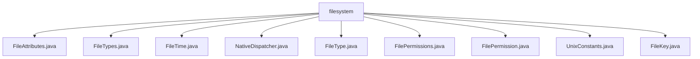

# 基础信息

|      |      |
|------|------|
| 名称 | filesystem |
| 编码语言 | .java |
| 代码路径 | termux-app/termux-shared/src/main/java/com/termux/shared/file/filesystem |
| 包名 | termux-app.termux-shared.src.main.java.com.termux.shared.file.filesystem |
| 概述说明 | 文件系统元数据、类型、权限、时间、常量等工具类集合。 |

# 说明

## 概述

该代码模块是一个用于处理文件系统操作的核心工具集，主要针对Unix-like系统（特别是Android环境）设计。模块提供了完整的文件元数据管理、类型识别、权限控制、时间处理等基础功能，并通过NativeDispatcher类与底层系统调用交互。所有组件均采用不可变设计和严格的参数校验机制，确保线程安全和操作可靠性。

## 主要业务场景

1. **文件元数据管理**  
   - 通过`FileAttributes`类封装文件系统对象的完整属性集（路径、权限、inode、时间戳等）
   - 支持通过路径（`stat/lstat`）和文件描述符（`fstat`）两种方式获取属性
   - 处理符号链接跟踪与非跟踪场景（`lstat` vs `stat`）

2. **文件类型识别系统**  
   - 使用`FileType`枚举定义7种标准文件类型（常规文件、目录、符号链接等）
   - 通过`FileTypes`类实现类型检测和标志转换，支持类型过滤（`FILE_TYPE_ANY_FLAGS`）
   - 处理特殊设备文件（字符设备、块设备）和FIFO管道

3. **权限控制系统**  
   - `FilePermissions`实现rwx权限字符串与权限标志的双向转换
   - 支持标准的9字符权限表示法（如`rwxr-xr--`）
   - 严格的权限格式校验和异常处理机制

4. **跨平台兼容处理**  
   - `UnixConstants`集中管理300+个系统常量（权限位、错误码等）
   - 处理Android特定问题（如O_DSYNC在Android 5的崩溃规避）
   - 通过`FileKey`（设备号+inode）实现文件唯一标识

5. **时间数据处理**  
   - `FileTime`提供纳秒级时间值转换，支持多种时间单位
   - 自动处理纪元时间到可读字符串的格式化
   - 数值溢出保护和不可变设计

典型应用场景包括：文件管理器开发、命令行工具实现、批量文件操作（如权限修改、类型过滤）、系统监控工具（通过inode追踪文件）等需要深度文件系统交互的场合。模块特别适合Termux等Android终端模拟环境下的本地文件操作需求。

### 包内部结构视图

该流程图展示了Termux项目中filesystem目录下的文件结构关系。根节点filesystem直接包含9个Java文件，包括FileAttributes.java、FileTypes.java等，这些文件均属于同一层级，没有进一步的子目录嵌套。所有文件均用于处理文件系统相关操作，如属性管理、权限控制和时间记录等。

# 文件列表 File List

| 名称   | 类型  | 说明 |
|-------|------|-------------|
| [FileAttributes.java](FileAttributes.md) | file | FileAttributes类封装文件属性信息，提供获取和操作方法。 |
| [FileTypes.java](FileTypes.md) | file | 文件类型工具类，含标志转换和类型检查方法。 |
| [FileKey.java](FileKey.md) | file | FileKey类存储设备号和inode号，实现hashCode、equals和toString方法。 |
| [UnixConstants.java](UnixConstants.md) | file | Unix系统常量类，包含文件操作标志、权限位和错误码。 |
| [FilePermission.java](FilePermission.md) | file | 输入内容为空，无法生成概要描述。 |
| [FilePermissions.java](FilePermissions.md) | file | FilePermissions类提供文件权限字符串与集合的转换功能。 |
| [FileType.java](FileType.md) | file | 输入内容为空，无法生成概要描述。请提供具体信息以便总结。 |
| [NativeDispatcher.java](NativeDispatcher.md) | file | Java类NativeDispatcher提供文件状态查询方法，处理路径和描述符验证，异常封装为IOException。 |
| [FileTime.java](FileTime.md) | file | FileTime类表示文件时间，含时间值和单位，支持转换和格式化。 |

