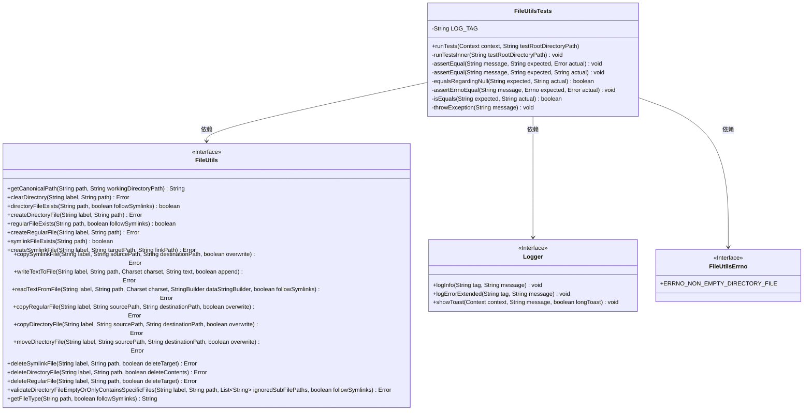

# 基础信息

|      |      |
|------|------|
| 名称 | FileUtilsTests |
| 编码语言 | .java |
| 代码路径 | termux-app/termux-shared/src/main/java/com/termux/shared/file/tests/FileUtilsTests.java |
| 包名 | com.termux.shared.file.tests |
| 依赖项 | ['android.content.Context', 'androidx.annotation.NonNull', 'com.termux.shared.errors.Errno', 'com.termux.shared.file.FileUtils', 'com.termux.shared.file.FileUtilsErrno', 'com.termux.shared.logger.Logger', 'com.termux.shared.errors.Error', 'java.io.File', 'java.nio.charset.Charset', 'java.util.Arrays', 'java.util.List'] |
| 概述说明 | FileUtilsTests类测试文件操作功能，包括创建、复制、移动、删除文件和目录，以及验证目录内容。 |

# 说明

FileUtilsTests类是一个用于测试FileUtils功能的工具类，主要验证文件操作如创建、复制、移动、删除目录和文件，以及处理符号链接。测试流程包括创建测试目录结构（dir1、dir2等），执行文件操作并验证结果，确保操作如预期。测试涵盖常规文件、目录、符号链接的创建与删除，文件读写，以及错误处理。通过assertEqual和assertErrnoEqual方法验证操作结果，确保文件系统操作的准确性和稳定性。测试需在verbose日志级别下运行，适用于应用启动时执行。

# 类列表 Class Summary

| 名称   | 类型  | 说明 |
|-------|------|-------------|
| FileUtilsTests | class | FileUtilsTests类测试文件操作功能，包括创建、复制、移动、删除及验证目录和文件。 |

## 类 FileUtilsTests

|      |      |
|------|------|
| 访问范围 | public |
| 类型 | class |
| 名称 | FileUtilsTests |
| 说明 | FileUtilsTests类测试文件操作功能，包括创建、复制、移动、删除及验证目录和文件。 |

### UML类图

类图描述：
该图展示了FileUtilsTests测试类与多个接口的依赖关系。FileUtilsTests是一个包含文件操作测试方法的工具类，主要测试FileUtils接口的各种文件操作方法，包括创建/删除目录/文件、读写文件内容、处理符号链接等。Logger接口用于日志记录和Toast显示，FileUtilsErrno定义了错误码常量。测试类通过assert方法验证操作结果，核心逻辑在runTestsInner()中构建复杂目录结构进行集成测试。

### 内部方法调用关系图

```mermaid
graph TD
    A["runTests(Context, String)"]
    B["Logger.logInfo"]
    C["FileUtils.getCanonicalPath"]
    D["assertEqual"]
    E["runTestsInner"]
    F["Logger.logErrorExtended"]
    G["Logger.showToast"]
    H["Exception Handling"]

    A --> B
    A --> C
    A --> D
    A --> E
    A --> H
    H --> F
    H --> G

    E --> E1["创建测试目录结构"]
    E --> E2["文件操作测试"]
    E --> E3["验证测试结果"]
    E --> E4["清理测试环境"]

    E1 --> E11["clearDirectory"]
    E1 --> E12["createDirectoryFile"]
    E1 --> E13["createRegularFile"]
    E1 --> E14["createSymlinkFile"]

    E2 --> E21["writeTextToFile"]
    E2 --> E22["readTextFromFile"]
    E2 --> E23["copyRegularFile"]
    E2 --> E24["moveDirectoryFile"]

    E3 --> E31["validateDirectoryFileEmptyOrOnlyContainsSpecificFiles"]
    E3 --> E32["assertEqual"]
    E3 --> E33["assertErrnoEqual"]

    E4 --> E41["deleteSymlinkFile"]
    E4 --> E42["deleteDirectoryFile"]
    E4 --> E43["deleteRegularFile"]
```

该流程图展示了FileUtilsTests类的核心测试流程。首先通过runTests方法初始化测试环境，然后调用runTestsInner执行具体测试。测试分为四个阶段：1) 创建包含目录、常规文件和符号链接的复杂测试目录结构；2) 执行文件读写、复制移动等操作；3) 验证操作结果是否符合预期；4) 清理测试环境。整个过程包含详细的错误处理和日志记录，每个操作都通过assert方法验证结果，确保FileUtils类的各项功能正确性。测试特别关注文件系统操作的边界情况，如符号链接处理、目录非空验证等场景。

### 字段列表 Field List

| 名称  | 类型  | 说明 |
|-------|-------|------|
| LOG_TAG = "FileUtilsTests" | String | 私有静态常量LOG_TAG值为FileUtilsTests |

### 方法列表 Method List

| 名称  | 类型  | 说明 |
|-------|-------|------|
| throwException | void | 静态方法抛出异常，参数非空。 |
| assertEqual | void | 静态方法assertEqual比较预期字符串与错误消息，不符时抛出异常。 |
| assertEqual | void | 静态方法assertEqual比较两个字符串，不等时抛出异常，包含预期值和实际值。 |
| runTestsInner | void | 测试目录操作：创建、复制、移动、删除文件和目录，验证文件类型和内容。 |
| isEquals | boolean | 比较两个字符串是否相等。 |
| assertErrnoEqual | void | 检查错误码是否匹配，不匹配则抛出异常。 |
| equalsRegardingNull | boolean | 比较两个字符串是否相等，处理null值情况。 |
| runTests | void | 运行测试并验证路径，成功记录日志，异常时显示错误。 |

