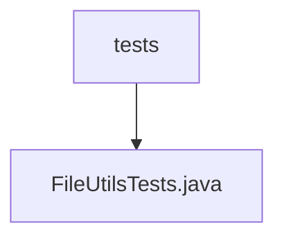

# 基础信息

|      |      |
|------|------|
| 名称 | tests |
| 编码语言 | .java |
| 代码路径 | termux-app/termux-shared/src/main/java/com/termux/shared/file/tests |
| 包名 | termux-app.termux-shared.src.main.java.com.termux.shared.file.tests |
| 概述说明 | FileUtilsTests类测试文件操作功能，包括创建、复制、移动、删除文件和目录，以及验证目录内容。 |

# 说明

FileUtilsTests类是一个用于测试FileUtils功能的工具类，主要验证文件操作如创建、复制、移动、删除目录和文件，以及处理符号链接。测试流程包括创建测试目录结构（dir1、dir2等），执行文件操作并验证结果，确保操作如预期。测试涵盖常规文件、目录、符号链接的创建与删除，文件读写，以及错误处理。通过assertEqual和assertErrnoEqual方法验证操作结果，确保文件系统操作的准确性和稳定性。测试需在verbose日志级别下运行，适用于应用启动时执行。

### 包内部结构视图

该流程图展示了Termux项目中测试目录的层级结构，tests文件夹包含一个测试文件FileUtilsTests.java。这是一个简单的单层结构，表示测试文件直接位于tests目录下，用于对文件工具类进行单元测试。路径清晰地反映了测试文件与父目录的从属关系。

# 文件列表 File List

| 名称   | 类型  | 说明 |
|-------|------|-------------|
| [FileUtilsTests.java](FileUtilsTests.md) | file | FileUtilsTests类测试文件操作功能，包括创建、复制、移动、删除文件和目录，以及验证目录内容。 |

