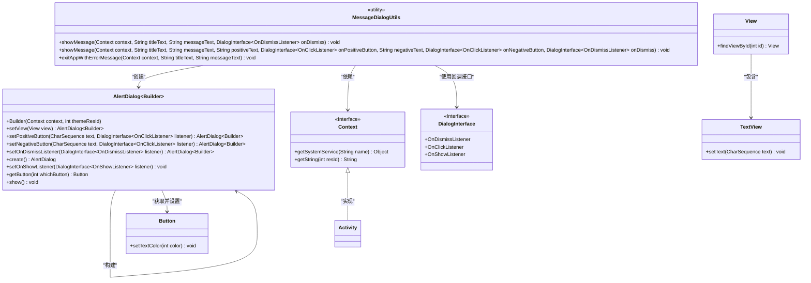
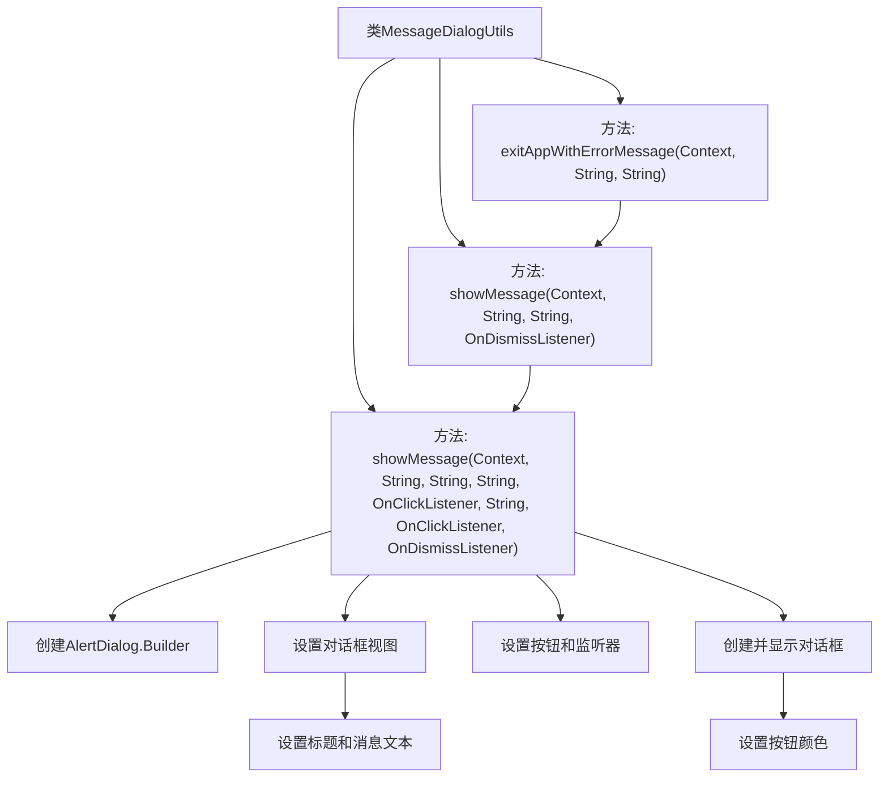

# 基础信息

|      |      |
|------|------|
| 名称 | MessageDialogUtils |
| 编码语言 | .java |
| 代码路径 | termux-app/termux-shared/src/main/java/com/termux/shared/interact/MessageDialogUtils.java |
| 包名 | com.termux.shared.interact |
| 依赖项 | ['android.app.Activity', 'android.app.AlertDialog', 'android.content.Context', 'android.content.DialogInterface', 'android.graphics.Color', 'android.view.LayoutInflater', 'android.view.View', 'android.widget.Button', 'android.widget.TextView', 'com.termux.shared.R', 'com.termux.shared.logger.Logger'] |
| 概述说明 | 显示对话框工具类，支持标题、消息、按钮及关闭监听。 |

# 说明

MessageDialogUtils是一个工具类，提供静态方法显示对话框。主要方法showMessage接受上下文、标题、消息文本及可选参数（如按钮文本和点击监听器），构建并显示AlertDialog。对话框使用自定义布局设置标题和消息，按钮文本默认为确认，可设置正负按钮及颜色。退出应用方法exitAppWithErrorMessage在显示错误信息后退出应用。要求上下文必须为Activity上下文，否则抛出异常。

# 类列表 Class Summary

| 名称   | 类型  | 说明 |
|-------|------|-------------|
| MessageDialogUtils | class | 工具类提供对话框显示功能，支持自定义标题、消息、按钮及回调。 |

## 类 MessageDialogUtils

|      |      |
|------|------|
| 访问范围 | public |
| 类型 | class |
| 名称 | MessageDialogUtils |
| 说明 | 工具类提供对话框显示功能，支持自定义标题、消息、按钮及回调。 |

### UML类图

类图描述：该图展示了MessageDialogUtils工具类与Android对话框系统的交互关系。核心是通过AlertDialog.Builder构建对话框，支持标题、消息内容和按钮的自定义配置，并处理各种回调事件。工具类封装了两种消息显示方式和一个应用退出方法，通过Context获取系统服务，使用View和TextView进行界面操作，并依赖DialogInterface的多重回调接口实现交互逻辑。

### 内部方法调用关系图

这段代码是MessageDialogUtils工具类，主要用于创建和显示自定义对话框。它包含三个主要方法：两个重载的showMessage()方法用于显示带不同按钮配置的对话框，以及exitAppWithErrorMessage()方法用于显示错误消息后退出应用。核心方法通过AlertDialog.Builder构建对话框，设置标题、消息、按钮文本及点击监听器，并自定义按钮颜色。流程图展示了方法间的调用关系和对话框创建的主要步骤。

### 字段列表 Field List

| 名称  | 类型  | 说明 |
|-------|-------|------|

### 方法列表 Method List

| 名称  | 类型  | 说明 |
|-------|-------|------|
| showMessage | void | 静态方法显示消息框，含标题、内容和关闭监听。 |
| showMessage | void | 创建自定义对话框，设置标题、消息和按钮，支持正负按钮点击及关闭监听。 |
| exitAppWithErrorMessage | void | 静态方法：显示错误消息后退出应用。参数：上下文、标题、消息。 |

