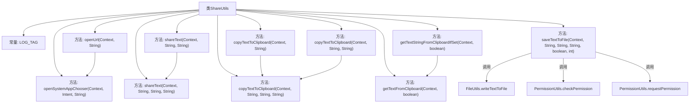
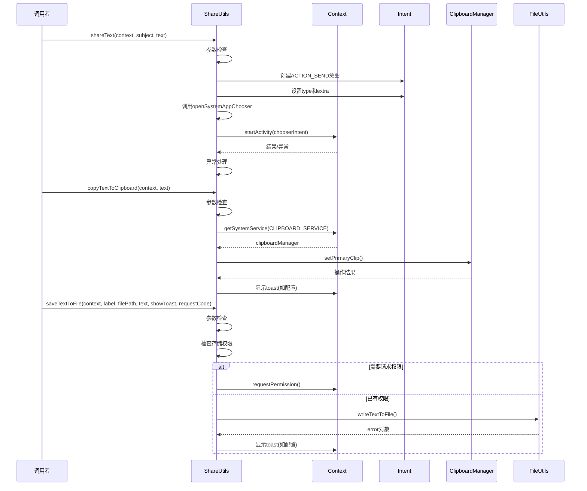

# 基础信息

|      |      |
|------|------|
| 名称 | ShareUtils |
| 编码语言 | .java |
| 代码路径 | termux-app/termux-shared/src/main/java/com/termux/shared/interact/ShareUtils.java |
| 包名 | com.termux.shared.interact |
| 依赖项 | ['android.Manifest', 'android.app.Activity', 'android.content.ActivityNotFoundException', 'android.content.ClipData', 'android.content.ClipboardManager', 'android.content.Context', 'android.content.Intent', 'android.net.Uri', 'android.os.Build', 'android.os.Environment', 'androidx.appcompat.app.AppCompatActivity', 'com.termux.shared.R', 'com.termux.shared.data.DataUtils', 'com.termux.shared.data.IntentUtils', 'com.termux.shared.file.FileUtils', 'com.termux.shared.logger.Logger', 'com.termux.shared.errors.Error', 'com.termux.shared.android.PermissionUtils', 'java.nio.charset.Charset', 'javax.annotation.Nullable'] |
| 概述说明 | ShareUtils提供系统分享、剪贴板操作、URL打开及文件保存功能。 |

# 说明

ShareUtils类提供了一系列实用功能：1.通过系统应用选择器分享内容，支持自定义标题；2.分享文本内容，可设置主题和标题；3.复制文本到剪贴板，支持剪贴标签和成功提示；4.从剪贴板获取文本，支持强制转换非文本数据；5.打开URL链接，失败时自动调用应用选择器；6.保存文本到文件，自动处理存储权限请求，支持成功提示。所有方法均包含空值检查和错误处理。

# 类列表 Class Summary

| 名称   | 类型  | 说明 |
|-------|------|-------------|
| ShareUtils | class | ShareUtils类提供系统分享、剪贴板操作、URL打开及文件保存功能。 |

## 类 ShareUtils

|      |      |
|------|------|
| 访问范围 | public |
| 类型 | class |
| 名称 | ShareUtils |
| 说明 | ShareUtils类提供系统分享、剪贴板操作、URL打开及文件保存功能。 |

### UML类图

```mermaid
classDiagram
    class ShareUtils {
        -String LOG_TAG
        +openSystemAppChooser(Context context, Intent intent, String title) void
        +shareText(Context context, String subject, String text) void
        +shareText(Context context, String subject, String text, String title) void
        +copyTextToClipboard(Context context, String text) void
        +copyTextToClipboard(Context context, String text, String toastString) void
        +copyTextToClipboard(Context context, String clipDataLabel, String text, String toastString) void
        +getTextStringFromClipboardIfSet(Context context, boolean coerceToText) String
        +getTextFromClipboard(Context context, boolean coerceToText) CharSequence
        +openUrl(Context context, String url) void
        +saveTextToFile(Context context, String label, String filePath, String text, boolean showToast, int storagePermissionRequestCode) void
    }

    class Context {
        <<Interface>>
    }

    class Intent {
        +ACTION_CHOOSER
        +EXTRA_INTENT
        +EXTRA_TITLE
        +FLAG_ACTIVITY_NEW_TASK
        +ACTION_SEND
        +EXTRA_SUBJECT
        +EXTRA_TEXT
        +ACTION_VIEW
    }

    class ClipboardManager {
        <<Interface>>
        +setPrimaryClip(ClipData clip) void
        +getPrimaryClip() ClipData
    }

    class ClipData {
        +newPlainText(String label, CharSequence text) ClipData
        +getItemAt(int index) Item
    }

    class ClipData.Item {
        +coerceToText(Context context) CharSequence
        +getText() CharSequence
    }

    class Uri {
        +parse(String uriString) Uri
    }

    class Environment {
        +getExternalStorageDirectory() File
    }

    class FileUtils {
        <<Utility>>
        +isPathInDirPath(String path, String dirPath, boolean prefixOnly) boolean
        +writeTextToFile(String label, String filePath, Charset charset, String text, boolean append) Error
    }

    class PermissionUtils {
        <<Utility>>
        +checkPermission(Context context, String permission) boolean
        +requestPermission(AppCompatActivity activity, String permission, int requestCode) void
        +requestPermission(Activity activity, String permission, int requestCode) void
    }

    class Logger {
        <<Utility>>
        +logStackTraceWithMessage(String tag, String message, Exception e) void
        +showToast(Context context, String message, boolean longDuration) void
        +logErrorAndShowToast(Context context, String tag, String message) void
        +logErrorExtended(String tag, String message) void
    }

    class DataUtils {
        <<Utility>>
        +getTruncatedCommandOutput(String text, int limit, boolean truncateAtStart, boolean returnNullIfTruncated, boolean addEllipsis) String
        +isNullOrEmpty(String str) boolean
    }

    ShareUtils --> Context : 依赖
    ShareUtils --> Intent : 使用
    ShareUtils --> ClipboardManager : 使用
    ShareUtils --> Uri : 使用
    ShareUtils --> Environment : 使用
    ShareUtils --> FileUtils : 使用
    ShareUtils --> PermissionUtils : 使用
    ShareUtils --> Logger : 使用
    ShareUtils --> DataUtils : 使用
    ClipboardManager --> ClipData : 返回
    ClipData --> ClipData.Item : 包含
    PermissionUtils --> AppCompatActivity : 依赖
    PermissionUtils --> Activity : 依赖
```

类图描述：该图展示了ShareUtils工具类的结构及其与Android系统组件的交互关系。ShareUtils提供了文本分享、剪贴板操作、URL打开和文件保存等功能，依赖Context、Intent等Android核心类，并调用Logger、DataUtils等工具类进行辅助操作。类图清晰地呈现了方法参数类型、返回值和类之间的依赖关系，特别是与系统服务(ClipboardManager)和权限管理(PermissionUtils)的交互。

### 内部方法调用关系图

这段代码实现了一个Android工具类ShareUtils，主要提供系统分享、剪贴板操作和文件保存等功能。流程图展示了类结构和主要方法调用关系，时序图则详细描述了三个核心方法（文本分享、剪贴板复制和文件保存）的执行流程。代码包含完善的参数检查、异常处理和权限管理，特别是处理了存储权限请求、剪贴板操作和系统分享选择器等复杂场景，并通过Logger进行统一错误日志记录。所有公开方法都支持链式调用和参数重载，体现了良好的API设计。

### 字段列表 Field List

| 名称  | 类型  | 说明 |
|-------|-------|------|
| LOG_TAG = "ShareUtils" | String | 私有静态常量LOG_TAG值为"ShareUtils"。 |

### 方法列表 Method List

| 名称  | 类型  | 说明 |
|-------|-------|------|
| getTextFromClipboard | CharSequence | 从剪贴板获取文本，支持强制转换，参数为空则返回空。 |
| getTextStringFromClipboardIfSet | String | 从剪贴板获取文本字符串，若为空或未设置则返回null。 |
| copyTextToClipboard | void | 复制文本到剪贴板，支持标签和提示。 |
| shareText | void | 静态方法分享文本，接收上下文、主题和文本参数，调用重载方法。 |
| openSystemAppChooser | void | 打开系统应用选择器，传入上下文、意图和标题，处理异常。 |
| copyTextToClipboard | void | 复制文本到剪贴板的静态方法，接受上下文和文本参数。 |
| copyTextToClipboard | void | 复制文本到剪贴板的静态方法，支持上下文和提示信息。 |
| shareText | void | 静态方法分享文本，检查参数后创建发送意图，设置类型和主题，截断文本后打开系统应用选择器。 |
| openUrl | void | 静态方法打开URL，检查参数后启动视图意图，异常时处理或记录错误。 |
| saveTextToFile | void | 保存文本到文件，检查权限，处理错误并显示提示。 |

