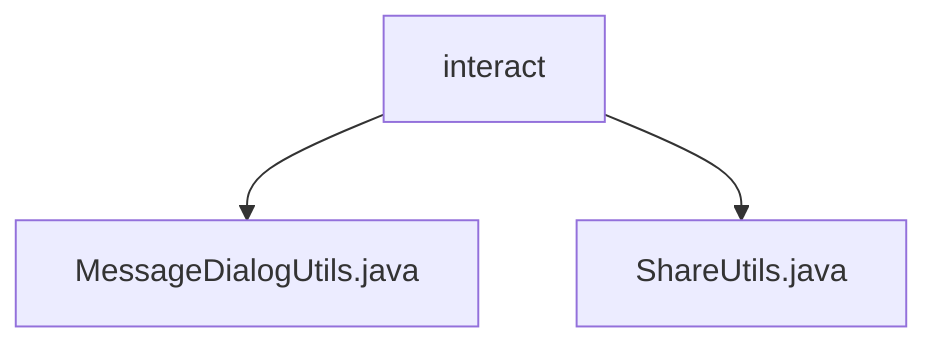

# 基础信息

|      |      |
|------|------|
| 名称 | interact |
| 编码语言 | .java |
| 代码路径 | termux-app/termux-shared/src/main/java/com/termux/shared/interact |
| 包名 | termux-app.termux-shared.src.main.java.com.termux.shared.interact |
| 概述说明 | MessageDialogUtils提供对话框显示功能，支持自定义按钮和布局。ShareUtils实现分享、复制、剪贴板操作及URL打开等功能，含错误处理。 |

# 说明

## 概述

该代码模块包含两个工具类：`MessageDialogUtils` 和 `ShareUtils`，主要用于提供交互和分享相关的实用功能。这两个类均属于 `com.termux.shared.interact` 包，旨在简化常见操作（如对话框显示、内容分享、剪贴板操作等）的实现，同时确保代码的健壮性和用户体验。

## 主要业务场景

### MessageDialogUtils
1. **对话框显示**  
   - 提供静态方法 `showMessage`，用于构建并显示自定义布局的 `AlertDialog`，支持设置标题、消息文本、按钮文本及点击监听器。
   - 默认按钮为“确认”，支持正负按钮的文本和颜色自定义。
   - 要求上下文必须为 `Activity` 上下文，否则抛出异常，确保对话框的正确显示。

2. **错误处理与退出应用**  
   - 方法 `exitAppWithErrorMessage` 在显示错误信息后退出应用，适用于需要终止应用并提示用户的场景（如致命错误）。

### ShareUtils
1. **内容分享**  
   - 通过系统应用选择器分享内容（如文本或链接），支持自定义分享标题。
   - 提供打开 URL 链接的功能，失败时自动调用应用选择器作为备用方案。

2. **剪贴板操作**  
   - 复制文本到剪贴板，支持设置剪贴标签和成功提示。
   - 从剪贴板获取文本，支持强制转换非文本数据（如 `Uri` 或 `Intent`）。

3. **文件保存**  
   - 保存文本到文件，自动处理存储权限请求，支持操作成功提示。

4. **通用处理**  
   - 所有方法均包含空值检查和错误处理，确保健壮性，避免因无效输入或操作失败导致崩溃。

### 包内部结构视图

该流程图展示了Termux项目中共享模块的交互工具类结构。根节点"interact"包含两个直接子节点：MessageDialogUtils.java（消息对话框工具类）和ShareUtils.java（共享功能工具类）。这两个Java文件位于相同的包路径层级下，属于同一功能模块的辅助工具实现，用于处理Android应用中的用户交互和内容共享操作。

# 文件列表 File List

| 名称   | 类型  | 说明 |
|-------|------|-------------|
| [MessageDialogUtils.java](MessageDialogUtils.md) | file | 显示对话框工具类，支持标题、消息、按钮及关闭监听。 |
| [ShareUtils.java](ShareUtils.md) | file | ShareUtils提供系统分享、剪贴板操作、URL打开及文件保存功能。 |

