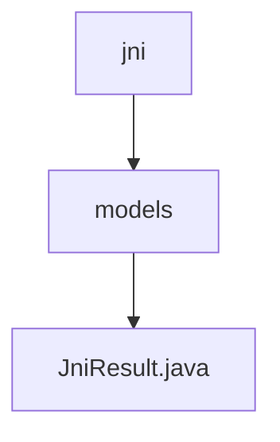

# 基础信息

|      |      |
|------|------|
| 名称 | jni |
| 编码语言 | .java |
| 代码路径 | termux-app/termux-shared/src/main/java/com/termux/shared/jni |
| 包名 | termux-app.termux-shared.src.main.java.com.termux.shared.jni |
| 概述说明 | JniResult类封装JNI调用结果，含retval、errno、errmsg和intData字段，提供错误处理功能。 |

# 说明

JniResult类用于封装JNI调用的返回结果，包含四个主要字段：retval表示调用结果（0为成功），errno记录系统调用错误码（无错误时为0），errmsg存储错误信息（包含strerror返回的errno描述），intData作为可选附加数据。提供三个构造函数：基础版本设置retval、errno和errmsg；扩展版本增加intData；异常版本通过Throwable生成错误信息。类方法getErrorString用于格式化错误信息输出，包含retval、errno和errmsg的详细日志。

### 包内部结构视图

该流程图展示了Termux项目中JNI模块的层级结构。根节点"jni"包含一个子目录"models"，而该子目录下包含具体的Java类文件"JniResult.java"。这种三层结构清晰地反映了代码的组织方式，其中顶层是功能模块，中间层是数据模型分类，底层是具体的实现类。整个结构简洁明了，符合Java项目的典型包组织规范。

# 文件列表 File List

| 名称   | 类型  | 说明 |
|-------|------|-------------|
| [models](models/_module.md) | package | JniResult类封装JNI调用结果，含retval、errno、errmsg和intData字段，提供错误处理功能。 |

