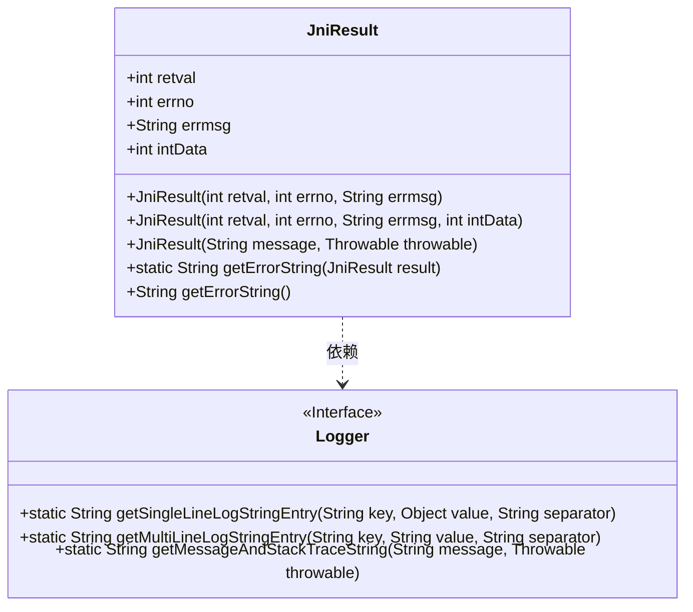
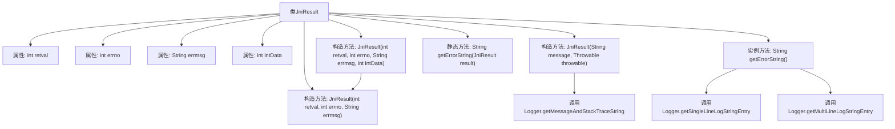

# 基础信息

|      |      |
|------|------|
| 名称 | JniResult |
| 编码语言 | .java |
| 代码路径 | termux-app/termux-shared/src/main/java/com/termux/shared/jni/models/JniResult.java |
| 包名 | com.termux.shared.jni.models |
| 依赖项 | ['androidx.annotation.Keep', 'androidx.annotation.NonNull', 'com.termux.shared.logger.Logger'] |
| 概述说明 | JniResult类封装JNI调用结果，含retval、errno、errmsg和intData字段，提供错误处理功能。 |

# 说明

JniResult类用于封装JNI调用的返回结果，包含四个主要字段：retval表示调用结果（0为成功），errno记录系统调用错误码（无错误时为0），errmsg存储错误信息（包含strerror返回的errno描述），intData作为可选附加数据。提供三个构造函数：基础版本设置retval、errno和errmsg；扩展版本增加intData；异常版本通过Throwable生成错误信息。类方法getErrorString用于格式化错误信息输出，包含retval、errno和errmsg的详细日志。

# 类列表 Class Summary

| 名称   | 类型  | 说明 |
|-------|------|-------------|
| JniResult | class | JniResult类封装JNI调用结果，含返回值、错误码、错误消息及可选数据。 |

## 类 JniResult

|      |      |
|------|------|
| 访问范围 | @Keep;public |
| 类型 | class |
| 名称 | JniResult |
| 说明 | JniResult类封装JNI调用结果，含返回值、错误码、错误消息及可选数据。 |

### UML类图

类图描述：
JniResult类用于封装JNI调用的返回结果，包含retval返回值、errno错误码、errmsg错误消息和intData额外数据四个公有字段。提供三种构造函数，支持从基本参数或Throwable对象构造实例。通过getErrorString方法生成格式化错误信息，依赖Logger接口提供的日志格式化方法。Logger作为接口提供静态工具方法，用于生成单行/多行日志条目和异常堆栈信息。

### 内部方法调用关系图

这段代码定义了一个用于封装JNI调用结果的JniResult类，包含四个核心属性：retval(返回值)、errno(错误码)、errmsg(错误信息)和intData(附加数据)。类提供了三种构造方法：基础构造方法、带附加数据的构造方法、以及从异常创建结果的构造方法。最重要的功能是通过getErrorString方法生成格式化的错误日志字符串，该方法会调用Logger工具类的方法来格式化各个字段。流程图清晰展示了类结构、属性关系和方法调用链，特别是构造方法之间的复用关系和日志工具类的调用细节。

### 字段列表 Field List

| 名称  | 类型  | 说明 |
|-------|-------|------|
| errno | int | 整型错误码变量errno |
| retval | int | 整型返回值变量retval。 |
| errmsg | String | 字符串类型错误信息变量。 |
| intData | int | 声明一个公共整型变量intData。 |

### 方法列表 Method List

| 名称  | 类型  | 说明 |
|-------|-------|------|
| getErrorString | String | 非空检查方法，返回JniResult的错误字符串或"null"。 |
| getErrorString | String | 方法生成错误日志字符串，包含返回值、错误号和错误信息。 |

