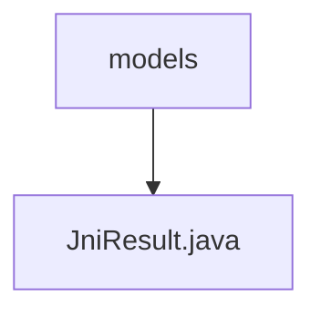

# 基础信息

|      |      |
|------|------|
| 名称 | models |
| 编码语言 | .java |
| 代码路径 | termux-app/termux-shared/src/main/java/com/termux/shared/jni/models |
| 包名 | termux-app.termux-shared.src.main.java.com.termux.shared.jni.models |
| 概述说明 | JniResult类封装JNI调用结果，含retval、errno、errmsg和intData字段，提供错误处理功能。 |

# 说明

JniResult类用于封装JNI调用的返回结果，包含四个主要字段：retval表示调用结果（0为成功），errno记录系统调用错误码（无错误时为0），errmsg存储错误信息（包含strerror返回的errno描述），intData作为可选附加数据。提供三个构造函数：基础版本设置retval、errno和errmsg；扩展版本增加intData；异常版本通过Throwable生成错误信息。类方法getErrorString用于格式化错误信息输出，包含retval、errno和errmsg的详细日志。

### 包内部结构视图

该流程图展示了Termux项目中JNI模块的层级结构，models文件夹作为父节点包含JniResult.java文件。这种结构体现了Java项目中典型的包-类关系，其中models作为JNI相关数据模型的存储目录，JniResult.java则是处理JNI调用结果的实体类。整个结构简洁清晰地反映了代码的组织方式。

# 文件列表 File List

| 名称   | 类型  | 说明 |
|-------|------|-------------|
| [JniResult.java](JniResult.md) | file | JniResult类封装JNI调用结果，含retval、errno、errmsg和intData字段，提供错误处理功能。 |

