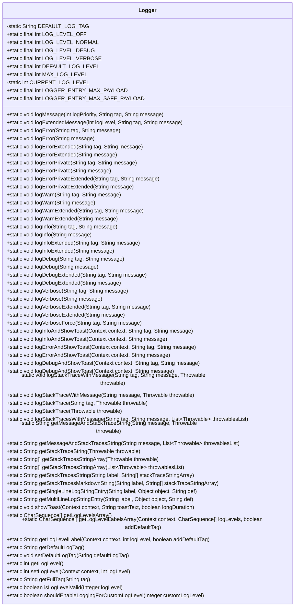
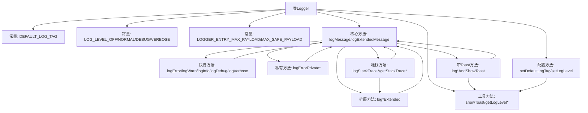
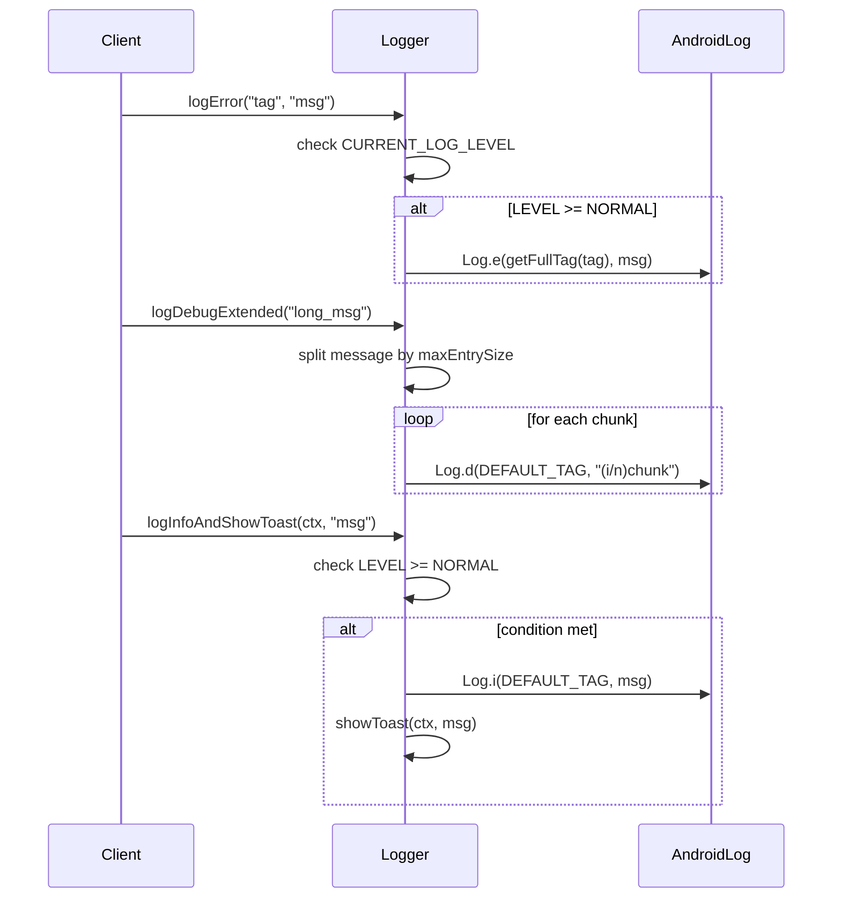

# 基础信息

|      |      |
|------|------|
| 名称 | Logger |
| 编码语言 | .java |
| 代码路径 | termux-app/termux-shared/src/main/java/com/termux/shared/logger/Logger.java |
| 包名 | com.termux.shared.logger |
| 依赖项 | ['android.content.Context', 'android.os.Handler', 'android.os.Looper', 'android.util.Log', 'android.widget.Toast', 'androidx.annotation.NonNull', 'com.termux.shared.R', 'com.termux.shared.data.DataUtils', 'java.io.IOException', 'java.io.PrintWriter', 'java.io.StringWriter', 'java.util.ArrayList', 'java.util.Collections', 'java.util.List'] |
| 概述说明 | Logger类提供多级别日志功能，支持错误、警告、信息、调试和详细日志，包含日志分段和Toast显示功能。 |

# 说明

这是一个功能全面的日志工具类，提供多级别日志记录功能。包含五个日志级别：关闭、普通、调试、详细，默认级别为普通。支持错误、警告、信息、调试和详细级别的日志记录，并提供了扩展方法处理超长日志内容的分段输出。类中还包含日志标签管理、堆栈跟踪记录、Toast提示集成等功能，同时确保日志标签长度兼容不同Android版本。提供了日志级别验证和自定义日志级别控制机制，支持获取日志级别标签和默认值检查。

# 类列表 Class Summary

| 名称   | 类型  | 说明 |
|-------|------|-------------|
| Logger | class | Logger类提供多级别日志功能，支持错误、警告、信息、调试和详细日志，可设置日志级别和标签，支持长消息分割和堆栈跟踪记录。 |

## 类 Logger

|      |      |
|------|------|
| 访问范围 | public |
| 类型 | class |
| 名称 | Logger |
| 说明 | Logger类提供多级别日志功能，支持错误、警告、信息、调试和详细日志，可设置日志级别和标签，支持长消息分割和堆栈跟踪记录。 |

### UML类图

这段代码定义了一个名为Logger的工具类，主要用于Android应用的日志记录功能。该类提供了多种日志级别（OFF/NORMAL/DEBUG/VERBOSE）和丰富的日志方法，包括常规日志、扩展日志（处理长消息）、带Toast显示的日志、异常堆栈跟踪日志等。它还包含日志标签管理、日志级别控制、字符串格式化等辅助功能，并考虑了Android系统的日志长度限制（4068字节）和标签长度限制（23字符）。所有方法均为静态方法，可直接通过类名调用。

### 内部方法调用关系图

该流程图展示了Logger类的完整架构，包含常量定义、核心日志记录方法、快捷方法、带Toast的扩展方法以及堆栈跟踪处理功能。核心方法logMessage根据当前日志级别决定是否输出到Android Log系统，logExtendedMessage处理超长消息分块。时序图演示了三种典型调用场景：基础日志记录、分块日志记录和带Toast的日志记录，体现了日志级别检查、消息处理和系统调用的完整流程。

### 字段列表 Field List

| 名称  | 类型  | 说明 |
|-------|-------|------|
| LOG_LEVEL_DEBUG = 2 | int | 定义调试日志级别常量，值为2。 |
| LOG_LEVEL_VERBOSE = 3 | int | 定义日志级别常量VERBOSE，值为3。 |
| LOG_LEVEL_OFF = 0 | int | 静态常量LOG_LEVEL_OFF值为0，表示关闭日志级别。 |
| LOGGER_ENTRY_MAX_SAFE_PAYLOAD = 4000 | int | 日志条目最大安全载荷4000 |
| LOG_LEVEL_NORMAL = 1 | int | 静态常量LOG_LEVEL_NORMAL值为1。 |
| DEFAULT_LOG_TAG = "Logger" | String | 默认日志标签为"Logger"。 |
| LOGGER_ENTRY_MAX_PAYLOAD = 4068 | int | 日志条目最大载荷4068字节 |
| MAX_LOG_LEVEL = LOG_LEVEL_VERBOSE | int | 定义常量MAX_LOG_LEVEL，值为LOG_LEVEL_VERBOSE。 |
| CURRENT_LOG_LEVEL = DEFAULT_LOG_LEVEL | int | 私有静态整型变量，记录当前日志级别，默认值为DEFAULT_LOG_LEVEL。 |
| DEFAULT_LOG_LEVEL = LOG_LEVEL_NORMAL | int | 定义默认日志级别常量，值为正常级别。 |

### 方法列表 Method List

| 名称  | 类型  | 说明 |
|-------|-------|------|
| logStackTrace | void | 静态方法logStackTrace记录异常堆栈信息，默认标签无消息。 |
| logStackTrace | void | 静态方法logStackTrace记录异常堆栈，调用logStackTraceWithMessage处理。 |
| logInfo | void | 静态方法logInfo记录信息日志，参数为标签和消息。 |
| logInfoAndShowToast | void | 静态方法记录日志并显示Toast，使用默认标签和消息。 |
| logVerbose | void | 静态方法logVerbose用标签和信息记录详细日志。 |
| setLogLevel | int | 设置日志级别并显示提示，返回当前级别。 |
| logErrorPrivate | void | 静态方法logErrorPrivate在日志级别达标时记录错误信息。 |
| getLogLevelLabel | String | 根据日志级别返回标签，含默认标记选项。 |
| logMessage | void | 根据日志优先级和当前级别输出不同日志信息。 |
| getLogLevelsArray | CharSequence[] | 静态方法返回日志级别数组：关闭、常规、调试、详细。 |
| logWarn | void | 静态方法logWarn记录警告级别日志，调用logMessage处理。 |
| getMultiLineLogStringEntry | String | 静态方法生成带标签的多行日志字符串，对象非空时格式化输出，否则返回默认值。 |
| logErrorPrivate | void | 静态方法logErrorPrivate在日志级别达标时记录错误信息。 |
| getStackTracesString | String | 静态方法拼接带标签的堆栈跟踪字符串，处理空数组并格式化输出。 |
| logWarn | void | 静态方法logWarn记录警告日志，调用logMessage并传入WARN级别。 |
| getStackTracesStringArray | String[] | 将异常列表转为堆栈字符串数组，空输入返回空。 |
| setDefaultLogTag | void | 设置默认日志标签，超23字符截断至22字符。 |
| getLogLevel | int | 获取当前日志级别 |
| logInfoExtended | void | 静态方法logInfoExtended记录扩展信息日志，调用logExtendedMessage处理。 |
| logDebug | void | 静态方法logDebug，以DEBUG级别记录消息。 |
| logError | void | 静态方法logError记录错误信息，调用logMessage处理。 |
| getMessageAndStackTracesString | String | 合并消息和异常堆栈，无输入返回空，否则组合输出。 |
| getMessageAndStackTraceString | String | 静态方法合并消息与异常堆栈，无输入返回空，否则组合或单独返回。 |
| logDebug | void | 静态方法logDebug用于记录调试信息，调用logMessage处理。 |
| getSingleLineLogStringEntry | String | 静态方法生成带标签的单行日志字符串，对象非空时显示值，否则显示默认值。 |
| logInfoAndShowToast | void | 静态方法logInfoAndShowToast在日志级别达标时记录日志并显示Toast。 |
| logStackTraceWithMessage | void | 记录带消息的堆栈跟踪，调用默认标签方法。 |
| logVerboseExtended | void | 静态方法logVerboseExtended记录详细日志消息。 |
| getLogLevelLabelsArray | CharSequence[] | 静态方法获取日志级别标签数组，处理空值并遍历生成标签。 |
| getStackTraceString | String | 获取异常堆栈信息字符串，处理异常并返回堆栈字符串。 |
| logExtendedMessage | void | 静态方法分割长日志消息为多段，添加序号前缀后逐条记录。 |
| logStackTracesWithMessage | void | 记录带消息的堆栈跟踪 |
| logVerboseForce | void | 静态方法logVerboseForce用于记录详细日志，参数为标签和信息。 |
| logWarnExtended | void | 静态方法logWarnExtended用于记录带标签的警告日志。 |
| logErrorAndShowToast | void | 静态方法记录错误并显示提示，参数为上下文和消息。 |
| getDefaultLogTag | String | 获取默认日志标签的方法，返回预设常量DEFAULT_LOG_TAG。 |
| logDebugAndShowToast | void | 静态方法：调试日志并显示Toast，需上下文、标签和消息。 |
| showToast | void | 显示Toast的静态方法，检查上下文和文本后，在主线程中显示长短时长Toast。 |
| logError | void | 静态方法logError记录错误日志，参数为标签和消息。 |
| logErrorPrivateExtended | void | 静态方法logErrorPrivateExtended在日志级别为DEBUG时记录错误信息。 |
| logWarnExtended | void | 静态方法记录警告信息，调用logExtendedMessage输出。 |
| logDebugAndShowToast | void | 静态方法：记录调试日志并显示Toast，使用默认标签和消息。 |
| logDebugExtended | void | 静态方法logDebugExtended记录调试信息，调用logExtendedMessage处理。 |
| logErrorExtended | void | 静态方法logErrorExtended记录带标签的错误日志信息。 |
| logVerbose | void | 静态方法logVerbose记录详细日志消息。 |
| logErrorPrivateExtended | void | 静态方法logErrorPrivateExtended在调试级别下记录带标签的错误信息。 |
| getStackTracesStringArray | String[] | 获取异常的堆栈跟踪字符串数组。 |
| logInfoExtended | void | 静态方法logInfoExtended记录INFO级别日志，使用默认标签和消息。 |
| logStackTraceWithMessage | void | 静态方法记录带消息的异常堆栈。 |
| getStackTracesMarkdownString | String | 生成带标签的堆栈跟踪Markdown字符串，支持多堆栈格式化输出。 |
| logDebugExtended | void | 静态方法logDebugExtended用于记录调试信息，调用logExtendedMessage。 |
| logErrorAndShowToast | void | 静态方法记录错误并显示提示，需上下文、标签和消息。 |
| logInfo | void | 静态方法logInfo记录信息级别日志，使用默认标签和指定消息。 |
| logVerboseExtended | void | 静态方法logVerboseExtended记录详细日志信息。 |
| logErrorExtended | void | 静态方法logErrorExtended记录错误信息，调用logExtendedMessage处理。 |
| getFullTag | String | 静态方法getFullTag：若tag为默认标签则返回原值，否则返回默认标签加后缀。 |
| isLogLevelValid | boolean | 检查日志级别是否有效：非空且在最小和最大级别之间。 |
| shouldEnableLoggingForCustomLogLevel | boolean | 静态方法判断是否启用自定义日志级别，基于当前级别和输入值决定。 |

