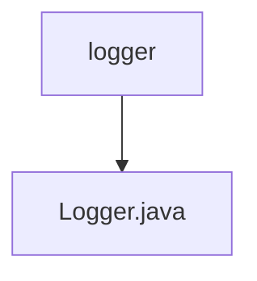

# 基础信息

|      |      |
|------|------|
| 名称 | logger |
| 编码语言 | .java |
| 代码路径 | termux-app/termux-shared/src/main/java/com/termux/shared/logger |
| 包名 | termux-app.termux-shared.src.main.java.com.termux.shared.logger |
| 概述说明 | Logger类提供多级别日志功能，支持错误、警告、信息、调试和详细日志，包含日志分段和Toast显示功能。 |

# 说明

这是一个功能全面的日志工具类，提供多级别日志记录功能。包含五个日志级别：关闭、普通、调试、详细，默认级别为普通。支持错误、警告、信息、调试和详细级别的日志记录，并提供了扩展方法处理超长日志内容的分段输出。类中还包含日志标签管理、堆栈跟踪记录、Toast提示集成等功能，同时确保日志标签长度兼容不同Android版本。提供了日志级别验证和自定义日志级别控制机制，支持获取日志级别标签和默认值检查。

### 包内部结构视图

该流程图展示了Termux项目中logger模块的简单结构。根节点"logger"代表日志模块目录，其下级只有一个Java文件"Logger.java"，这是该模块的核心实现文件。这种简洁的结构表明这是一个功能集中的单一用途模块，专门处理应用程序的日志记录功能。

# 文件列表 File List

| 名称   | 类型  | 说明 |
|-------|------|-------------|
| [Logger.java](Logger.md) | file | Logger类提供多级别日志功能，支持错误、警告、信息、调试和详细日志，包含日志分段和Toast显示功能。 |

