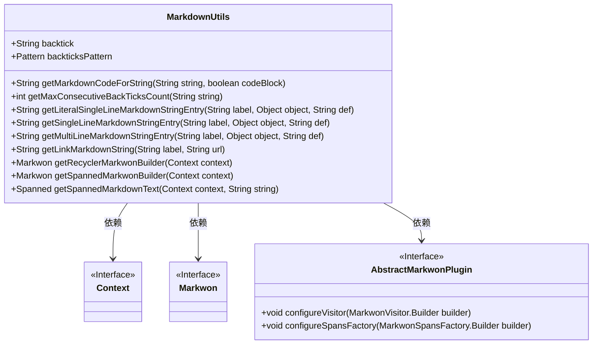
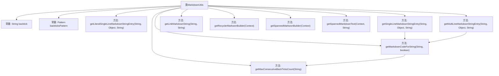

# 基础信息

|      |      |
|------|------|
| 名称 | MarkdownUtils |
| 编码语言 | .java |
| 代码路径 | termux-app/termux-shared/src/main/java/com/termux/shared/markdown/MarkdownUtils.java |
| 包名 | com.termux.shared.markdown |
| 依赖项 | ['android.content.Context', 'android.graphics.Typeface', 'android.text.Spanned', 'android.text.style.AbsoluteSizeSpan', 'android.text.style.BackgroundColorSpan', 'android.text.style.BulletSpan', 'android.text.style.QuoteSpan', 'android.text.style.StrikethroughSpan', 'android.text.style.StyleSpan', 'android.text.style.TypefaceSpan', 'android.text.util.Linkify', 'androidx.annotation.NonNull', 'androidx.core.content.ContextCompat', 'com.google.common.base.Strings', 'com.termux.shared.R', 'com.termux.shared.theme.ThemeUtils', 'org.commonmark.ext.gfm.strikethrough.Strikethrough', 'org.commonmark.node.BlockQuote', 'org.commonmark.node.Code', 'org.commonmark.node.Emphasis', 'org.commonmark.node.FencedCodeBlock', 'org.commonmark.node.ListItem', 'org.commonmark.node.StrongEmphasis', 'java.util.regex.Matcher', 'java.util.regex.Pattern', 'io.noties.markwon.AbstractMarkwonPlugin', 'io.noties.markwon.Markwon', 'io.noties.markwon.MarkwonSpansFactory', 'io.noties.markwon.MarkwonVisitor', 'io.noties.markwon.ext.strikethrough.StrikethroughPlugin', 'io.noties.markwon.linkify.LinkifyPlugin'] |
| 概述说明 | 工具类MarkdownUtils提供Markdown字符串处理及渲染功能。 |

# 说明

该代码定义了一个MarkdownUtils工具类，主要用于处理Markdown文本格式转换。核心功能包括：转义字符串中的反引号以生成代码块或内联代码；计算字符串中连续反引号的最大数量；生成带标签的单行/多行Markdown文本条目；创建Markdown链接。还提供了两个Markwon构建器：一个用于RecyclerView，支持代码高亮和主题适配；另一个用于生成Spanned文本，支持斜体、粗体、删除线等样式。工具类封装了Markdown解析和渲染的常用操作。

# 类列表 Class Summary

| 名称   | 类型  | 说明 |
|-------|------|-------------|
| MarkdownUtils | class | 工具类MarkdownUtils，提供字符串转Markdown代码、链接生成及样式构建功能。 |

## 类 MarkdownUtils

|      |      |
|------|------|
| 访问范围 | public |
| 类型 | class |
| 名称 | MarkdownUtils |
| 说明 | 工具类MarkdownUtils，提供字符串转Markdown代码、链接生成及样式构建功能。 |

### UML类图

这段代码定义了一个`MarkdownUtils`工具类，主要用于处理Markdown文本的格式化和渲染。它包含多个静态方法，能够生成带格式的Markdown字符串、构建Markwon渲染器实例，并处理Markdown文本的转义和样式。类中使用了`Context`、`Markwon`和`AbstractMarkwonPlugin`等接口，通过依赖关系实现Markdown文本的解析和渲染功能。特别值得注意的是，它能够智能处理反引号的转义，并支持代码块和内联代码的不同格式化需求。

### 内部方法调用关系图

该流程图展示了MarkdownUtils类的结构及其方法调用关系。类包含2个常量和9个方法，核心方法getMarkdownCodeForString()依赖getMaxConsecutiveBackTicksCount()来计算反引号数量，其他格式化方法（如getSingleLineMarkdownStringEntry）会调用核心方法。最后三个方法处理Markwon构建器和Markdown文本转换，形成完整的Markdown处理工具链。

### 字段列表 Field List

| 名称  | 类型  | 说明 |
|-------|-------|------|
| backtick = "`" | String | 定义静态常量字符串backtick值为"`"。 |
| backticksPattern = Pattern.compile("(" + backtick + "+)") | Pattern | 定义正则模式匹配连续反引号。 |

### 方法列表 Method List

| 名称  | 类型  | 说明 |
|-------|-------|------|
| getMultiLineMarkdownStringEntry | String | 静态方法生成带标签的多行Markdown字符串，非空时格式化输出，否则返回默认值。 |
| getRecyclerMarkwonBuilder | Markwon | 创建Markwon构建器，配置链接、代码块高亮和夜间模式适配。 |
| getSingleLineMarkdownStringEntry | String | 静态方法生成带标签的Markdown单行字符串，非空时显示对象值，否则显示默认值。 |
| getMaxConsecutiveBackTicksCount | int | 计算字符串中连续反引号的最大数量。 |
| getMarkdownCodeForString | String | 生成Markdown代码块或行内代码，处理字符串中的反引号。 |
| getLiteralSingleLineMarkdownStringEntry | String | 生成单行Markdown格式字符串，包含标签、对象值或默认值。 |
| getLinkMarkdownString | String | 静态方法生成Markdown链接，处理特殊字符，无URL返回标签。 |
| getSpannedMarkwonBuilder | Markwon | 创建Markwon实例，配置斜体、粗体、引用、删除线、代码背景色和列表样式。 |
| getSpannedMarkdownText | Spanned | 静态方法，传入上下文和字符串，返回Markdown格式文本。 |

