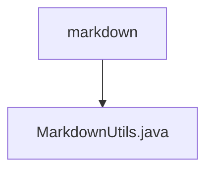

# 基础信息

|      |      |
|------|------|
| 名称 | markdown |
| 编码语言 | .java |
| 代码路径 | termux-app/termux-shared/src/main/java/com/termux/shared/markdown |
| 包名 | termux-app.termux-shared.src.main.java.com.termux.shared.markdown |
| 概述说明 | 工具类MarkdownUtils提供Markdown字符串处理及渲染功能。 |

# 说明

该代码定义了一个MarkdownUtils工具类，主要用于处理Markdown文本格式转换。核心功能包括：转义字符串中的反引号以生成代码块或内联代码；计算字符串中连续反引号的最大数量；生成带标签的单行/多行Markdown文本条目；创建Markdown链接。还提供了两个Markwon构建器：一个用于RecyclerView，支持代码高亮和主题适配；另一个用于生成Spanned文本，支持斜体、粗体、删除线等样式。工具类封装了Markdown解析和渲染的常用操作。

### 包内部结构视图

该流程图展示了Termux项目中markdown模块的层级结构，其中markdown目录下包含一个MarkdownUtils.java文件。这种简洁的层级关系体现了模块化设计思想，便于开发者快速定位工具类文件。图表严格遵循了只显示末端节点名称的规则，准确反映了给定路径的父子关系。

# 文件列表 File List

| 名称   | 类型  | 说明 |
|-------|------|-------------|
| [MarkdownUtils.java](MarkdownUtils.md) | file | 工具类MarkdownUtils提供Markdown字符串处理及渲染功能。 |

