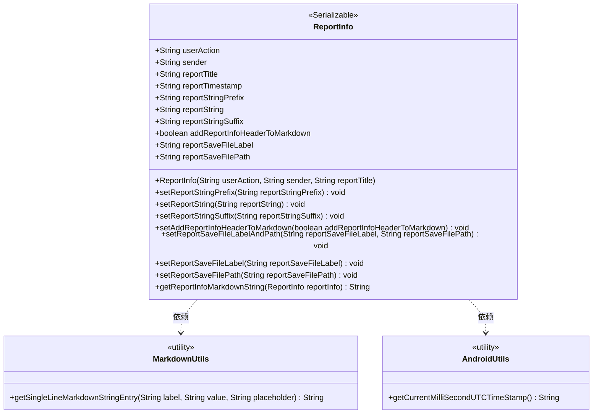

# 基础信息

|      |      |
|------|------|
| 名称 | ReportInfo |
| 编码语言 | .java |
| 代码路径 | termux-app/termux-shared/src/main/java/com/termux/shared/models/ReportInfo.java |
| 包名 | com.termux.shared.models |
| 依赖项 | ['com.termux.shared.markdown.MarkdownUtils', 'com.termux.shared.android.AndroidUtils', 'java.io.Serializable'] |
| 概述说明 | 报告信息类，包含用户操作、发送者、标题、时间戳及报告内容，支持生成Markdown格式。 |

# 说明

该内容描述了一个名为ReportInfo的Java类，用于存储和生成报告信息。类中包含多个字段，包括用户操作、发送者、报告标题、时间戳、报告文本前缀、报告文本、报告文本后缀等。此外，还提供了设置这些字段的方法。类中有一个静态方法getReportInfoMarkdownString，用于将ReportInfo对象转换为Markdown格式的字符串。该方法会根据设置决定是否添加报告头信息，并拼接报告文本内容。整个类实现了Serializable接口，支持序列化。

# 类列表 Class Summary

| 名称   | 类型  | 说明 |
|-------|------|-------------|
| ReportInfo | class | 报告信息类，包含用户操作、发送者、标题、时间戳及报告内容，支持生成Markdown格式。 |

## 类 ReportInfo

|      |      |
|------|------|
| 访问范围 | public |
| 类型 | class |
| 名称 | ReportInfo |
| 说明 | 报告信息类，包含用户操作、发送者、标题、时间戳及报告内容，支持生成Markdown格式。 |

### UML类图

该类图展示了`ReportInfo`类的结构及其与工具类的关系。`ReportInfo`是一个可序列化的报告信息类，包含用户行为、发送者、标题等核心字段，以及报告内容的前缀/后缀、文件保存路径等配置项。通过`getReportInfoMarkdownString`方法可将对象转换为Markdown格式，期间依赖`MarkdownUtils`进行字符串格式化，并调用`AndroidUtils`获取时间戳。所有字段均为公开，提供链式设置方法，支持灵活构建报告内容。

### 内部方法调用关系图

```mermaid
graph TD
    A["类ReportInfo"]
    B["final属性: String userAction"]
    C["final属性: String sender"]
    D["final属性: String reportTitle"]
    E["final属性: String reportTimestamp"]
    F["可变属性: String reportStringPrefix"]
    G["可变属性: String reportString"]
    H["可变属性: String reportStringSuffix"]
    I["属性: boolean addReportInfoHeaderToMarkdown"]
    J["属性: String reportSaveFileLabel"]
    K["属性: String reportSaveFilePath"]
    L["构造方法: ReportInfo(userAction, sender, reportTitle)"]
    M["方法: setReportStringPrefix(prefix)"]
    N["方法: setReportString(string)"]
    O["方法: setReportStringSuffix(suffix)"]
    P["方法: setAddReportInfoHeaderToMarkdown(flag)"]
    Q["方法: setReportSaveFileLabelAndPath(label, path)"]
    R["方法: setReportSaveFileLabel(label)"]
    S["方法: setReportSaveFilePath(path)"]
    T["静态方法: getReportInfoMarkdownString(reportInfo)"]
    U["调用: AndroidUtils.getCurrentMilliSecondUTCTimeStamp()"]
    V["调用: MarkdownUtils.getSingleLineMarkdownStringEntry()"]
    W["StringBuilder操作"]

    A --> B
    A --> C
    A --> D
    A --> E
    A --> F
    A --> G
    A --> H
    A --> I
    A --> J
    A --> K
    A --> L
    A --> M
    A --> N
    A --> O
    A --> P
    A --> Q
    Q --> R
    Q --> S
    A --> T
    L --> U
    T --> V
    T --> W
```

该流程图展示了ReportInfo类的完整结构，包含5个final属性和6个可变属性，以及9个方法。核心功能是通过构造方法初始化报告基本信息，通过setter方法设置报告内容，最终通过静态方法getReportInfoMarkdownString将报告转换为Markdown格式字符串。转换过程中会根据标志决定是否添加报告头信息，并调用MarkdownUtils工具类进行格式化处理。所有属性设置方法都采用链式调用设计，特别是文件保存路径设置采用了组合方法模式。

### 字段列表 Field List

| 名称  | 类型  | 说明 |
|-------|-------|------|
| reportStringSuffix | String | 公开字符串后缀变量reportStringSuffix。 |
| reportString | String | 公开字符串变量reportString。 |
| sender | String | 公开不可变的字符串变量sender。 |
| userAction | String | 用户操作字符串不可变。 |
| reportSaveFileLabel | String | 保存文件标签字段 |
| reportSaveFilePath | String | 字符串变量reportSaveFilePath，用于存储文件保存路径。 |
| addReportInfoHeaderToMarkdown = false | boolean | 添加报告信息头到Markdown的开关设为关闭。 |
| reportStringPrefix | String | 字符串报告前缀变量。 |
| reportTitle | String | 公开不可变的报告标题字符串。 |
| reportTimestamp | String | 公开不可变字符串报告时间戳 |

### 方法列表 Method List

| 名称  | 类型  | 说明 |
|-------|-------|------|
| setReportStringPrefix | void | 设置报告字符串前缀的方法。 |
| setReportString | void | 设置报告字符串的方法。 |
| setAddReportInfoHeaderToMarkdown | void | 设置是否将报告信息头添加到Markdown的布尔方法。 |
| setReportSaveFileLabelAndPath | void | 设置报告保存标签和路径的方法。 |
| setReportSaveFilePath | void | 设置报告保存路径的方法。 |
| getReportInfoMarkdownString | String | 生成报告信息的Markdown字符串，包含用户操作、发送者和时间戳。 |
| setReportStringSuffix | void | 设置报告字符串后缀的方法。 |
| setReportSaveFileLabel | void | 设置报告保存文件标签的方法。 |

