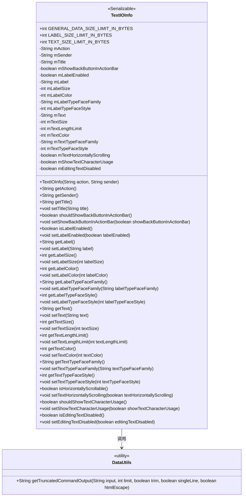

# 基础信息

|      |      |
|------|------|
| 名称 | TextIOInfo |
| 编码语言 | .java |
| 代码路径 | termux-app/termux-shared/src/main/java/com/termux/shared/models/TextIOInfo.java |
| 包名 | com.termux.shared.models |
| 依赖项 | ['android.graphics.Color', 'android.graphics.Typeface', 'androidx.annotation.NonNull', 'com.termux.shared.activities.TextIOActivity', 'com.termux.shared.data.DataUtils', 'java.io.Serializable'] |
| 概述说明 | TextIOInfo类定义文本输入配置，包含标签和文本的样式、大小限制及显示控制。 |

# 说明

TextIOInfo是一个实现Serializable接口的类，用于配置文本输入界面的属性。它定义了数据大小限制：通用数据1000字节，标签4000字节，文本小于100KB。类包含启动TextIOActivity的动作和发送者信息，以及标题、返回按钮显示等全局设置。标签和文本部分分别控制是否启用、内容、大小、颜色、字体等样式属性。文本部分还支持水平滚动、字符使用统计和禁用编辑功能。所有设置方法均提供getter和setter，并对输入数据进行长度限制处理。

# 类列表 Class Summary

| 名称   | 类型  | 说明 |
|-------|------|-------------|
| TextIOInfo | class | TextIOInfo类定义文本输入配置，包含标签和文本的样式、大小限制及显示控制。 |

## 类 TextIOInfo

|      |      |
|------|------|
| 访问范围 | public |
| 类型 | class |
| 名称 | TextIOInfo |
| 说明 | TextIOInfo类定义文本输入配置，包含标签和文本的样式、大小限制及显示控制。 |

### UML类图

该图展示了一个实现Serializable接口的TextIOInfo类，包含文本输入输出的配置参数（如大小限制、颜色、字体等）和操作方法。类通过DataUtils工具类进行字符串截断处理，主要用于Android应用中文本输入界面的配置管理。所有字段均为私有，通过getter/setter方法访问，符合JavaBean规范。

### 内部方法调用关系图

```mermaid
graph TD
    A["类TextIOInfo"]
    B["常量: GENERAL_DATA_SIZE_LIMIT_IN_BYTES=1000"]
    C["常量: LABEL_SIZE_LIMIT_IN_BYTES=4000"]
    D["常量: TEXT_SIZE_LIMIT_IN_BYTES=95000"]
    E["属性: String mAction"]
    F["属性: String mSender"]
    G["属性: String mTitle"]
    H["属性: boolean mShowBackButtonInActionBar"]
    I["属性组: Label相关(5个)"]
    J["属性组: Text相关(10个)"]
    K["构造方法: TextIOInfo(String action, String sender)"]
    L["方法组: Action/Sender/Title/BackButton(4对getter/setter)"]
    M["方法组: Label配置(7对getter/setter)"]
    N["方法组: Text配置(11对getter/setter)"]

    A --> B
    A --> C
    A --> D
    A --> E
    A --> F
    A --> G
    A --> H
    A --> I
    A --> J
    A --> K
    A --> L
    A --> M
    A --> N
```

该流程图展示了TextIOInfo类的完整结构，包含3个静态常量、7个核心属性（分为基础配置、Label和Text三组）以及对应的构造方法和配置方法。其中Label和Text属性组各自包含多个样式控制字段，所有字段都通过规范的getter/setter方法进行访问控制，特别值得注意的是setText()和setLabel()方法会通过DataUtils进行长度截断处理。类设计符合Android组件配置模式，支持文本输入界面的全方位定制。

### 字段列表 Field List

| 名称  | 类型  | 说明 |
|-------|-------|------|
| mTextHorizontallyScrolling = false | boolean | 私有布尔变量mTextHorizontallyScrolling初始值为false。 |
| mTextColor = Color.BLACK | int | 定义私有整型变量mTextColor，初始值为黑色。 |
| mAction | String | 私有字符串变量mAction |
| TEXT_SIZE_LIMIT_IN_BYTES = 100000 - GENERAL_DATA_SIZE_LIMIT_IN_BYTES - LABEL_SIZE_LIMIT_IN_BYTES | int | 文本大小限制为总字节数减通用数据和标签限制。 |
| mLabelTypeFaceFamily = "sans-serif" | String | 私有字符串变量mLabelTypeFaceFamily初始值为"sans-serif"。 |
| mLabelTypeFaceStyle = Typeface.BOLD | int | 私有整型变量mLabelTypeFaceStyle初始化为粗体样式。 |
| mTextLengthLimit = TEXT_SIZE_LIMIT_IN_BYTES | int | 私有整型变量mTextLengthLimit，初始值为TEXT_SIZE_LIMIT_IN_BYTES。 |
| LABEL_SIZE_LIMIT_IN_BYTES = 4000 | int | 静态常量LABEL_SIZE_LIMIT_IN_BYTES值为4000。 |
| mEditingTextDisabled = false | boolean | 私有布尔变量mEditingTextDisabled初始值为false。 |
| mShowTextCharacterUsage = false | boolean | 私有布尔变量mShowTextCharacterUsage初始值为false。 |
| mShowBackButtonInActionBar = false | boolean | 私有布尔变量mShowBackButtonInActionBar初始值为false。 |
| mLabel | String | 私有字符串变量mLabel |
| mSender | String | 私有字符串变量mSender |
| mTitle | String | 私有字符串变量mTitle |
| mTextTypeFaceFamily = "sans-serif" | String | 私有字符串变量mTextTypeFaceFamily初始化为"sans-serif"。 |
| mTextTypeFaceStyle = Typeface.NORMAL | int | 私有整型变量mTextTypeFaceStyle初始化为Typeface.NORMAL。 |
| mLabelColor = Color.BLACK | int | 私有整型变量mLabelColor初始值为黑色。 |
| mLabelEnabled = false | boolean | 私有布尔变量mLabelEnabled默认值为false。 |
| mTextSize = 12 | int | 私有整型变量mTextSize，默认值12。 |
| mText | String | 私有字符串变量mText |
| mLabelSize = 14 | int | 私有整型变量mLabelSize，默认值14。 |
| GENERAL_DATA_SIZE_LIMIT_IN_BYTES = 1000 | int | 静态常量限制通用数据大小为1000字节。 |

### 方法列表 Method List

| 名称  | 类型  | 说明 |
|-------|-------|------|
| getTextTypeFaceStyle | int | 获取文本字体样式的方法，返回整型值mTextTypeFaceStyle。 |
| getTextLengthLimit | int | 获取文本长度限制值的方法。 |
| shouldShowTextCharacterUsage | boolean | 方法返回是否显示文本字符使用状态。 |
| setShowTextCharacterUsage | void | 设置显示文本字符使用状态的方法。 |
| isEditingTextDisabled | boolean | 检查文本编辑是否禁用 |
| setEditingTextDisabled | void | 设置文本编辑禁用状态 |
| getText | String | 获取文本方法，返回mText变量。 |
| getAction | String | 方法返回字符串类型变量mAction的值。 |
| setTextSize | void | 设置文本大小，仅当输入值大于0时生效。 |
| getLabel | String | 获取标签字符串的方法。 |
| getSender | String | 获取发送者信息的方法。 |
| setTitle | void | 设置标题方法，将输入字符串赋值给成员变量mTitle。 |
| setLabelSize | void | 设置标签大小，仅当输入值大于0时生效。 |
| setLabel | void | 设置标签，截断超限部分。 |
| getTextColor | int | 获取文本颜色值的方法。 |
| shouldShowBackButtonInActionBar | boolean | 方法返回是否在操作栏显示返回按钮的布尔值。 |
| getLabelTypeFaceStyle | int | 获取标签字体样式值的方法。 |
| isHorizontallyScrollable | boolean | 方法返回文本是否水平滚动。 |
| getLabelTypeFaceFamily | String | 获取标签字体家族名称的方法。 |
| getTextTypeFaceFamily | String | 获取文本字体家族名称的方法。 |
| setText | void | 设置文本，截断超限内容。 |
| getTitle | String | 获取标题字符串方法。 |
| setTextHorizontallyScrolling | void | 设置文本水平滚动属性。 |
| setTextTypeFaceFamily | void | 设置文本字体家族属性。 |
| setTextColor | void | 设置文本颜色方法，参数为颜色值。 |
| isLabelEnabled | boolean | 方法返回标签启用状态布尔值。 |
| getLabelColor | int | 获取标签颜色值的方法。 |
| getLabelSize | int | 获取标签大小的方法，返回mLabelSize值。 |
| setLabelEnabled | void | 设置标签启用状态的方法。 |
| setTextLengthLimit | void | 设置文本长度限制，仅当输入值小于字节限制时生效。 |
| getTextSize | int | 获取文本大小的方法，返回mTextSize值。 |
| setLabelTypeFaceStyle | void | 设置标签字体样式的方法。 |
| setLabelTypeFaceFamily | void | 设置标签字体家族属性。 |
| setShowBackButtonInActionBar | void | 设置操作栏是否显示返回按钮。 |
| setLabelColor | void | 设置标签颜色方法，参数为整型labelColor。 |
| setTextTypeFaceStyle | void | 设置文本字体样式的方法，参数为字体样式值。 |

