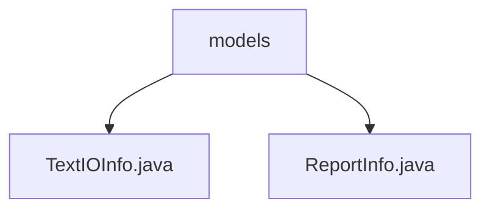

# 基础信息

|      |      |
|------|------|
| 名称 | models |
| 编码语言 | .java |
| 代码路径 | termux-app/termux-shared/src/main/java/com/termux/shared/models |
| 包名 | termux-app.termux-shared.src.main.java.com.termux.shared.models |
| 概述说明 | TextIOInfo类配置文本输入属性，定义数据大小限制和样式。ReportInfo类存储报告信息，支持序列化和Markdown转换。 |

# 说明

## 概述  
该代码模块主要包含两个核心类：`TextIOInfo` 和 `ReportInfo`，均实现了 `Serializable` 接口，支持序列化功能。  
- **TextIOInfo**：用于配置文本输入界面的属性，包括数据大小限制、样式设置、交互控制等，同时支持启动文本输入活动（`TextIOActivity`）并传递相关配置。  
- **ReportInfo**：用于存储和生成报告信息，支持将报告内容转换为Markdown格式字符串，包含标题、时间戳、文本内容及其前后缀等结构化字段。  

## 主要业务场景  
1. **文本输入配置与交互**  
   - `TextIOInfo` 适用于需要动态配置文本输入界面的场景，例如：  
     - 限制输入数据大小（通用数据、标签、文本分别有不同限制）。  
     - 控制文本样式（颜色、字体、滚动行为等）。  
     - 实现编辑禁用、字符统计等辅助功能。  
   - 典型用例：终端应用中的用户输入界面，需根据业务需求定制输入框的属性和行为。  

2. **报告生成与格式化**  
   - `ReportInfo` 用于生成结构化报告，例如：  
     - 记录用户操作日志并附加时间戳和标题。  
     - 将报告内容转换为Markdown格式，便于导出或展示。  
     - 动态拼接报告文本的前缀、主体和后缀，支持灵活的内容组装。  
   - 典型用例：应用内错误报告、操作日志导出或跨模块的数据共享场景。  

**模块共性**  
- 均采用Java Bean风格设计，提供完整的getter/setter方法。  
- 支持序列化，便于跨进程或持久化存储。  
- 注重数据格式化和限制（如文本长度、Markdown转换），确保数据规范性和可读性。

### 包内部结构视图

该流程图展示了Termux项目中共享模块的模型文件结构。根节点为models文件夹，包含两个Java类文件：TextIOInfo.java和ReportInfo.java。这两个文件分别处理文本输入输出信息和报告信息的模型定义，属于同一层级且没有子目录结构。

# 文件列表 File List

| 名称   | 类型  | 说明 |
|-------|------|-------------|
| [ReportInfo.java](ReportInfo.md) | file | 报告信息类，包含用户操作、发送者、标题、时间戳及报告内容，支持生成Markdown格式。 |
| [TextIOInfo.java](TextIOInfo.md) | file | TextIOInfo类定义文本输入配置，包含标签和文本的样式、大小限制及显示控制。 |

