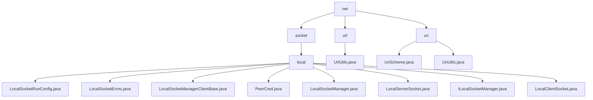

# 基础信息

|      |      |
|------|------|
| 名称 | net |
| 编码语言 | .java |
| 代码路径 | termux-app/termux-shared/src/main/java/com/termux/shared/net |
| 包名 | termux-app.termux-shared.src.main.java.com.termux.shared.net |
| 概述说明 | Android本地IPC框架，含套接字管理、安全验证、超时控制。URL工具类处理路径拼接、解析。URI模块定义方案类型及路径处理。 |

# 说明

```markdown
## 概述

该代码模块是一个面向Android平台（特别是Termux应用）的网络通信工具集，主要包含以下三大功能组件：

1. **本地进程通信框架**  
   基于Unix域套接字(LocalSocket)实现，提供完整的IPC解决方案，包含服务端/客户端实现、安全验证和错误处理体系。

2. **URL处理工具集**  
   提供URL拼接、解析、比较等实用功能，支持协议无关化处理和健壮的错误处理机制。

3. **URI处理工具集**  
   包含URI方案类型定义和路径处理工具，支持文件/内容/网络等多种URI类型的创建和解析。

采用分层设计，同时包含Java和JNI实现，模块间通过标准化接口协作，具有以下技术特性：
- 线程安全的回调机制
- SELinux兼容性处理
- 细粒度超时控制
- 完善的错误日志系统

## 主要业务场景

### 1. 本地服务通信
- **服务监听**：通过`LocalServerSocket`创建持久化服务，支持抽象命名空间
  ```java
  config.setPath("\0termux_socket").setAbstractNamespaceSocket(true);
  serverSocket.start(config); // 启动监听
  ```
- **安全验证**：利用`PeerCred`进行客户端身份校验（PID/UID/GID）
- **跨进程调试**：支持生成Markdown格式的调试信息

### 2. 网络资源处理
- **URL规范化**：
  ```java
  String cleanUrl = UrlUtils.removeProtocol("https://termux.org"); // -> "termux.org"
  ```
- **路径拼接**：
  ```java
  String fullUrl = UrlUtils.joinUrl("https://termux.org", "wiki/"); 
  // -> "https://termux.org/wiki/"
  ```

### 3. 多类型URI管理
- **资源标识**：
  ```java
  if(UriScheme.SCHEME_CONTENT.equals(uri.getScheme())) {
      // 处理content://类型URI
  }
  ```
- **文件路径提取**：
  ```java
  String path = UriUtils.getUriFilePathWithFragment(uri); // 包含#片段
  ```

### 4. 异常处理
- **分级错误码**：`LocalSocketErrno`定义150+错误码体系
- **安全日志**：敏感信息（如凭证）仅输出到debug日志
- **健壮性保障**：所有工具方法均包含空值检查和异常捕获

### 5. 性能关键操作
- **双通道超时**：
  ```java
  socket.setReceiveTimeout(30_000); // 30秒接收超时
  ```
- **JNI优化**：原生套接字操作通过`JniResult`封装错误信息

该模块特别适用于需要同时处理本地进程通信和网络资源访问的Android应用场景，如Termux的插件系统、远程命令执行等功能实现。
```


### 包内部结构视图



该流程图展示了Termux项目中net模块的层级结构，包含socket、url和uri三个子目录。其中socket目录下包含local子目录，内含9个Java实现文件；url和uri目录各包含1个工具类文件。整个结构清晰地反映了网络通信相关代码的组织方式，从顶层分类到具体实现文件共形成4级目录深度。

# 文件列表 File List

| 名称   | 类型  | 说明 |
|-------|------|-------------|
| [socket](socket/_module.md) | package | LocalSocketRunConfig配置本地套接字参数。LocalSocketErrno定义错误码。LocalSocketManagerClientBase处理异常和日志。PeerCred存储进程凭证。LocalSocketManager管理套接字。LocalServerSocket处理服务器通信。LocalClientSocket管理客户端通信。 |
| [uri](uri/_module.md) | package | UriScheme类定义五种URI方案常量。UriUtils类提供处理Uri路径的方法，包括获取路径、基名及创建文件或内容Uri。 |
| [url](url/_module.md) | package | UrlUtils工具类：提供URL拼接、解析、去协议及比较功能。 |


