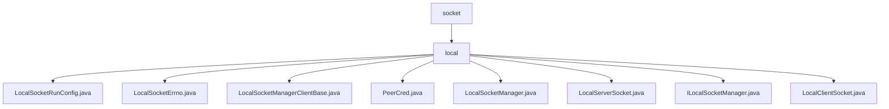

# 基础信息

|      |      |
|------|------|
| 名称 | socket |
| 编码语言 | .java |
| 代码路径 | termux-app/termux-shared/src/main/java/com/termux/shared/net/socket |
| 包名 | termux-app.termux-shared.src.main.java.com.termux.shared.net.socket |
| 概述说明 | LocalSocketRunConfig配置本地套接字参数。LocalSocketErrno定义错误码。LocalSocketManagerClientBase处理异常和日志。PeerCred存储进程凭证。LocalSocketManager管理套接字。LocalServerSocket处理服务器通信。LocalClientSocket管理客户端通信。 |

# 说明

```markdown
## 概述
该代码模块是一个基于Unix域套接字（LocalSocket）实现的本地进程间通信（IPC）框架，主要服务于Android平台（特别是Termux应用）。模块采用Java/JNI混合编程，通过分层设计提供完整的套接字生命周期管理，包含以下核心组件：

1. **配置管理**：`LocalSocketRunConfig`统一管理套接字路径、超时、队列长度等运行参数
2. **错误体系**：`LocalSocketErrno`定义标准化的错误码体系（100-250范围）
3. **核心控制器**：`LocalSocketManager`作为中枢，通过JNI桥接原生套接字操作
4. **服务端实现**：`LocalServerSocket`支持抽象/非抽象命名空间，处理连接监听和权限控制
5. **客户端实现**：`LocalClientSocket`封装数据读写、超时控制和凭证验证
6. **安全凭证**：`PeerCred`记录进程身份信息（PID/UID/GID等）
7. **回调接口**：`ILocalSocketManager`和`LocalSocketManagerClientBase`提供事件处理模板

## 主要业务场景

### 1. 本地服务监听
- 通过`LocalServerSocket`创建持久化服务：
  ```java
  // 配置抽象命名空间套接字
  config.setPath("\0my_socket").setAbstractNamespaceSocket(true);
  serverSocket.start(config); // 启动监听线程
  ```
- 自动处理SELinux限制（Android 9+）
- 客户端连接队列管理（默认backlog=50）

### 2. 安全通信控制
- 连接时通过`PeerCred`验证客户端身份：
  ```java
  if(peerCred.getUid() != expectedUid) {
      manager.onUnauthorizedClient(socket); // 触发未授权回调
  }
  ```
- 敏感日志过滤（如凭证信息仅输出debug日志）

### 3. 超时数据传输
- 双通道超时控制：
  ```java
  clientSocket.setReceiveTimeout(30_000); // 30秒接收超时
  clientSocket.sendData(buffer, 5_000);   // 5秒发送超时
  ```
- 截止时间检查（通过`mDeadline`字段）

### 4. 异常处理流程
- 分级错误处理：
  ```java
  switch(errno.getType()) {
      case SERVER_SOCKET_ERROR: // 150-200错误码
          manager.onError(socket, errno); 
          break;
  }
  ```
- JNI操作统一返回`JniResult`对象：
  ```c
  JNIEXPORT jint JNICALL Java_..._sendData(JNIEnv* env, ...) {
      if(write(fd, buf, len) == -1) {
          return makeJniResult(ERR_SEND_FAILED, errno);
      }
  }
  ```

### 5. 跨进程调试支持
- 丰富的日志输出：
  ```java
  socket.toMarkdownString(); // 生成带格式的调试信息
  ```
- 线程安全的回调机制（独立事件处理线程）
```


### 包内部结构视图



该流程图展示了Termux项目中网络套接字模块的层级结构。顶层节点为socket目录，其下包含local子目录，local目录中包含8个Java源文件，分别实现本地套接字的不同功能组件，包括套接字管理器、客户端/服务端实现以及错误处理等核心类。所有文件均位于termux-shared模块的网络通信功能部分。

# 文件列表 File List

| 名称   | 类型  | 说明 |
|-------|------|-------------|
| [local](local/_module.md) | package | LocalSocketRunConfig配置本地套接字参数。LocalSocketErrno定义错误码。LocalSocketManagerClientBase处理异常和日志。PeerCred存储进程凭证。LocalSocketManager管理套接字。LocalServerSocket处理服务器通信。LocalClientSocket管理客户端通信。 |


