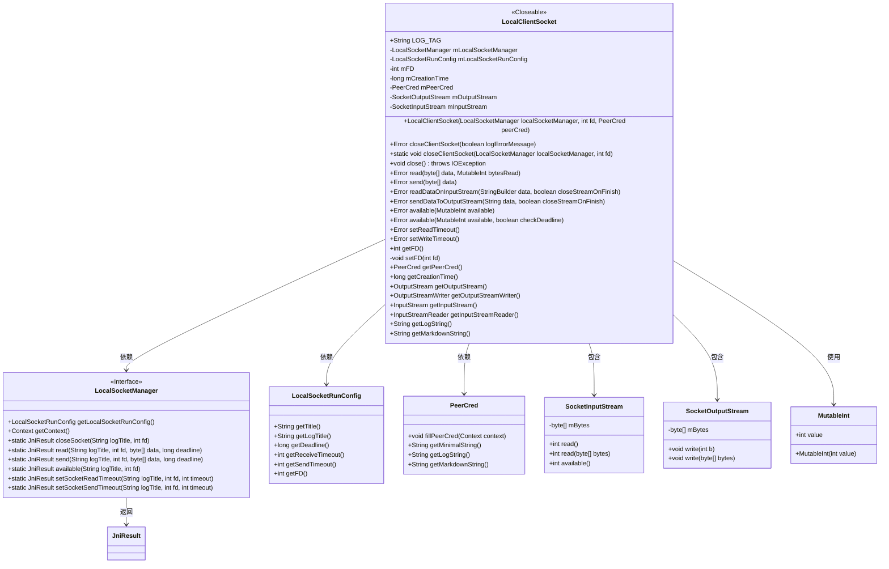

# 基础信息

|      |      |
|------|------|
| 名称 | LocalClientSocket |
| 编码语言 | .java |
| 代码路径 | termux-app/termux-shared/src/main/java/com/termux/shared/net/socket/local/LocalClientSocket.java |
| 包名 | com.termux.shared.net.socket.local |
| 依赖项 | ['androidx.annotation.NonNull', 'com.termux.shared.data.DataUtils', 'com.termux.shared.errors.Error', 'com.termux.shared.jni.models.JniResult', 'com.termux.shared.logger.Logger', 'com.termux.shared.markdown.MarkdownUtils', 'java.io.BufferedWriter', 'java.io.Closeable', 'java.io.IOException', 'java.io.InputStream', 'java.io.InputStreamReader', 'java.io.OutputStream', 'java.io.OutputStreamWriter'] |
| 概述说明 | LocalClientSocket类实现本地客户端套接字功能，包含读写、超时设置及错误处理。 |

# 说明

LocalClientSocket是一个实现Closeable接口的本地客户端套接字类，用于管理本地套接字通信。它包含关键组件如LocalSocketManager、LocalSocketRunConfig、文件描述符mFD、创建时间mCreationTime、客户端凭证PeerCred以及输入输出流SocketInputStream和SocketOutputStream。类提供了读取、发送数据、检查可用数据、设置超时等方法，并支持通过closeClientSocket关闭套接字。输入输出流封装了底层读写操作，错误处理通过JniResult和自定义错误码实现。类还包含日志和Markdown生成功能，便于调试和信息展示。

# 类列表 Class Summary

| 名称   | 类型  | 说明 |
|-------|------|-------------|
| LocalClientSocket | class | LocalClientSocket类实现本地客户端套接字，管理连接、读写及超时设置，含输入输出流封装。 |

## 类 LocalClientSocket

|      |      |
|------|------|
| 访问范围 | public |
| 类型 | class |
| 名称 | LocalClientSocket |
| 说明 | LocalClientSocket类实现本地客户端套接字，管理连接、读写及超时设置，含输入输出流封装。 |

### UML类图

类图描述：该图展示了LocalClientSocket类的结构及其与相关组件的关系。LocalClientSocket实现了Closeable接口，管理本地客户端套接字连接，包含输入/输出流(SocketInputStream/SocketOutputStream)和凭证信息(PeerCred)。它依赖LocalSocketManager进行底层套接字操作，使用LocalSocketRunConfig获取运行时配置，并通过MutableInt传递整数值。类图清晰地呈现了套接字管理的核心架构和组件间的协作关系。

### 内部方法调用关系图

```mermaid
graph TD
    A["类LocalClientSocket"]
    B["属性: LOG_TAG"]
    C["属性: mLocalSocketManager"]
    D["属性: mLocalSocketRunConfig"]
    E["属性: mFD"]
    F["属性: mCreationTime"]
    G["属性: mPeerCred"]
    H["属性: mOutputStream"]
    I["属性: mInputStream"]
    J["构造方法: LocalClientSocket()"]
    K["方法: closeClientSocket()"]
    L["方法: close()"]
    M["方法: read()"]
    N["方法: send()"]
    O["方法: readDataOnInputStream()"]
    P["方法: sendDataToOutputStream()"]
    Q["方法: available()"]
    R["方法: setReadTimeout()"]
    S["方法: setWriteTimeout()"]
    T["方法: getFD()"]
    U["方法: setFD()"]
    V["方法: getPeerCred()"]
    W["方法: getCreationTime()"]
    X["方法: getOutputStream()"]
    Y["方法: getOutputStreamWriter()"]
    Z["方法: getInputStream()"]
    AA["方法: getInputStreamReader()"]
    AB["方法: getLogString()"]
    AC["方法: getMarkdownString()"]
    AD["内部类: MutableInt"]
    AE["内部类: SocketInputStream"]
    AF["内部类: SocketOutputStream"]

    A --> B
    A --> C
    A --> D
    A --> E
    A --> F
    A --> G
    A --> H
    A --> I
    A --> J
    A --> K
    A --> L
    A --> M
    A --> N
    A --> O
    A --> P
    A --> Q
    A --> R
    A --> S
    A --> T
    A --> U
    A --> V
    A --> W
    A --> X
    A --> Y
    A --> Z
    A --> AA
    A --> AB
    A --> AC
    A --> AD
    A --> AE
    A --> AF

    K --> L
    L -->|调用| LocalSocketManager.closeSocket
    M -->|调用| LocalSocketManager.read
    N -->|调用| LocalSocketManager.send
    O -->|调用| LocalSocketManager.available
    R -->|调用| LocalSocketManager.setSocketReadTimeout
    S -->|调用| LocalSocketManager.setSocketSendTimeout
    AE -->|调用| M
    AE -->|调用| Q
    AF -->|调用| N
```

该流程图展示了LocalClientSocket类的完整结构，包含12个主要属性、18个公共方法、3个内部类及其调用关系。核心功能围绕socket通信实现，包括连接管理（closeClientSocket）、数据读写（read/send）、流处理（InputStream/OutputStream）和超时控制（setReadTimeout/setWriteTimeout）。内部类SocketInputStream和SocketOutputStream通过委托模式调用外部类的核心读写方法，形成完整的IO操作链。所有网络操作最终通过LocalSocketManager的JNI方法实现底层通信。

### 字段列表 Field List

| 名称  | 类型  | 说明 |
|-------|-------|------|
| LOG_TAG = "LocalClientSocket" | String | 本地客户端套接字日志标签 |
| mInputStream | SocketInputStream | 非空受保护的最终Socket输入流mInputStream |
| mOutputStream | SocketOutputStream | 非空受保护的最终Socket输出流mOutputStream |
| mCreationTime | long | 保护型长整型变量mCreationTime，记录创建时间。 |
| mFD | int | 受保护的整型变量mFD |
| mLocalSocketManager | LocalSocketManager | 非空保护的本地套接字管理器 |
| mLocalSocketRunConfig | LocalSocketRunConfig | 非空保护的本地套接字运行配置变量 |
| mPeerCred | PeerCred | 非空受保护终态PeerCred对象mPeerCred |

### 方法列表 Method List

| 名称  | 类型  | 说明 |
|-------|-------|------|
| closeClientSocket | void | 关闭客户端套接字，传入管理器、文件描述符和凭据。 |
| setFD | void | 设置文件描述符fd，非负时赋值mFD，否则置为-1。 |
| read | Error | 方法读取客户端套接字数据，检查FD有效性，处理错误并返回读取字节数。 |
| sendDataToOutputStream | Error | 发送数据到输出流，处理异常并可选关闭流。 |
| getOutputStreamWriter | OutputStreamWriter | 获取输出流写入器，基于getOutputStream方法创建。 |
| getFD | int | 获取文件描述符方法，返回整型mFD。 |
| setReadTimeout | Error | 设置客户端套接字读取超时，失败返回错误信息。 |
| getInputStreamReader | InputStreamReader | 方法返回基于输入流的读取器。 |
| closeClientSocket | Error | 同步方法关闭客户端套接字，失败时记录错误并返回异常信息。 |
| getPeerCred | PeerCred | 获取对等凭证方法，返回mPeerCred成员变量。 |
| available | Error | 可用性检查方法，接受可变整型参数，默认严格模式。 |
| available | Error | 检查客户端套接字数据可用性，处理无效FD和超时，返回错误或可用数据量。 |
| readDataOnInputStream | Error | 从输入流读取数据到StringBuilder，异常时返回错误，可关闭流。 |
| getCreationTime | long | 获取创建时间的方法，返回长整型数值。 |
| getOutputStream | OutputStream | 获取输出流对象。 |
| close | void | 客户端关闭socket连接，检查文件描述符，记录日志并调用JNI关闭，异常时抛出IO错误。 |
| setWriteTimeout | Error | 设置客户端套接字发送超时，失败返回错误信息。 |
| send | Error | 检查文件描述符有效性后发送数据，失败返回错误，成功返回null。 |
| getInputStream | InputStream | 公开方法返回输入流对象。 |
| getLogString | String | 生成客户端Socket日志字符串，包含FD、创建时间和对端凭证信息。 |
| getMarkdownString | String | 生成客户端套接字信息的Markdown字符串，包含FD、创建时间和对等凭证。 |

