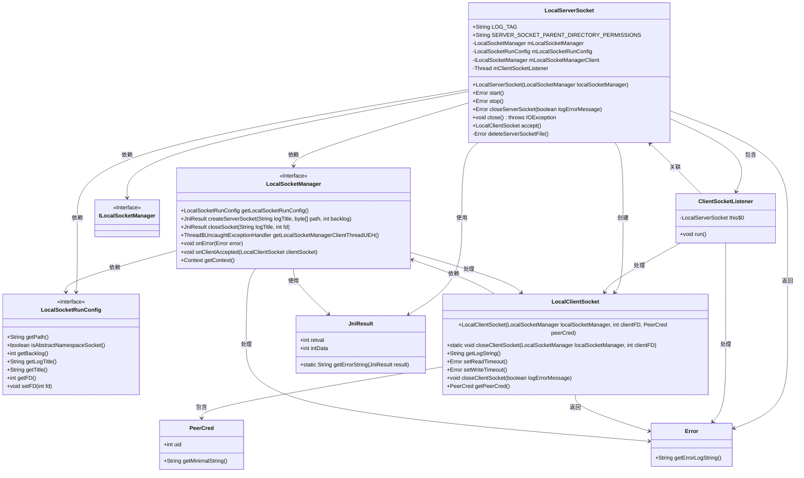
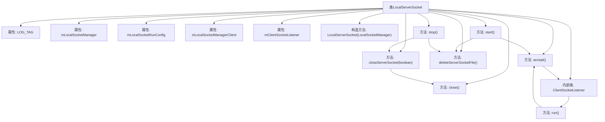
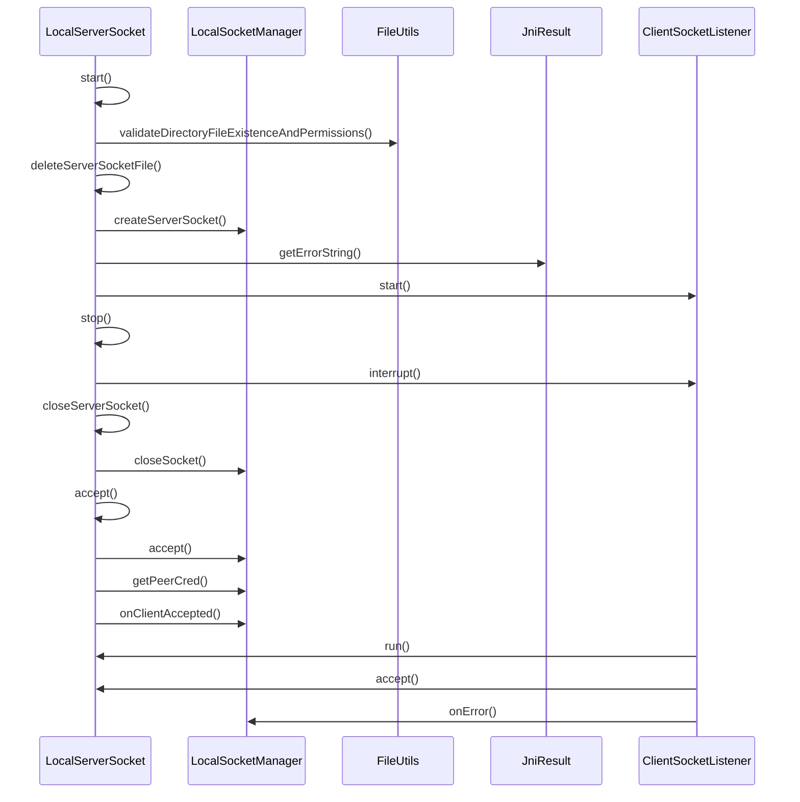

# 基础信息

|      |      |
|------|------|
| 名称 | LocalServerSocket |
| 编码语言 | .java |
| 代码路径 | termux-app/termux-shared/src/main/java/com/termux/shared/net/socket/local/LocalServerSocket.java |
| 包名 | com.termux.shared.net.socket.local |
| 依赖项 | ['androidx.annotation.NonNull', 'com.termux.shared.errors.Error', 'com.termux.shared.file.FileUtils', 'com.termux.shared.jni.models.JniResult', 'com.termux.shared.logger.Logger', 'java.io.Closeable', 'java.io.File', 'java.io.IOException', 'java.nio.charset.StandardCharsets'] |
| 概述说明 | LocalServerSocket类实现本地服务器套接字管理，包含启动、停止、监听客户端连接等功能。 |

# 说明

LocalServerSocket是一个实现Closeable接口的本地服务器套接字类，用于管理本地套接字通信。它包含LocalSocketManager、LocalSocketRunConfig和ILocalSocketManager等关键组件，并通过ClientSocketListener线程监听客户端连接。主要功能包括启动服务器（检查路径、权限、创建套接字）、停止服务器（关闭套接字、删除文件）、接受客户端连接（验证权限、处理错误）以及管理套接字生命周期。服务器套接字支持抽象命名空间和非抽象路径，确保安全性和稳定性。

# 类列表 Class Summary

| 名称   | 类型  | 说明 |
|-------|------|-------------|
| LocalServerSocket | class | LocalServerSocket类实现本地服务器套接字管理，包含启动、停止、接受客户端连接及错误处理功能。 |

## 类 LocalServerSocket

|      |      |
|------|------|
| 访问范围 | public |
| 类型 | class |
| 名称 | LocalServerSocket |
| 说明 | LocalServerSocket类实现本地服务器套接字管理，包含启动、停止、接受客户端连接及错误处理功能。 |

### UML类图

这段类图描述了LocalServerSocket及其相关组件的结构关系。LocalServerSocket是一个可关闭的本地服务器套接字实现，依赖于LocalSocketManager进行底层操作，并通过ClientSocketListener线程监听客户端连接。它使用LocalSocketRunConfig管理运行时配置，并通过JniResult处理本地方法调用结果。当客户端连接时，会创建LocalClientSocket实例，并通过PeerCred验证客户端身份。整个设计体现了清晰的职责分离，服务器管理、客户端处理和错误处理逻辑被分配到不同的组件中。

### 内部方法调用关系图

该流程图展示了LocalServerSocket类的核心结构和交互关系。类包含6个主要属性和8个关键方法，其中start()方法是核心流程，涉及文件权限验证、socket创建和监听线程启动。时序图则详细描述了服务器启动、停止和客户端连接处理的全过程，包括与LocalSocketManager、FileUtils等组件的交互。特别注意accept()方法与ClientSocketListener的内部循环调用关系，以及错误处理流程的完整链路。整个设计体现了严谨的socket管理和线程安全控制机制。

### 字段列表 Field List

| 名称  | 类型  | 说明 |
|-------|-------|------|
| SERVER_SOCKET_PARENT_DIRECTORY_PERMISSIONS = "rwx" | String | 服务器套接字父目录权限设为读写执行 |
| mClientSocketListener | Thread | 非空保护型客户端套接字监听线程 |
| mLocalSocketRunConfig | LocalSocketRunConfig | 非空受保护最终本地套接字运行配置 |
| LOG_TAG = "LocalServerSocket" | String | 定义日志标签常量"LocalServerSocket"。 |
| mLocalSocketManagerClient | ILocalSocketManager | 非空保护的本地套接字管理器客户端实例 |
| mLocalSocketManager | LocalSocketManager | 非空保护的本地套接字管理器 |

### 方法列表 Method List

| 名称  | 类型  | 说明 |
|-------|-------|------|
| stop | Error | 同步方法stop：停止客户端监听，关闭服务端套接字并删除文件。 |
| closeServerSocket | Error | 同步方法关闭服务器套接字，出错时记录错误并返回错误对象。 |
| start | Error | 检查路径有效性，创建并启动本地服务器套接字，处理错误。 |
| close | void | 同步关闭本地Socket，若失败抛IO异常。 |
| deleteServerSocketFile | Error | 删除服务器套接字文件，非抽象命名空间时执行删除操作。 |
| accept | LocalClientSocket | 本地套接字接受客户端连接，验证权限后返回客户端对象。 |

