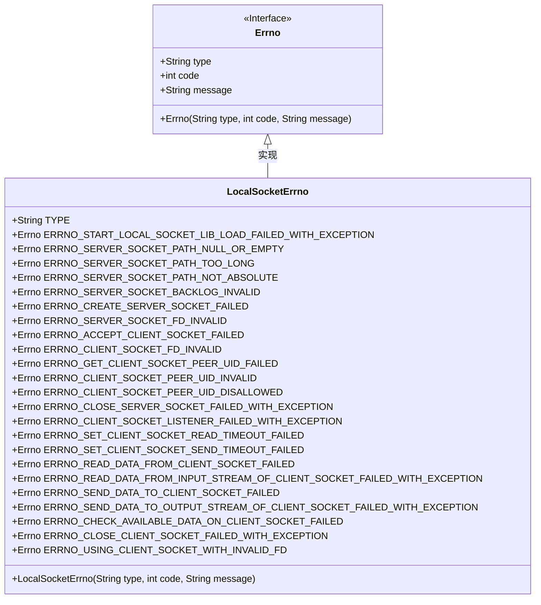

# 基础信息

|      |      |
|------|------|
| 名称 | LocalSocketErrno |
| 编码语言 | .java |
| 代码路径 | termux-app/termux-shared/src/main/java/com/termux/shared/net/socket/local/LocalSocketErrno.java |
| 包名 | com.termux.shared.net.socket.local |
| 依赖项 | ['com.termux.shared.errors.Errno'] |
| 概述说明 | 本地套接字错误码类，包含库加载、服务端和客户端套接字操作失败等错误定义。 |

# 说明

LocalSocketErrno类定义了本地套接字相关错误码，分为三部分：LocalSocketManager错误（100-150）、LocalServerSocket错误（150-200）和LocalClientSocket错误（200-250）。错误类型包括库加载失败、路径无效、文件描述符无效、超时设置失败、数据传输失败、连接关闭异常等。每个错误码包含类型、编号和详细描述信息，用于标识和记录具体错误情况。

# 类列表 Class Summary

| 名称   | 类型  | 说明 |
|-------|------|-------------|
| LocalSocketErrno | class | 本地套接字错误码类，包含库加载、服务端和客户端套接字操作错误。 |

## 类 LocalSocketErrno

|      |      |
|------|------|
| 访问范围 | public |
| 类型 | class |
| 名称 | LocalSocketErrno |
| 说明 | 本地套接字错误码类，包含库加载、服务端和客户端套接字操作错误。 |

### UML类图

这段代码定义了一个`LocalSocketErrno`类，它继承自`Errno`接口，用于管理本地套接字相关的错误码和错误信息。该类包含了一系列静态的`Errno`实例，每个实例代表一种特定的错误情况，涵盖了从库加载失败、服务器套接字路径问题、客户端套接字操作失败等多种场景。这些错误码按照功能范围分组，并通过构造函数初始化错误类型、代码和消息。类图清晰地展示了`LocalSocketErrno`与`Errno`之间的继承关系，以及类中定义的常量错误码。

### 内部方法调用关系图

这段代码定义了一个`LocalSocketErrno`类，继承自`Errno`类，主要用于管理本地套接字相关的错误码和错误信息。类中包含一个构造方法和多个静态常量，这些常量分别对应不同的错误场景，如服务器套接字路径无效、客户端套接字操作失败等。每个静态常量都是一个`Errno`实例，包含错误类型、错误代码和错误信息。该类的设计使得错误码和错误信息可以集中管理，便于维护和使用。

### 字段列表 Field List

| 名称  | 类型  | 说明 |
|-------|-------|------|
| ERRNO_CLIENT_SOCKET_LISTENER_FAILED_WITH_EXCEPTION = new Errno(TYPE, 162, "Exception in client socket listener for \"%1$s\" server.\nException: %2$s") | Errno | 客户端套接字监听异常，错误码162，服务器"%1$s"，异常详情%2$s。 |
| ERRNO_CLIENT_SOCKET_PEER_UID_DISALLOWED = new Errno(TYPE, 160, "Disallowed peer %1$s tried to connect with \"%2$s\" server.") | Errno | 客户端连接被拒绝：非法用户尝试访问服务器。 |
| ERRNO_GET_CLIENT_SOCKET_PEER_UID_FAILED = new Errno(TYPE, 158, "Getting peer uid for client socket for \"%1$s\" server failed.\n%2$s") | Errno | 获取客户端socket对端uid失败 |
| ERRNO_CLIENT_SOCKET_FD_INVALID = new Errno(TYPE, 157, "Invalid file descriptor \"%1$s\" returned when accept new client for \"%2$s\" server.") | Errno | 客户端套接字文件描述符无效，错误码157。 |
| ERRNO_READ_DATA_FROM_CLIENT_SOCKET_FAILED = new Errno(TYPE, 202, "Read data from \"%1$s\" client socket failed.\n%2$s") | Errno | 读取客户端套接字数据失败，错误码202。 |
| ERRNO_CLOSE_SERVER_SOCKET_FAILED_WITH_EXCEPTION = new Errno(TYPE, 161, "Close \"%1$s\" server socket failed.\nException: %2$s") | Errno | 关闭服务器套接字失败，异常信息：%2$s |
| ERRNO_READ_DATA_FROM_INPUT_STREAM_OF_CLIENT_SOCKET_FAILED_WITH_EXCEPTION = new Errno(TYPE, 203, "Read data from \"%1$s\" client socket input stream failed.\n%2$s") | Errno | 读取客户端套接字输入流数据失败，错误码203。 |
| ERRNO_SERVER_SOCKET_FD_INVALID = new Errno(TYPE, 155, "Invalid file descriptor \"%1$s\" returned when creating \"%2$s\" server socket.") | Errno | 创建服务器套接字时返回无效文件描述符。 |
| ERRNO_SEND_DATA_TO_CLIENT_SOCKET_FAILED = new Errno(TYPE, 204, "Send data to \"%1$s\" client socket failed.\n%2$s") | Errno | 发送数据到客户端套接字失败，错误码204。 |
| ERRNO_ACCEPT_CLIENT_SOCKET_FAILED = new Errno(TYPE, 156, "Accepting client socket for \"%1$s\" server failed.\n%2$s") | Errno | 接受客户端套接字失败，错误码156。 |
| TYPE = "LocalSocket Error" | String | 本地套接字错误类型常量 |
| ERRNO_START_LOCAL_SOCKET_LIB_LOAD_FAILED_WITH_EXCEPTION = new Errno(TYPE, 100, "Failed to load \"%1$s\" library.\nException: %2$s") | Errno | 加载本地套接字库失败，异常信息：%2$s |
| ERRNO_SET_CLIENT_SOCKET_SEND_TIMEOUT_FAILED = new Errno(TYPE, 201, "Set \"%1$s\" client socket send (SO_SNDTIMEO) timeout \"%2$s\" failed.\n%3$s") | Errno | 设置客户端套接字发送超时失败，错误码201。 |
| ERRNO_SERVER_SOCKET_BACKLOG_INVALID = new Errno(TYPE, 153, "The \"%1$s\" server socket backlog \"%2$s\" is not greater than 0.") | Errno | 服务器socket backlog值无效，必须大于0。 |
| ERRNO_SET_CLIENT_SOCKET_READ_TIMEOUT_FAILED = new Errno(TYPE, 200, "Set \"%1$s\" client socket read (SO_RCVTIMEO) timeout to \"%2$s\" failed.\n%3$s") | Errno | 设置客户端套接字读取超时失败。 |
| ERRNO_SERVER_SOCKET_PATH_NOT_ABSOLUTE = new Errno(TYPE, 152, "The \"%1$s\" server socket path \"%2$s\" is not an absolute file path.") | Errno | 服务器套接字路径必须为绝对路径。 |
| ERRNO_SERVER_SOCKET_PATH_TOO_LONG = new Errno(TYPE, 151, "The \"%1$s\" server socket path \"%2$s\" is greater than 108 bytes.") | Errno | 定义错误码151：服务器套接字路径过长，超过108字节。 |
| ERRNO_SERVER_SOCKET_PATH_NULL_OR_EMPTY = new Errno(TYPE, 150, "The \"%1$s\" server socket path is null or empty.") | Errno | 服务器套接字路径为空或未设置 |
| ERRNO_CREATE_SERVER_SOCKET_FAILED = new Errno(TYPE, 154, "Create \"%1$s\" server socket failed.\n%2$s") | Errno | 创建服务器套接字失败，错误码154。 |
| ERRNO_CLIENT_SOCKET_PEER_UID_INVALID = new Errno(TYPE, 158, "Invalid peer uid \"%1$s\" returned for new client for \"%2$s\" server.") | Errno | 客户端socket对端UID无效，错误码158。 |
| ERRNO_SEND_DATA_TO_OUTPUT_STREAM_OF_CLIENT_SOCKET_FAILED_WITH_EXCEPTION = new Errno(TYPE, 205, "Send data to \"%1$s\" client socket output stream failed.\n%2$s") | Errno | 发送数据到客户端套接字输出流失败。 |
| ERRNO_CHECK_AVAILABLE_DATA_ON_CLIENT_SOCKET_FAILED = new Errno(TYPE, 206, "Check available data on \"%1$s\" client socket failed.\n%2$s") | Errno | 检查客户端套接字可用数据失败。 |
| ERRNO_CLOSE_CLIENT_SOCKET_FAILED_WITH_EXCEPTION = new Errno(TYPE, 207, "Close \"%1$s\" client socket failed.\n%2$s") | Errno | 关闭客户端套接字失败，错误码207。 |
| ERRNO_USING_CLIENT_SOCKET_WITH_INVALID_FD = new Errno(TYPE, 208, "Trying to use client socket with invalid file descriptor \"%1$s\" for \"%2$s\" server.") | Errno | 使用无效文件描述符尝试操作客户端套接字。 |

### 方法列表 Method List

| 名称  | 类型  | 说明 |
|-------|-------|------|

