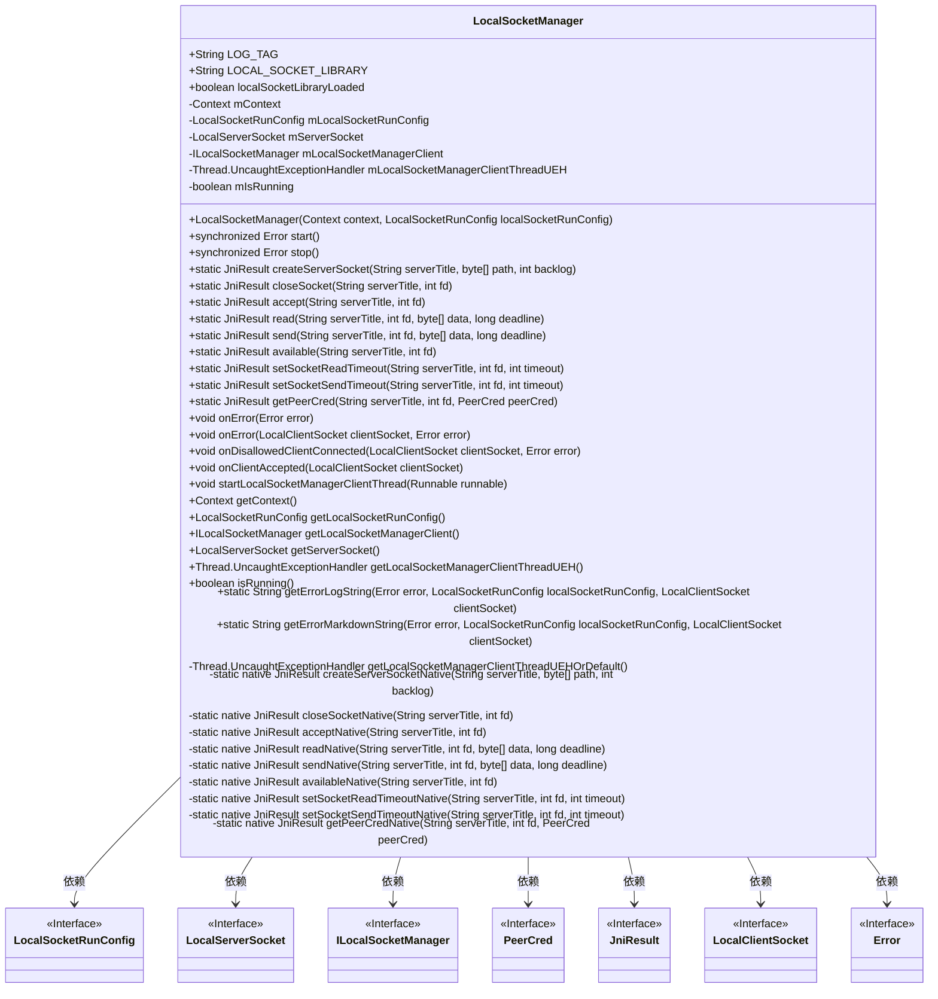
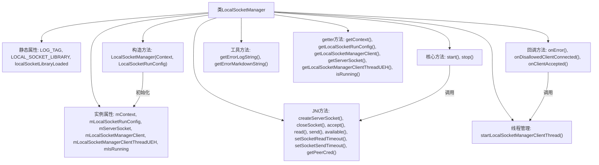

# 基础信息

|      |      |
|------|------|
| 名称 | LocalSocketManager |
| 编码语言 | .java |
| 代码路径 | termux-app/termux-shared/src/main/java/com/termux/shared/net/socket/local/LocalSocketManager.java |
| 包名 | com.termux.shared.net.socket.local |
| 依赖项 | ['android.content.Context', 'androidx.annotation.NonNull', 'androidx.annotation.Nullable', 'com.termux.shared.errors.Error', 'com.termux.shared.jni.models.JniResult', 'com.termux.shared.logger.Logger'] |
| 概述说明 | LocalSocketManager管理本地套接字服务端，提供启动、停止及客户端连接处理功能。 |

# 说明

LocalSocketManager是一个用于管理本地Unix域套接字的Java类，通过JNI调用原生库实现底层操作。它包含核心组件如LocalServerSocket、ILocalSocketManager客户端接口和运行配置LocalSocketRunConfig。主要功能包括启动/停止服务器套接字、处理客户端连接、数据读写及超时设置，所有JNI操作均通过try-catch捕获异常并返回JniResult结果对象。类提供线程安全的客户端回调机制，通过独立线程处理连接事件和错误，并支持自定义未捕获异常处理器。关键特性包含套接字创建、读写超时控制、对等凭证获取及详尽的错误日志记录功能。

# 类列表 Class Summary

| 名称   | 类型  | 说明 |
|-------|------|-------------|
| LocalSocketManager | class | LocalSocketManager管理本地套接字，提供启动、停止及客户端通信功能。 |

## 类 LocalSocketManager

|      |      |
|------|------|
| 访问范围 | public |
| 类型 | class |
| 名称 | LocalSocketManager |
| 说明 | LocalSocketManager管理本地套接字，提供启动、停止及客户端通信功能。 |

### UML类图

该类图展示了LocalSocketManager的核心结构和依赖关系。LocalSocketManager是一个本地套接字管理类，负责加载本地库、启动/停止服务器套接字、处理客户端连接和错误回调等。它依赖于多个接口类如LocalSocketRunConfig、LocalServerSocket、ILocalSocketManager等来实现具体功能。类中包含了同步方法start()和stop()来管理服务器状态，以及多个静态原生方法用于底层套接字操作。错误处理和客户端回调通过专门的线程机制实现，确保不会阻塞主线程。

### 内部方法调用关系图

这段代码实现了一个本地套接字管理器，主要功能包括：1) 通过JNI与底层本地套接字库交互；2) 管理LocalServerSocket的生命周期(start/stop)；3) 处理客户端连接和通信；4) 提供错误处理和日志功能。类结构清晰分为属性管理、核心操作、JNI封装、回调处理和工具方法五大模块，通过同步方法和线程机制确保线程安全，支持配置化运行和详细的错误报告。

### 字段列表 Field List

| 名称  | 类型  | 说明 |
|-------|-------|------|
| mLocalSocketManagerClientThreadUEH | Thread.UncaughtExceptionHandler | 受保护且不可为空的线程未捕获异常处理器。 |
| mLocalSocketManagerClient | ILocalSocketManager | 非空保护的本地Socket管理器客户端实例 |
| LOG_TAG = "LocalSocketManager" | String | 定义日志标签常量"LocalSocketManager"。 |
| mServerSocket | LocalServerSocket | 非空保护的本地服务器套接字变量mServerSocket。 |
| localSocketLibraryLoaded | boolean | 静态布尔变量标记本地套接字库是否加载 |
| mLocalSocketRunConfig | LocalSocketRunConfig | 非空保护的本地套接字运行配置实例。 |
| LOCAL_SOCKET_LIBRARY = "local-socket" | String | 保护静态字符串变量LOCAL_SOCKET_LIBRARY赋值为"local-socket"。 |
| mContext | Context | 非空保护的上下文变量mContext |
| mIsRunning | boolean | 运行状态保护变量 |

### 方法列表 Method List

| 名称  | 类型  | 说明 |
|-------|-------|------|
| onError | void | 方法处理错误，调用带空值和错误的onError方法。 |
| createServerSocketNative | JniResult | 可空私有静态本地方法，创建服务端Socket，参数含标题、路径和队列长度。 |
| getContext | Context | 获取上下文对象mContext。 |
| getErrorLogString | String | 生成错误日志字符串，包含配置、错误和客户端信息。 |
| closeSocketNative | JniResult | 可空静态本地方法，关闭指定服务器和文件描述符的套接字。 |
| setSocketSendTimeout | JniResult | 设置Socket发送超时的JNI方法，捕获异常并记录日志。 |
| accept | JniResult | Java方法：接受服务器标题和文件描述符，调用原生方法，捕获异常并记录日志。 |
| getErrorMarkdownString | String | 生成错误和配置的Markdown字符串。 |
| getPeerCred | JniResult | 获取对等凭证的JNI方法，捕获异常并记录日志。 |
| send | JniResult | Java方法：发送数据到服务器，捕获异常并记录日志。 |
| isRunning | boolean | 检查运行状态，返回布尔值mIsRunning。 |
| read | JniResult | Java方法：通过JNI读取数据，捕获异常并记录日志。 |
| stop | Error | 同步方法stop检查运行状态，停止则返回错误，否则返回空。 |
| createServerSocket | JniResult | 创建服务器Socket，捕获异常并记录日志。 |
| startLocalSocketManagerClientThread | void | 启动本地Socket管理客户端线程，设置异常处理并捕获启动异常。 |
| getLocalSocketManagerClient | ILocalSocketManager | 获取本地Socket管理客户端实例。 |
| start | Error | 同步方法start()加载本地库并启动服务，失败返回错误。 |
| getServerSocket | LocalServerSocket | 获取本地服务器套接字对象。 |
| closeSocket | JniResult | 关闭Socket的JNI方法，捕获异常并记录日志。 |
| onDisallowedClientConnected | void | 本地客户端连接被拒时启动管理线程处理错误。 |
| setSocketReadTimeout | JniResult | 设置socket读取超时，捕获异常并记录日志。 |
| getLocalSocketRunConfig | LocalSocketRunConfig | 获取本地套接字运行配置。 |
| getLocalSocketManagerClientThreadUEH | Thread.UncaughtExceptionHandler | 获取本地Socket管理器客户端线程异常处理器。 |
| onError | void | 本地Socket错误处理：启动线程调用onError方法处理客户端Socket错误。 |
| onClientAccepted | void | 本地客户端连接时启动管理线程处理。 |
| getLocalSocketManagerClientThreadUEHOrDefault | Thread.UncaughtExceptionHandler | 获取线程异常处理器，若为空则返回默认日志记录处理器。 |
| available | JniResult | 检查JNI可用性，异常时记录日志并返回结果。 |
| acceptNative | JniResult | 可空静态本地方法，接受服务名和文件描述符，返回Jni结果。 |
| readNative | JniResult | 可空静态本地方法，读取Jni结果，参数含服务标题、文件描述符、字节数组和截止时间。 |
| sendNative | JniResult | 非公开静态原生方法，发送数据到指定服务器，参数包括服务名、文件描述符、数据数组和截止时间。 |
| availableNative | JniResult | 可空静态原生方法，检查服务可用性，参数为服务名和文件描述符。 |
| setSocketReadTimeoutNative | JniResult | 私有本地方法设置套接字读取超时 |
| setSocketSendTimeoutNative | JniResult | 可空静态原生方法，设置套接字发送超时。 |
| getPeerCredNative | JniResult | 原生方法获取对等凭证，参数为服务名、文件描述符和凭证对象。 |

