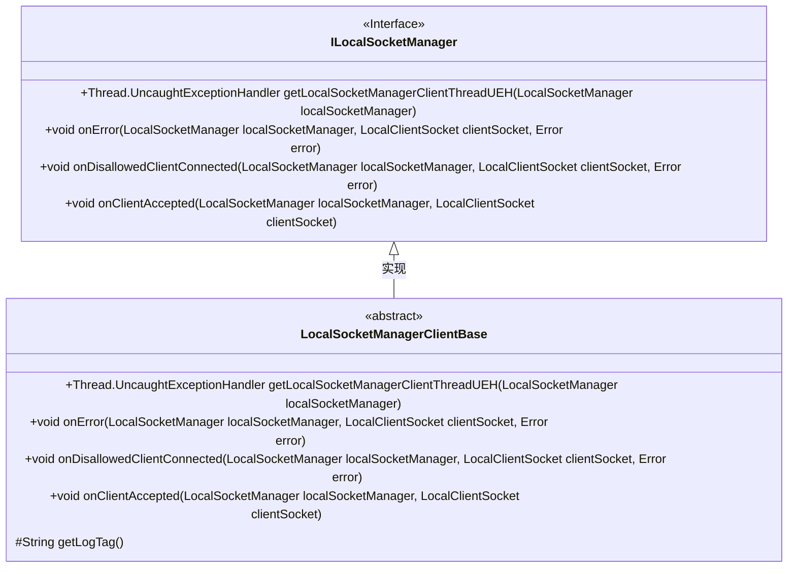
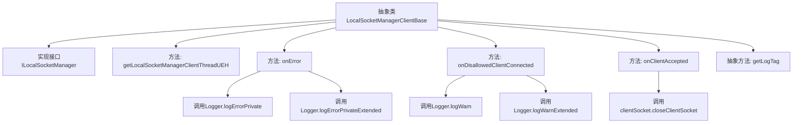

# 基础信息

|      |      |
|------|------|
| 名称 | LocalSocketManagerClientBase |
| 编码语言 | .java |
| 代码路径 | termux-app/termux-shared/src/main/java/com/termux/shared/net/socket/local/LocalSocketManagerClientBase.java |
| 包名 | com.termux.shared.net.socket.local |
| 依赖项 | ['androidx.annotation.NonNull', 'androidx.annotation.Nullable', 'com.termux.shared.errors.Error', 'com.termux.shared.logger.Logger'] |
| 概述说明 | 抽象类实现本地套接字管理接口，处理错误、连接和日志。 |

# 说明

这是一个抽象类LocalSocketManagerClientBase，实现了ILocalSocketManager接口。主要功能包括：提供线程未捕获异常处理（返回null默认实现）、错误处理时记录私有日志、处理未授权客户端连接时记录警告日志、客户端连接接受后关闭套接字。要求子类必须实现getLogTag方法提供日志标签。所有方法都接收LocalSocketManager参数，部分方法还涉及LocalClientSocket和Error对象。错误日志会过滤敏感信息，仅在调试级别记录。

# 类列表 Class Summary

| 名称   | 类型  | 说明 |
|-------|------|-------------|
| LocalSocketManagerClientBase | class | 抽象类实现本地套接字管理接口，含错误处理、日志记录和客户端连接管理方法。 |

## 类 LocalSocketManagerClientBase

|      |      |
|------|------|
| 访问范围 | public abstract |
| 类型 | class |
| 名称 | LocalSocketManagerClientBase |
| 说明 | 抽象类实现本地套接字管理接口，含错误处理、日志记录和客户端连接管理方法。 |

### UML类图

这段代码展示了一个抽象类LocalSocketManagerClientBase实现ILocalSocketManager接口的结构。该抽象类提供了默认的错误处理、客户端连接管理和日志标签获取功能，其中getLogTag()需要子类具体实现。类图清晰地反映了接口与实现类的关系，以及抽象方法的保护级别，体现了对本地套接字管理客户端基础功能的封装设计。

### 内部方法调用关系图

这段代码流程图展示了抽象类LocalSocketManagerClientBase的结构及其方法调用关系。该类实现了ILocalSocketManager接口，包含4个具体方法和1个抽象方法。核心功能包括处理客户端连接错误（onError）、禁止连接（onDisallowedClientConnected）和接受连接（onClientAccepted）等场景，均通过Logger记录日志或操作socket。其中onError和onDisallowedClientConnected会调用日志记录方法，而onClientAccepted会直接关闭客户端socket。抽象方法getLogTag()需要子类实现以提供日志标签。

### 字段列表 Field List

| 名称  | 类型  | 说明 |
|-------|-------|------|

### 方法列表 Method List

| 名称  | 类型  | 说明 |
|-------|-------|------|
| getLogTag | String | 获取日志标签的抽象方法。 |
| getLocalSocketManagerClientThreadUEH | Thread.UncaughtExceptionHandler | 空方法返回null，处理本地Socket客户端线程异常。 |
| onError | void | 重写onError方法，记录错误日志，包含私有信息时仅在调试级别输出。 |
| onDisallowedClientConnected | void | 客户端连接被拒时记录警告日志及错误详情。 |
| onClientAccepted | void | 子类处理通信，直接关闭客户端套接字。 |

