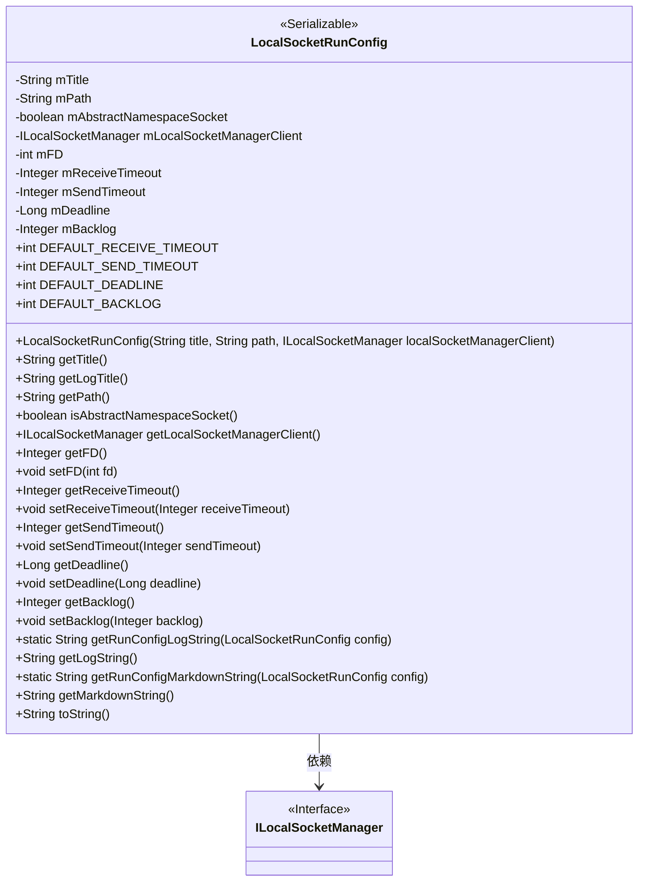

# 基础信息

|      |      |
|------|------|
| 名称 | LocalSocketRunConfig |
| 编码语言 | .java |
| 代码路径 | termux-app/termux-shared/src/main/java/com/termux/shared/net/socket/local/LocalSocketRunConfig.java |
| 包名 | com.termux.shared.net.socket.local |
| 依赖项 | ['androidx.annotation.NonNull', 'com.termux.shared.file.FileUtils', 'com.termux.shared.logger.Logger', 'com.termux.shared.markdown.MarkdownUtils', 'java.io.Serializable', 'java.nio.charset.StandardCharsets'] |
| 概述说明 | LocalSocketRunConfig类用于配置本地套接字，包含路径、超时、客户端等参数。 |

# 说明

LocalSocketRunConfig是一个实现Serializable接口的类，用于配置本地套接字服务器的运行参数。主要属性包括标题mTitle、套接字路径mPath（支持文件系统或抽象命名空间）、是否为抽象命名空间套接字mAbstractNamespaceSocket、客户端接口mLocalSocketManagerClient、文件描述符mFD（初始为-1）、接收超时mReceiveTimeout（默认10秒）、发送超时mSendTimeout（默认10秒）、截止时间mDeadline（默认0）和待处理连接队列最大长度mBacklog（默认50）。类提供了各属性的getter/setter方法，并支持生成日志字符串和Markdown格式的配置信息。路径处理考虑了权限和Android 9+的SELinux限制，抽象命名空间套接字需以空字符开头。

# 类列表 Class Summary

| 名称   | 类型  | 说明 |
|-------|------|-------------|
| LocalSocketRunConfig | class | LocalSocketRunConfig类用于配置本地套接字服务器，包含路径、超时、客户端等参数。 |

## 类 LocalSocketRunConfig

|      |      |
|------|------|
| 访问范围 | public |
| 类型 | class |
| 名称 | LocalSocketRunConfig |
| 说明 | LocalSocketRunConfig类用于配置本地套接字服务器，包含路径、超时、客户端等参数。 |

### UML类图

该类图展示了LocalSocketRunConfig类的结构，它是一个可序列化的配置类，用于管理本地套接字连接的各种参数。该类包含多个受保护的成员变量，如套接字路径、超时设置、文件描述符等，并提供了相应的getter/setter方法。通过ILocalSocketManager接口与套接字管理器交互，同时实现了日志和markdown格式的输出功能。该类主要用于配置和管理本地套接字服务器的运行参数，包括连接超时、发送/接收超时等网络相关设置。

### 内部方法调用关系图

```mermaid
graph TD
    A["类LocalSocketRunConfig"]
    B["属性: String mTitle"]
    C["属性: String mPath"]
    D["属性: boolean mAbstractNamespaceSocket"]
    E["属性: ILocalSocketManager mLocalSocketManagerClient"]
    F["属性: int mFD"]
    G["属性: Integer mReceiveTimeout"]
    H["属性: Integer mSendTimeout"]
    I["属性: Long mDeadline"]
    J["属性: Integer mBacklog"]
    K["构造方法: LocalSocketRunConfig(String title, String path, ILocalSocketManager localSocketManagerClient)"]
    L["方法: String getTitle()"]
    M["方法: String getLogTitle()"]
    N["方法: String getPath()"]
    O["方法: boolean isAbstractNamespaceSocket()"]
    P["方法: ILocalSocketManager getLocalSocketManagerClient()"]
    Q["方法: Integer getFD()"]
    R["方法: void setFD(int fd)"]
    S["方法: Integer getReceiveTimeout()"]
    T["方法: void setReceiveTimeout(Integer receiveTimeout)"]
    U["方法: Integer getSendTimeout()"]
    V["方法: void setSendTimeout(Integer sendTimeout)"]
    W["方法: Long getDeadline()"]
    X["方法: void setDeadline(Long deadline)"]
    Y["方法: Integer getBacklog()"]
    Z["方法: void setBacklog(Integer backlog)"]
    AA["静态方法: String getRunConfigLogString(LocalSocketRunConfig config)"]
    AB["方法: String getLogString()"]
    AC["静态方法: String getRunConfigMarkdownString(LocalSocketRunConfig config)"]
    AD["方法: String getMarkdownString()"]
    AE["重写方法: String toString()"]

    A --> B
    A --> C
    A --> D
    A --> E
    A --> F
    A --> G
    A --> H
    A --> I
    A --> J
    A --> K
    A --> L
    A --> M
    A --> N
    A --> O
    A --> P
    A --> Q
    A --> R
    A --> S
    A --> T
    A --> U
    A --> V
    A --> W
    A --> X
    A --> Y
    A --> Z
    A -.-> AA
    A -.-> AB
    A -.-> AC
    A -.-> AD
    A --> AE
    AA --> AB
    AC --> AD
```

这段代码定义了一个`LocalSocketRunConfig`类，用于配置本地套接字服务器的运行参数。类中包含多个属性如套接字路径、超时设置、文件描述符等，以及对应的getter/setter方法。特别提供了日志和markdown格式的输出方法，便于调试和文档记录。构造方法会根据路径首字符判断是否为抽象命名空间套接字，并自动处理路径规范化。所有配置参数都有默认值，并通过严谨的空值检查和边界条件处理确保数据完整性。

### 字段列表 Field List

| 名称  | 类型  | 说明 |
|-------|-------|------|
| mSendTimeout | Integer | 受保护的整型变量mSendTimeout |
| mReceiveTimeout | Integer | 受保护的整数类型接收超时变量。 |
| mBacklog | Integer | 保护整型变量mBacklog |
| mFD = -1 | int | 声明受保护的整型变量mFD，初始值为-1。 |
| mTitle | String | 受保护不可变的字符串mTitle |
| mAbstractNamespaceSocket | boolean | 保护型布尔变量，表示抽象命名空间套接字状态。 |
| mLocalSocketManagerClient | ILocalSocketManager | 受保护的最终本地套接字管理客户端实例。 |
| mPath | String | 受保护不可变字符串变量mPath |
| DEFAULT_DEADLINE = 0 | int | 静态常量DEFAULT_DEADLINE默认值为0。 |
| DEFAULT_RECEIVE_TIMEOUT = 10000 | int | 默认接收超时10秒 |
| mDeadline | Long | 声明长整型变量mDeadline，用于存储截止时间。 |
| DEFAULT_BACKLOG = 50 | int | 默认积压数50。 |
| DEFAULT_SEND_TIMEOUT = 10000 | int | 默认发送超时时间为一万毫秒。 |

### 方法列表 Method List

| 名称  | 类型  | 说明 |
|-------|-------|------|
| getTitle | String | 获取标题字符串方法。 |
| setFD | void | 设置文件描述符，非负赋值否则设为-1。 |
| getFD | Integer | 获取文件描述符mFD的整数值。 |
| getPath | String | 获取路径字符串的方法。 |
| setBacklog | void | 设置TCP连接请求队列最大长度，仅当输入值大于0时生效。 |
| getRunConfigLogString | String | 非空检查后返回配置日志字符串 |
| getRunConfigMarkdownString | String | 静态方法返回本地套接字运行配置的Markdown字符串，若配置为空返回"null"。 |
| getSendTimeout | Integer | 获取发送超时时间，若未设置则返回默认值。 |
| setDeadline | void | 设置截止时间的方法，参数为长整型。 |
| setReceiveTimeout | void | 设置接收超时时间参数。 |
| setSendTimeout | void | 设置发送超时时间参数。 |
| getBacklog | Integer | 获取待办任务数，若为空则返回默认值。 |
| getReceiveTimeout | Integer | 获取接收超时时间，若未设置则返回默认值。 |
| getDeadline | Long | 获取截止时间，若为空则返回默认值。 |
| getLocalSocketManagerClient | ILocalSocketManager | 获取本地套接字管理客户端实例。 |
| isAbstractNamespaceSocket | boolean | 检查是否为抽象命名空间套接字 |
| getLogTitle | String | 方法返回日志标题，格式为默认日志标签加自定义标题。 |
| getLogString | String | 生成Socket服务器运行配置日志，包含路径、命名空间、客户端类、文件描述符、收发超时、截止时间和积压数。 |
| getMarkdownString | String | 生成Socket服务器运行配置信息，包含路径、超时等关键参数。 |
| toString | String | 重写toString方法，返回getLogString()结果。 |

