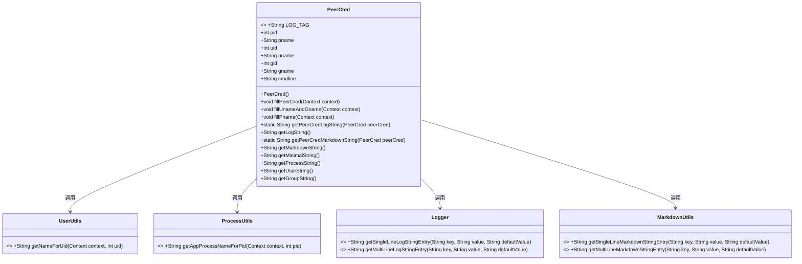
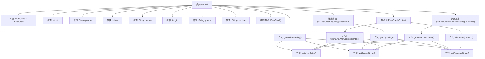

# 基础信息

|      |      |
|------|------|
| 名称 | PeerCred |
| 编码语言 | .java |
| 代码路径 | termux-app/termux-shared/src/main/java/com/termux/shared/net/socket/local/PeerCred.java |
| 包名 | com.termux.shared.net.socket.local |
| 依赖项 | ['android.content.Context', 'androidx.annotation.Keep', 'androidx.annotation.NonNull', 'com.termux.shared.android.ProcessUtils', 'com.termux.shared.android.UserUtils', 'com.termux.shared.logger.Logger', 'com.termux.shared.markdown.MarkdownUtils'] |
| 概述说明 | PeerCred类存储进程、用户和组信息，提供日志和Markdown格式化方法。 |

# 说明

PeerCred类用于存储和操作进程凭证信息，包含进程ID、名称、用户ID、名称、组ID、名称及命令行。初始化时ID设为-1以避免返回root权限。提供填充未设置数据的方法，如根据上下文获取用户名、组名和进程名。支持生成日志字符串、Markdown格式字符串及简化字符串，用于记录和展示凭证信息。日志和Markdown格式包含进程、用户、组及命令行的详细信息。

# 类列表 Class Summary

| 名称   | 类型  | 说明 |
|-------|------|-------------|
| PeerCred | class | PeerCred类存储进程凭据信息，包括PID、UID、GID及名称，提供日志和Markdown格式化方法。 |

## 类 PeerCred

|      |      |
|------|------|
| 访问范围 | @Keep;public |
| 类型 | class |
| 名称 | PeerCred |
| 说明 | PeerCred类存储进程凭据信息，包括PID、UID、GID及名称，提供日志和Markdown格式化方法。 |

### UML类图

PeerCred类用于封装和操作进程凭证信息，包括进程ID、用户ID、组ID及其对应的名称，以及命令行信息。该类提供了多种方法来填充、格式化和输出这些信息，包括日志字符串、Markdown字符串和最小化字符串。PeerCred依赖于UserUtils、ProcessUtils、Logger和MarkdownUtils等工具类来完成其功能，这些工具类提供了静态方法用于名称查找和字符串格式化。

### 内部方法调用关系图

这段代码定义了一个PeerCred类，用于存储和操作进程凭证信息，包括进程ID、用户ID、组ID及其名称等。类提供了多种方法来填充和格式化这些信息，如fillPeerCred()用于补充未设置的凭证数据，getLogString()和getMarkdownString()分别生成日志和Markdown格式的字符串。代码结构清晰，通过辅助方法如getProcessString()等实现字符串格式化，确保信息的可读性和一致性。

### 字段列表 Field List

| 名称  | 类型  | 说明 |
|-------|-------|------|
| pid | int | 整型变量pid，表示进程ID。 |
| gid | int | 整型公共变量gid |
| uname | String | 声明公共字符串变量uname。 |
| gname | String | 声明字符串变量gname |
| uid | int | 整数类型用户ID |
| pname | String | 声明字符串变量pname |
| LOG_TAG = "PeerCred" | String | 日志标签为"PeerCred"。 |
| cmdline | String | 命令行字符串参数 |

### 方法列表 Method List

| 名称  | 类型  | 说明 |
|-------|-------|------|
| getMinimalString | String | 返回进程、用户和组的字符串信息。 |
| getUserString | String | 返回用户ID和用户名组合字符串，若用户名为空则仅返回ID。 |
| getGroupString | String | 方法返回组ID和名称组合字符串，若名称为空则仅返回ID。 |
| fillPeerCred | void | 填充对等凭证：调用填充用户名组名和进程名方法。 |
| getLogString | String | 生成日志字符串，包含进程、用户、组及命令行信息。 |
| fillPname | void | 检查并设置进程名，若未设置则根据PID获取应用进程名。 |
| fillUnameAndGname | void | 方法根据用户ID和组ID填充用户名和组名，若组ID与用户ID相同则组名等于用户名。 |
| getPeerCredLogString | String | 静态方法，检查peerCred非空后返回其日志字符串，空则返回"null"。 |
| getPeerCredMarkdownString | String | 静态方法返回PeerCred的Markdown字符串，若为空返回"null"。 |
| getMarkdownString | String | 生成Peer Cred信息，包含进程、用户、组及命令行详情。 |
| getProcessString | String | 方法返回进程字符串，格式为"pid (pname)"，若pname为空则仅返回pid。 |

