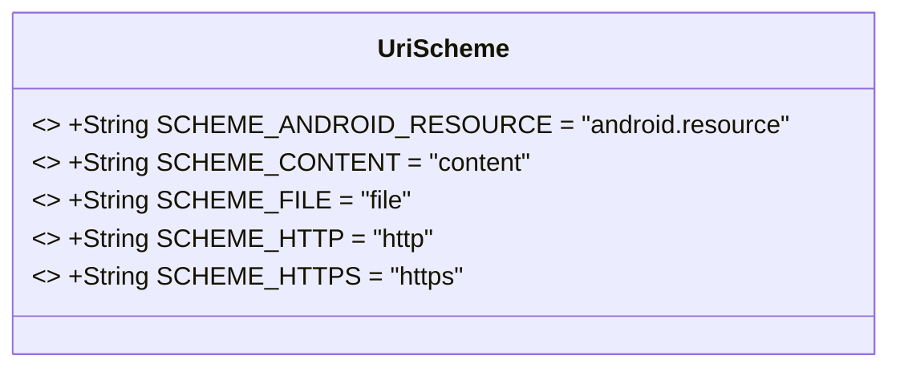
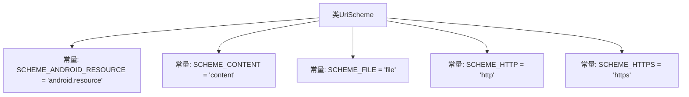

# 基础信息

|      |      |
|------|------|
| 名称 | UriScheme |
| 编码语言 | .java |
| 代码路径 | termux-app/termux-shared/src/main/java/com/termux/shared/net/uri/UriScheme.java |
| 包名 | com.termux.shared.net.uri |
| 依赖项 | ['android.net.Uri'] |
| 概述说明 | UriScheme类定义了五种URI协议常量：android.resource、content、file、http和https。 |

# 说明

该代码定义了一个UriScheme类，包含五个公共静态常量字符串，分别表示不同的URI方案类型。SCHEME_ANDROID_RESOURCE表示Android应用资源，SCHEME_CONTENT表示Android内容提供者，SCHEME_FILE表示文件系统或Android应用资源，SCHEME_HTTP和SCHEME_HTTPS分别表示超文本传输协议及其安全版本。每个常量都有对应的注释说明其用途或相关参考链接。

# 类列表 Class Summary

| 名称   | 类型  | 说明 |
|-------|------|-------------|
| UriScheme | class | UriScheme类定义了五种URI协议常量：android.resource、content、file、http和https。 |

## 类 UriScheme

|      |      |
|------|------|
| 访问范围 | public |
| 类型 | class |
| 名称 | UriScheme |
| 说明 | UriScheme类定义了五种URI协议常量：android.resource、content、file、http和https。 |

### UML类图

这段代码定义了一个名为UriScheme的类，该类包含了五个公共静态常量字符串，分别表示不同的URI协议方案。这些常量包括Android资源、内容提供者、文件系统、HTTP和HTTPS协议。这些常量通常用于标识和区分不同类型的URI，方便在代码中引用和比较。由于这些常量都是静态和final的，因此它们在类加载时被初始化，并且在整个程序运行期间保持不变。

### 内部方法调用关系图

该流程图展示了UriScheme类的结构，它是一个包含5个公共静态常量的工具类，这些常量定义了常见的URI协议方案。每个常量对应不同的网络或本地资源访问协议，包括Android资源标识符、内容提供者、文件系统、HTTP和HTTPS协议。这些常量通常用于统一资源标识符的解析和处理场景，为代码提供标准化的协议字符串引用。

### 字段列表 Field List

| 名称  | 类型  | 说明 |
|-------|-------|------|
| SCHEME_ANDROID_RESOURCE = "android.resource" | String | 定义安卓资源URI的常量字符串。 |
| SCHEME_HTTPS = "https" | String | 定义HTTPS协议常量字符串"https"。 |
| SCHEME_CONTENT = "content" | String | 静态常量SCHEME_CONTENT值为"content"。 |
| SCHEME_FILE = "file" | String | 定义文件协议常量"file"。 |
| SCHEME_HTTP = "http" | String | 定义HTTP协议常量字符串"http"。 |

### 方法列表 Method List

| 名称  | 类型  | 说明 |
|-------|-------|------|

