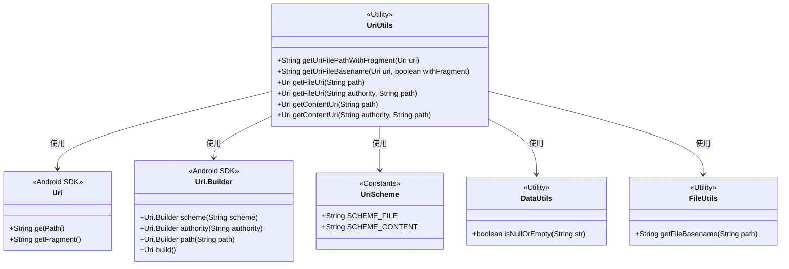
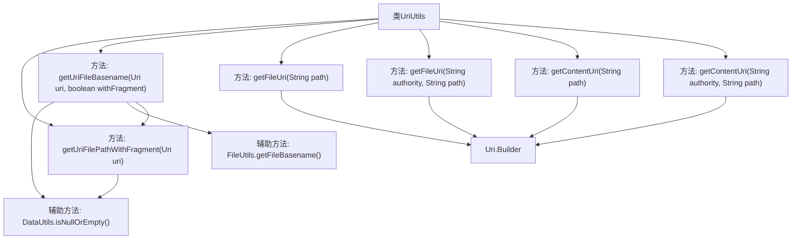

# 基础信息

|      |      |
|------|------|
| 名称 | UriUtils |
| 编码语言 | .java |
| 代码路径 | termux-app/termux-shared/src/main/java/com/termux/shared/net/uri/UriUtils.java |
| 包名 | com.termux.shared.net.uri |
| 依赖项 | ['android.net.Uri', 'androidx.annotation.NonNull', 'androidx.annotation.Nullable', 'com.termux.shared.data.DataUtils', 'com.termux.shared.file.FileUtils'] |
| 概述说明 | UriUtils工具类：处理Uri路径，获取完整路径、文件名及构建文件或内容Uri。 |

# 说明

UriUtils类提供处理Uri路径的实用方法。getUriFilePathWithFragment方法从Uri获取完整文件路径，包括片段部分，处理了通过Uri.parse创建时可能丢失片段的问题。getUriFileBasename方法获取文件基名，可选择是否包含片段。getFileUri方法创建文件类型的Uri，支持带或不带授权信息。getContentUri方法创建内容类型的Uri，同样支持带或不带授权信息。所有方法都进行空值检查，确保健壮性。

# 类列表 Class Summary

| 名称   | 类型  | 说明 |
|-------|------|-------------|
| UriUtils | class | UriUtils工具类：处理文件路径与Uri转换，支持含片段路径及获取文件名，提供文件和内容Uri构建方法。 |

## 类 UriUtils

|      |      |
|------|------|
| 访问范围 | public |
| 类型 | class |
| 名称 | UriUtils |
| 说明 | UriUtils工具类：处理文件路径与Uri转换，支持含片段路径及获取文件名，提供文件和内容Uri构建方法。 |

### UML类图

这段代码展示了一个Android工具类UriUtils，主要用于处理URI相关的文件路径操作。类图中包含UriUtils与Android SDK中的Uri、Uri.Builder类的交互，以及与其他工具类DataUtils、FileUtils的依赖关系。UriUtils提供了6个静态方法，功能包括：获取带片段(如#hash)的完整文件路径、获取文件名(可选择包含片段)、构建file://和content://两种协议的URI等。所有方法都处理了空值检查，并通过组合Uri.Builder和工具类方法实现安全操作。

### 内部方法调用关系图

这段代码是UriUtils工具类，主要用于处理Android中的Uri相关操作。核心功能包括：1) 获取包含片段(fragment)的完整文件路径；2) 获取带或不带片段(fragment)的文件名；3) 创建file://和content://两种scheme的Uri对象。流程图展示了类中的6个主要方法及其调用关系，其中getUriFileBasename方法会根据参数决定是否调用getUriFilePathWithFragment方法，所有Uri构建方法都依赖Uri.Builder类。辅助方法DataUtils和FileUtils被用于空值检查和文件名提取。

### 字段列表 Field List

| 名称  | 类型  | 说明 |
|-------|-------|------|

### 方法列表 Method List

| 名称  | 类型  | 说明 |
|-------|-------|------|
| getContentUri | Uri | 静态方法生成内容URI，参数为authority和path。 |
| getUriFileBasename | String | 静态方法获取URI文件名，支持是否包含片段。 |
| getUriFilePathWithFragment | String | 从URI获取带片段的文件路径，空则返回空。 |
| getContentUri | Uri | 静态方法生成内容URI，参数为路径。 |
| getFileUri | Uri | 静态方法生成文件URI，参数为路径，返回构建的URI对象。 |
| getFileUri | Uri | 静态方法生成文件URI，参数为权限和路径，返回构建的URI对象。 |

