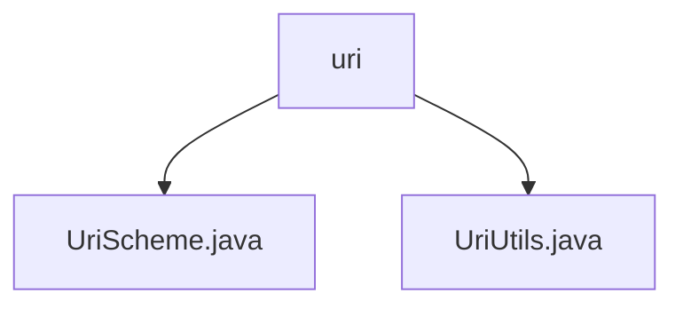

# 基础信息

|      |      |
|------|------|
| 名称 | uri |
| 编码语言 | .java |
| 代码路径 | termux-app/termux-shared/src/main/java/com/termux/shared/net/uri |
| 包名 | termux-app.termux-shared.src.main.java.com.termux.shared.net.uri |
| 概述说明 | UriScheme类定义五种URI方案常量。UriUtils类提供处理Uri路径的方法，包括获取路径、基名及创建文件或内容Uri。 |

# 说明

## 概述

该代码模块主要提供与URI（统一资源标识符）相关的处理和定义功能，包含两个核心类：

1. **UriScheme类**：定义了常见的URI方案类型（scheme）的静态常量，用于标识不同资源类型的URI前缀。
2. **UriUtils类**：提供了一系列实用方法，用于处理URI路径的解析、构建和转换，支持文件路径、片段（fragment）处理以及不同类型URI的创建。

## 主要业务场景

1. **URI方案类型标识**  
   - 通过`UriScheme`类的静态常量（如`SCHEME_ANDROID_RESOURCE`、`SCHEME_CONTENT`等），明确区分不同类型的URI资源（如Android应用资源、内容提供者、文件系统、HTTP/HTTPS等），便于在代码中统一管理和使用。

2. **URI路径解析与处理**  
   - **文件路径提取**：`UriUtils`提供方法（如`getUriFilePathWithFragment`）从URI中提取完整文件路径，包括片段部分，解决`Uri.parse`可能丢失片段的问题。
   - **文件基名获取**：支持从URI中提取文件基名（`getUriFileBasename`），可选择是否包含片段信息。

3. **URI构建**  
   - **文件URI创建**：支持构建文件类型的URI（`getFileUri`），可包含或不包含授权信息（authority）。
   - **内容URI创建**：支持构建内容类型的URI（`getContentUri`），同样支持授权信息的灵活配置。

4. **健壮性保障**  
   - 所有方法均包含空值检查，避免因无效输入导致的异常，确保代码的稳定性和可靠性。

该模块适用于需要处理多种URI类型（如本地文件、网络资源、Android特定资源）的场景，尤其在Termux等涉及跨平台资源访问的应用中发挥重要作用。

### 包内部结构视图

该流程图展示了Termux项目中网络URI相关代码的层级结构。根节点"uri"包含两个Java文件：UriScheme.java和UriUtils.java，这两个文件分别处理URI方案和URI工具功能。整个结构简洁明了，反映了URI相关功能模块的代码组织方式，符合典型的Java项目包结构设计。

# 文件列表 File List

| 名称   | 类型  | 说明 |
|-------|------|-------------|
| [UriUtils.java](UriUtils.md) | file | UriUtils工具类：处理Uri路径，获取完整路径、文件名及构建文件或内容Uri。 |
| [UriScheme.java](UriScheme.md) | file | UriScheme类定义了五种URI协议常量：android.resource、content、file、http和https。 |

