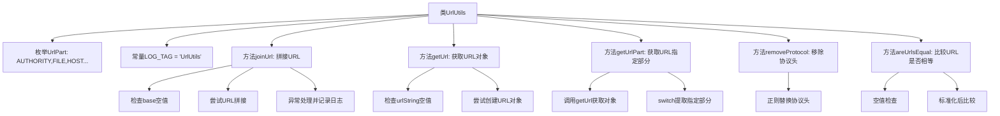

# 基础信息

|      |      |
|------|------|
| 名称 | UrlUtils |
| 编码语言 | .java |
| 代码路径 | termux-app/termux-shared/src/main/java/com/termux/shared/net/url/UrlUtils.java |
| 包名 | com.termux.shared.net.url |
| 依赖项 | ['androidx.annotation.Nullable', 'com.termux.shared.data.DataUtils', 'com.termux.shared.logger.Logger', 'java.net.MalformedURLException', 'java.net.URL'] |
| 概述说明 | UrlUtils工具类：提供URL拼接、解析、去协议及比较功能。 |

# 说明

UrlUtils是一个工具类，提供URL处理功能。包含UrlPart枚举，定义URL的各个部分（如协议、主机、路径等）。主要方法包括：joinUrl用于拼接基础URL和目标URL；getUrl将字符串转换为URL对象；getUrlPart提取URL的指定部分；removeProtocol移除URL的协议和www前缀；areUrlsEqual比较两个URL是否相等（忽略协议和末尾斜杠）。方法均处理空值和异常情况，部分操作支持错误日志记录。

# 类列表 Class Summary

| 名称   | 类型  | 说明 |
|-------|------|-------------|
| UrlUtils | class | UrlUtils类提供URL处理功能，包括拼接、解析、比较及移除协议前缀。 |


## 类 UrlUtils

|      |      |
|------|------|
| 访问范围 | public |
| 类型 | class |
| 名称 | UrlUtils |
| 说明 | UrlUtils类提供URL处理功能，包括拼接、解析、比较及移除协议前缀。 |


### UML类图

```mermaid
classDiagram
    class UrlUtils {
        -String LOG_TAG
        +enum UrlPart {
            AUTHORITY,
            FILE,
            HOST,
            REF,
            FRAGMENT,
            PATH,
            PORT,
            PROTOCOL,
            QUERY,
            USER_INFO
        }
        +String joinUrl(String base, String destination, boolean logError)
        +URL getUrl(String urlString)
        +String getUrlPart(String urlString, UrlPart urlPart)
        +String removeProtocol(String urlString)
        +boolean areUrlsEqual(String url1, String url2)
    }

    class URL {
        <<External>>
    }

    class DataUtils {
        <<External>>
        +boolean isNullOrEmpty(String)
    }

    class Logger {
        <<External>>
        +void logError(String tag, String message)
    }

    UrlUtils --> DataUtils : 依赖
    UrlUtils --> Logger : 依赖
    UrlUtils --> URL : 依赖
```

这段代码展示了一个URL工具类`UrlUtils`，提供了多种URL处理功能。类中包含一个枚举`UrlPart`定义URL的各个组成部分，主要方法包括URL拼接(`joinUrl`)、URL解析(`getUrl`)、获取URL特定部分(`getUrlPart`)、移除协议(`removeProtocol`)和URL比较(`areUrlsEqual`)。该类依赖外部工具类`DataUtils`进行空值检查，依赖`Logger`记录错误日志，并依赖Java标准库的`URL`类进行核心URL操作。所有方法均为静态方法，体现了工具类的设计特点。


### 内部方法调用关系图



流程图描述：该流程图展示了UrlUtils工具类的完整结构，包含枚举定义、常量和5个核心方法。主要逻辑包括URL拼接时的空值检查和异常处理、URL对象创建、通过switch-case提取URL不同部分、使用正则移除协议前缀，以及通过标准化处理比较两个URL的等效性。各方法间存在调用关系，如getUrlPart会调用getUrl方法获取URL对象。

### 字段列表 Field List

| 名称  | 类型  | 说明 |
|-------|-------|------|
| LOG_TAG = "UrlUtils" | String | 私有静态常量LOG_TAG值为"UrlUtils"。 |

### 方法列表 Method List

| 名称  | 类型  | 说明 |
|-------|-------|------|
| getUrl | URL | 静态方法，输入字符串返回URL对象，空或异常返回null。 |
| areUrlsEqual | boolean | 比较两URL是否相同，忽略协议和末尾斜杠。 |
| joinUrl | String | 静态方法joinUrl拼接URL，失败返回null，可选记录错误日志。 |
| getUrlPart | String | 静态方法getUrlPart根据UrlPart参数返回URL的指定部分，若URL无效或部分不存在则返回null。 |
| removeProtocol | String | 移除URL中的协议和www前缀 |


