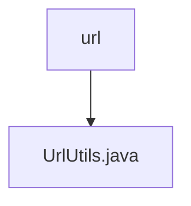

# 基础信息

|      |      |
|------|------|
| 名称 | url |
| 编码语言 | .java |
| 代码路径 | termux-app/termux-shared/src/main/java/com/termux/shared/net/url |
| 包名 | termux-app.termux-shared.src.main.java.com.termux.shared.net.url |
| 概述说明 | UrlUtils工具类：提供URL拼接、解析、去协议及比较功能。 |

# 说明

UrlUtils是一个工具类，提供URL处理功能。包含UrlPart枚举，定义URL的各个部分（如协议、主机、路径等）。主要方法包括：joinUrl用于拼接基础URL和目标URL；getUrl将字符串转换为URL对象；getUrlPart提取URL的指定部分；removeProtocol移除URL的协议和www前缀；areUrlsEqual比较两个URL是否相等（忽略协议和末尾斜杠）。方法均处理空值和异常情况，部分操作支持错误日志记录。

### 包内部结构视图

该流程图展示了Termux项目中URL工具类的层级关系。顶层节点为"url"目录，其下级包含一个具体实现文件"UrlUtils.java"。这种简洁的层级结构表明这是一个功能集中的工具模块，专注于URL相关操作，符合单一职责原则。图中仅包含给定的两个路径节点，准确反映了实际项目结构。

# 文件列表 File List

| 名称   | 类型  | 说明 |
|-------|------|-------------|
| [UrlUtils.java](UrlUtils.md) | file | UrlUtils工具类：提供URL拼接、解析、去协议及比较功能。 |

