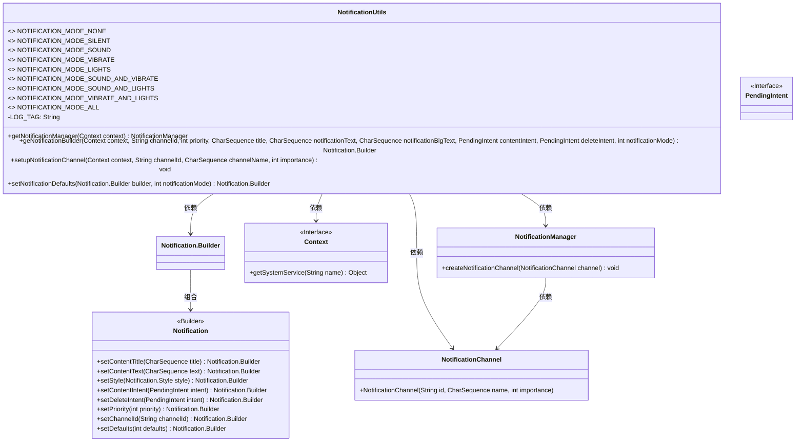
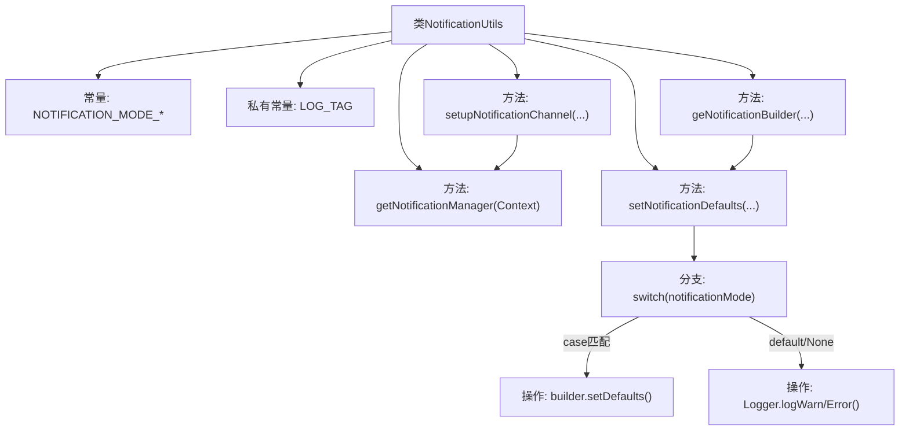
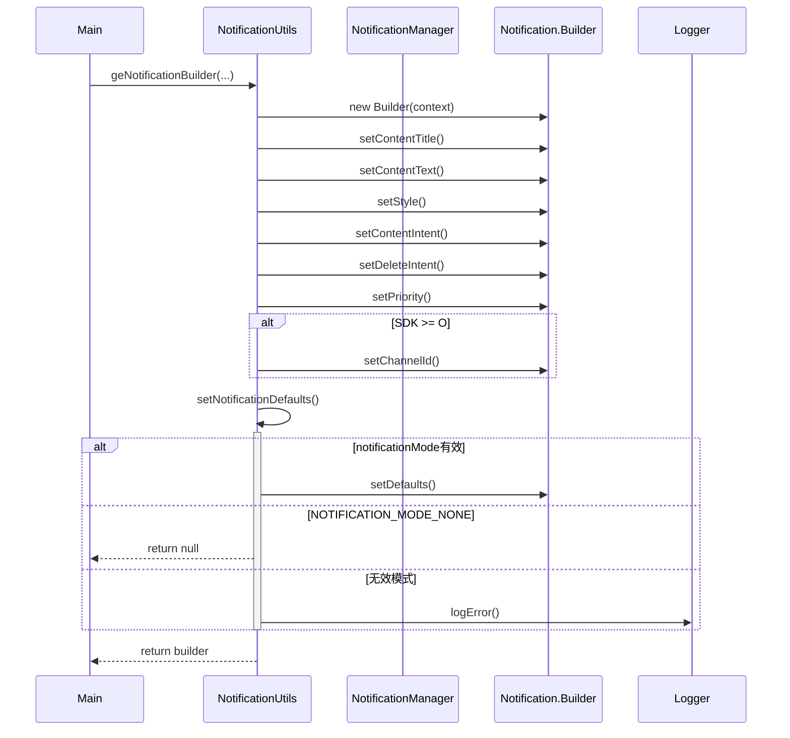

# 基础信息

|      |      |
|------|------|
| 名称 | NotificationUtils |
| 编码语言 | .java |
| 代码路径 | termux-app/termux-shared/src/main/java/com/termux/shared/notification/NotificationUtils.java |
| 包名 | com.termux.shared.notification |
| 依赖项 | ['android.app.Notification', 'android.app.NotificationChannel', 'android.app.NotificationManager', 'android.app.PendingIntent', 'android.content.Context', 'android.os.Build', 'androidx.annotation.Nullable', 'com.termux.shared.logger.Logger'] |
| 概述说明 | 通知工具类，包含多种通知模式和构建方法。 |

# 说明

NotificationUtils类提供了处理通知功能的工具方法。定义了9种通知模式常量，包括无通知、静默、声音、振动、灯光等组合模式。主要功能包括获取NotificationManager实例、构建Notification.Builder对象（支持设置标题、内容、点击/删除意图等属性）、创建通知渠道（适配Android O及以上版本）以及根据通知模式设置默认通知行为（声音、振动、灯光）。其中setNotificationDefaults方法会根据传入的notificationMode参数配置相应的通知效果，并处理无效模式的情况。

# 类列表 Class Summary

| 名称   | 类型  | 说明 |
|-------|------|-------------|
| NotificationUtils | class | NotificationUtils类提供通知管理功能，包括模式设置、构建器和通道配置。 |

## 类 NotificationUtils

|      |      |
|------|------|
| 访问范围 | public |
| 类型 | class |
| 名称 | NotificationUtils |
| 说明 | NotificationUtils类提供通知管理功能，包括模式设置、构建器和通道配置。 |

### UML类图

这段代码描述了一个Android通知工具类NotificationUtils，它提供了多种通知模式（静音、声音、振动等）的静态常量定义，并封装了获取通知管理器、构建通知、设置通知通道等功能方法。该类通过Context获取系统服务，使用Notification.Builder构建通知对象，并针对不同Android版本进行兼容处理（如Oreo及以上版本需要设置通知通道）。类图中清晰地展示了NotificationUtils与Android通知系统核心组件（Notification、NotificationChannel、NotificationManager）的交互关系，以及对外部接口（Context、PendingIntent）的依赖。

### 内部方法调用关系图

该流程图展示了NotificationUtils类的核心结构和调用关系，包含9种通知模式常量定义和4个关键方法。时序图详细描述了geNotificationBuilder方法的完整调用链，包括Builder对象创建、参数设置、版本兼容性处理以及通知模式配置过程，特别突出了setNotificationDefaults方法中根据不同模式设置默认参数的分支逻辑。整个设计实现了灵活的通知管理功能，支持从静默到全功能（声音+震动+灯光）的多种通知模式配置。

### 字段列表 Field List

| 名称  | 类型  | 说明 |
|-------|-------|------|
| NOTIFICATION_MODE_SOUND_AND_VIBRATE = 5 | int | 通知模式：声音加振动（值为5）。 |
| NOTIFICATION_MODE_SOUND_AND_LIGHTS = 6 | int | 通知模式：声音和灯光（值为6）。 |
| NOTIFICATION_MODE_SILENT = 1 | int | 静态常量NOTIFICATION_MODE_SILENT值为1，表示静音通知模式。 |
| LOG_TAG = "NotificationUtils" | String | 日志标签定义为"NotificationUtils"。 |
| NOTIFICATION_MODE_ALL = 8 | int | 静态常量NOTIFICATION_MODE_ALL值为8。 |
| NOTIFICATION_MODE_NONE = 0 | int | 静态常量NOTIFICATION_MODE_NONE值为0。 |
| NOTIFICATION_MODE_LIGHTS = 4 | int | 静态常量NOTIFICATION_MODE_LIGHTS值为4。 |
| NOTIFICATION_MODE_VIBRATE = 3 | int | 静态常量NOTIFICATION_MODE_VIBRATE值为3，表示震动通知模式。 |
| NOTIFICATION_MODE_VIBRATE_AND_LIGHTS = 7 | int | 振动和灯光通知模式，值为7。 |
| NOTIFICATION_MODE_SOUND = 2 | int | 静态常量NOTIFICATION_MODE_SOUND值为2，表示声音通知模式。 |

### 方法列表 Method List

| 名称  | 类型  | 说明 |
|-------|-------|------|
| setNotificationDefaults | Notification.Builder | 根据通知模式设置默认提示方式，无模式返回null，无效模式报错。 |
| geNotificationBuilder | Notification.Builder | 创建通知构建器，设置标题、内容、意图等参数，适配不同系统版本。 |
| getNotificationManager | NotificationManager | 获取通知管理器，若上下文为空则返回空。 |
| setupNotificationChannel | void | 创建通知渠道，仅适用于Android O及以上版本。 |

