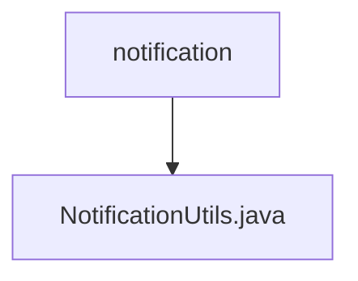

# 基础信息

|      |      |
|------|------|
| 名称 | notification |
| 编码语言 | .java |
| 代码路径 | termux-app/termux-shared/src/main/java/com/termux/shared/notification |
| 包名 | termux-app.termux-shared.src.main.java.com.termux.shared.notification |
| 概述说明 | 通知工具类，包含多种通知模式和构建方法。 |

# 说明

NotificationUtils类提供了处理通知功能的工具方法。定义了9种通知模式常量，包括无通知、静默、声音、振动、灯光等组合模式。主要功能包括获取NotificationManager实例、构建Notification.Builder对象（支持设置标题、内容、点击/删除意图等属性）、创建通知渠道（适配Android O及以上版本）以及根据通知模式设置默认通知行为（声音、振动、灯光）。其中setNotificationDefaults方法会根据传入的notificationMode参数配置相应的通知效果，并处理无效模式的情况。

### 包内部结构视图

该流程图展示了Termux项目中通知模块的层级关系。顶层节点为notification文件夹，其下包含一个具体的工具类文件NotificationUtils.java。这种结构体现了模块化设计思想，将通知相关功能集中管理，便于维护和扩展。

# 文件列表 File List

| 名称   | 类型  | 说明 |
|-------|------|-------------|
| [NotificationUtils.java](NotificationUtils.md) | file | 通知工具类，包含多种通知模式和构建方法。 |

