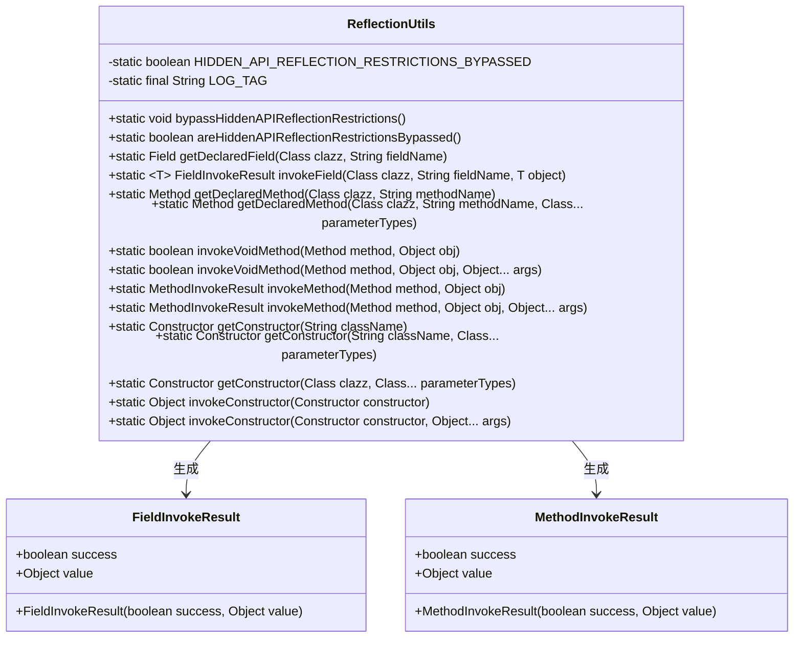
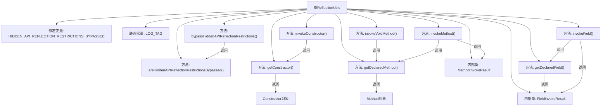

# 基础信息

|      |      |
|------|------|
| 名称 | ReflectionUtils |
| 编码语言 | .java |
| 代码路径 | termux-app/termux-shared/src/main/java/com/termux/shared/reflection/ReflectionUtils.java |
| 包名 | com.termux.shared.reflection |
| 依赖项 | ['android.os.Build', 'androidx.annotation.NonNull', 'androidx.annotation.Nullable', 'com.termux.shared.logger.Logger', 'org.lsposed.hiddenapibypass.HiddenApiBypass', 'java.lang.reflect.Constructor', 'java.lang.reflect.Field', 'java.lang.reflect.Method', 'java.util.Arrays'] |
| 概述说明 | 反射工具类，提供绕过Android隐藏API限制、获取字段方法构造器及调用功能。 |

# 说明

ReflectionUtils类提供了一系列用于绕过Android隐藏API反射限制及简化反射操作的工具方法。主要功能包括：通过bypassHiddenAPIReflectionRestrictions方法绕过Android P及以上版本的隐藏API限制；提供getDeclaredField、getDeclaredMethod和getConstructor方法分别获取字段、方法和构造器；通过invokeField、invokeMethod和invokeConstructor方法执行反射调用。所有方法均包含错误处理，并通过日志记录异常。类中还定义了FieldInvokeResult和MethodInvokeResult两个内部类，用于封装反射调用的结果状态和返回值。

# 类列表 Class Summary

| 名称   | 类型  | 说明 |
|-------|------|-------------|
| ReflectionUtils | class | 反射工具类，绕过Android隐藏API限制，提供字段、方法和构造函数的反射操作。 |

## 类 ReflectionUtils

|      |      |
|------|------|
| 访问范围 | public |
| 类型 | class |
| 名称 | ReflectionUtils |
| 说明 | 反射工具类，绕过Android隐藏API限制，提供字段、方法和构造函数的反射操作。 |

### UML类图

这段代码实现了一个Android反射工具类ReflectionUtils，主要用于绕过Android隐藏API限制，并提供字段/方法/构造函数的反射操作功能。类中包含两个静态内部类FieldInvokeResult和MethodInvokeResult用于封装反射调用结果。主要功能包括：检查/绕过隐藏API限制、获取/调用字段、获取/调用方法、获取/调用构造函数等操作，所有方法都包含完善的错误处理和日志记录。

### 内部方法调用关系图

这段代码是Android反射工具类，主要功能包括：绕过隐藏API限制、获取类字段/方法/构造器、执行方法调用和构造器实例化。核心流程包含条件检查、异常处理和日志记录，通过FieldInvokeResult和MethodInvokeResult封装操作结果。所有反射操作均包含setAccessible(true)调用以突破Java访问限制，并通过Logger统一记录错误信息。

### 字段列表 Field List

| 名称  | 类型  | 说明 |
|-------|-------|------|
| LOG_TAG = "ReflectionUtils" | String | 私有静态常量LOG_TAG值为ReflectionUtils |
| HIDDEN_API_REFLECTION_RESTRICTIONS_BYPASSED = Build.VERSION.SDK_INT < Build.VERSION_CODES.P | boolean | 检查SDK版本是否低于P以绕过隐藏API限制 |

### 方法列表 Method List

| 名称  | 类型  | 说明 |
|-------|-------|------|
| areHiddenAPIReflectionRestrictionsBypassed | boolean | 检查隐藏API反射限制是否被绕过。 |
| bypassHiddenAPIReflectionRestrictions | void | 绕过Android隐藏API反射限制 |
| getDeclaredField | Field | 获取类的指定字段，失败返回null。 |
| invokeMethod | MethodInvokeResult | 调用方法并返回结果，参数为方法和对象。 |
| getConstructor | Constructor<?> | 获取类的构造函数，失败返回null。 |
| invokeConstructor | Object | 调用无参构造方法。 |
| invokeConstructor | Object | 调用构造方法并处理异常，失败返回null。 |
| invokeVoidMethod | boolean | 调用无参void方法，返回执行结果。 |
| getDeclaredMethod | Method | 获取类中指定方法，失败返回null。 |
| getConstructor | Constructor<?> | 静态方法获取类构造器，失败返回null并记录日志。 |
| getConstructor | Constructor<?> | 获取指定类名的无参构造方法。 |
| invokeVoidMethod | boolean | 反射调用方法，成功返回true，失败记录日志并返回false。 |
| invokeField | FieldInvokeResult | 反射调用类字段，返回结果包含状态和值。 |
| invokeMethod | MethodInvokeResult | 调用方法并返回结果，成功返回true和结果，失败记录日志并返回false和null。 |
| getDeclaredMethod | Method | 获取类中指定名称的无参方法。 |

