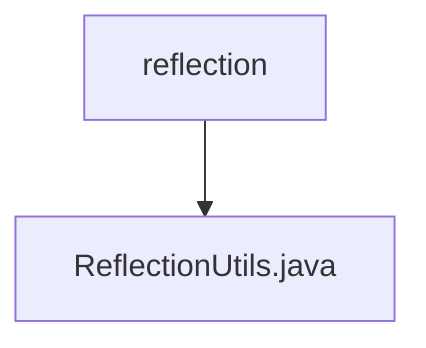

# 基础信息

|      |      |
|------|------|
| 名称 | reflection |
| 编码语言 | .java |
| 代码路径 | termux-app/termux-shared/src/main/java/com/termux/shared/reflection |
| 包名 | termux-app.termux-shared.src.main.java.com.termux.shared.reflection |
| 概述说明 | 反射工具类，提供绕过Android隐藏API限制、获取字段方法构造器及调用功能。 |

# 说明

ReflectionUtils类提供了一系列用于绕过Android隐藏API反射限制及简化反射操作的工具方法。主要功能包括：通过bypassHiddenAPIReflectionRestrictions方法绕过Android P及以上版本的隐藏API限制；提供getDeclaredField、getDeclaredMethod和getConstructor方法分别获取字段、方法和构造器；通过invokeField、invokeMethod和invokeConstructor方法执行反射调用。所有方法均包含错误处理，并通过日志记录异常。类中还定义了FieldInvokeResult和MethodInvokeResult两个内部类，用于封装反射调用的结果状态和返回值。

### 包内部结构视图

该流程图展示了Termux项目中反射工具类的层级关系。根节点为"reflection"目录，其下包含一个具体的工具类文件"ReflectionUtils.java"。这种简洁的层级结构体现了单一职责原则，将反射相关的工具方法集中管理在同一个文件中，便于维护和使用。

# 文件列表 File List

| 名称   | 类型  | 说明 |
|-------|------|-------------|
| [ReflectionUtils.java](ReflectionUtils.md) | file | 反射工具类，提供绕过Android隐藏API限制、获取字段方法构造器及调用功能。 |

