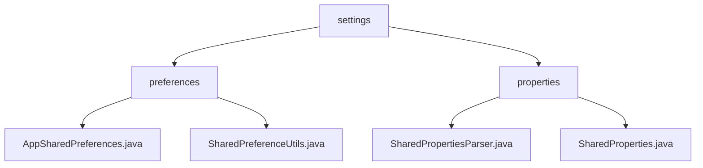

# 基础信息

|      |      |
|------|------|
| 名称 | settings |
| 编码语言 | .java |
| 代码路径 | termux-app/termux-shared/src/main/java/com/termux/shared/settings |
| 包名 | termux-app.termux-shared.src.main.java.com.termux.shared.settings |
| 概述说明 | Android偏好设置管理工具，支持多进程同步、类型安全操作和原子性处理。Termux属性管理模块，提供双缓存、线程安全和动态配置加载功能。 |

# 说明

```markdown
## 概述

该代码模块是一个面向Android平台的配置管理系统，由两个核心子模块组成：

1. **偏好设置管理工具集**  
   基于SharedPreferences封装，提供基础配置存储和增强工具：
   - `AppSharedPreferences`：支持单进程/多进程场景的SharedPreferences实例管理
   - `SharedPreferenceUtils`：提供类型安全操作、原子性支持和错误处理

2. **属性文件管理核心**  
   专为Termux设计的动态配置解决方案：
   - `SharedProperties`：实现属性文件的双缓存加载和线程安全访问
   - `SharedPropertiesParser`：支持自定义解析逻辑的可扩展接口

模块采用分层架构设计，兼具Android原生配置管理和动态文件配置能力，所有操作均包含完善的错误处理、日志记录和线程安全机制。

## 主要业务场景

### 跨平台配置管理
- **多进程配置同步**：通过`mMultiProcessSharedPreferences`实现进程间配置实时同步
- **混合存储模式**：同时支持SharedPreferences存储和属性文件动态加载（如`termux.properties`）

### 数据安全与可靠性
- 私有模式存储（MODE_PRIVATE）确保配置数据安全
- 原子性操作支持（如`getAndIncrementInt`）
- 多线程环境下的数据一致性保障

### 动态配置处理
- 运行时属性文件热重载能力
- 智能数据类型转换：
  - 布尔值智能映射（"1/on/true"→`true`）
  - 数值范围校验（如端口号有效性检查）
  - 默认值回退机制

### 开发支持
- 详尽的日志记录系统
- 同步/异步写入模式选择（apply/commit）
- 工具类方法：
  - 文件路径合法性检查
  - 枚举值匹配
  - 终端配色配置管理等
```


### 包内部结构视图



该流程图展示了Termux应用共享设置模块的目录结构，根节点为settings文件夹，包含preferences和properties两个子目录。preferences目录下有两个Java文件：AppSharedPreferences和SharedPreferenceUtils，用于处理应用偏好设置；properties目录下也有两个Java文件：SharedPropertiesParser和SharedProperties，负责属性文件的解析与管理。整体结构清晰地反映了配置管理模块的功能划分。

# 文件列表 File List

| 名称   | 类型  | 说明 |
|-------|------|-------------|
| [properties](properties/_module.md) | package | SharedProperties类管理属性文件，支持加载、缓存、类型转换及线程安全。 |
| [preferences](preferences/_module.md) | package | AppSharedPreferences封装SharedPreferences功能，支持多进程。SharedPreferenceUtils提供安全便捷的SharedPreferences操作，含错误处理和日志。 |


