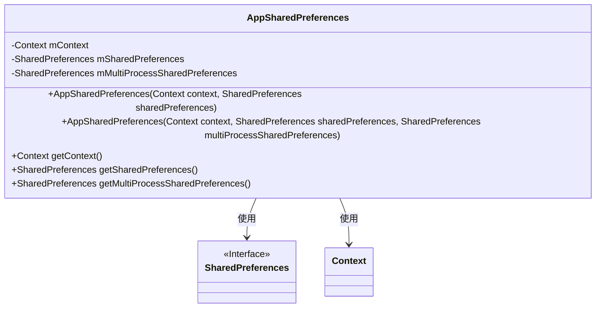
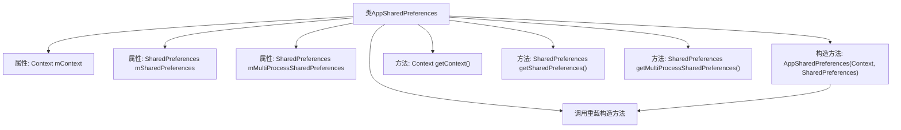

# 基础信息

|      |      |
|------|------|
| 名称 | AppSharedPreferences |
| 编码语言 | .java |
| 代码路径 | termux-app/termux-shared/src/main/java/com/termux/shared/settings/preferences/AppSharedPreferences.java |
| 包名 | com.termux.shared.settings.preferences |
| 依赖项 | ['android.content.Context', 'android.content.SharedPreferences', 'androidx.annotation.NonNull', 'androidx.annotation.Nullable'] |
| 概述说明 | AppSharedPreferences类封装了Context和SharedPreferences，支持多进程访问。 |

# 说明

AppSharedPreferences类封装了SharedPreferences功能，包含三个核心成员变量：mContext用于操作上下文，mSharedPreferences存储私有偏好设置，mMultiProcessSharedPreferences支持多进程共享。提供两个构造函数，分别支持单参数和三参数初始化，以及三个getter方法分别返回这些成员变量。该类设计用于通过SharedPreferenceUtils工具类创建安全的偏好设置实例。

# 类列表 Class Summary

| 名称   | 类型  | 说明 |
|-------|------|-------------|
| AppSharedPreferences | class | AppSharedPreferences类封装了Context和SharedPreferences，支持多进程访问。 |

## 类 AppSharedPreferences

|      |      |
|------|------|
| 访问范围 | public |
| 类型 | class |
| 名称 | AppSharedPreferences |
| 说明 | AppSharedPreferences类封装了Context和SharedPreferences，支持多进程访问。 |

### UML类图

这段代码定义了一个`AppSharedPreferences`类，用于封装Android中的`SharedPreferences`操作。该类包含三个主要成员变量：`mContext`用于存储上下文，`mSharedPreferences`用于存储单进程的偏好设置，`mMultiProcessSharedPreferences`用于支持多进程的偏好设置。类提供了两个构造方法和三个getter方法，分别用于获取这些成员变量的值。该类依赖于Android的`Context`和`SharedPreferences`接口，主要用于简化偏好设置的访问和管理。

### 内部方法调用关系图

该流程图展示了AppSharedPreferences类的结构，包含3个核心属性和3个主要方法。两个构造方法之间存在重载关系，其中简化版构造方法会调用完整版构造方法。类主要用于封装SharedPreferences的访问，支持单进程和多进程模式，通过getter方法提供对内部存储数据的访问控制。流程图清晰地呈现了类成员之间的层级关系和调用路径。

### 字段列表 Field List

| 名称  | 类型  | 说明 |
|-------|-------|------|
| mContext | Context | 受保护的最终上下文变量mContext。 |
| mMultiProcessSharedPreferences | SharedPreferences | 多进程共享偏好设置实例 |
| mSharedPreferences | SharedPreferences | 保护型共享偏好实例变量 |

### 方法列表 Method List

| 名称  | 类型  | 说明 |
|-------|-------|------|
| getSharedPreferences | SharedPreferences | 获取SharedPreferences实例的方法。 |
| getContext | Context | 获取上下文对象的方法。 |
| getMultiProcessSharedPreferences | SharedPreferences | 获取多进程共享的SharedPreferences实例。 |

