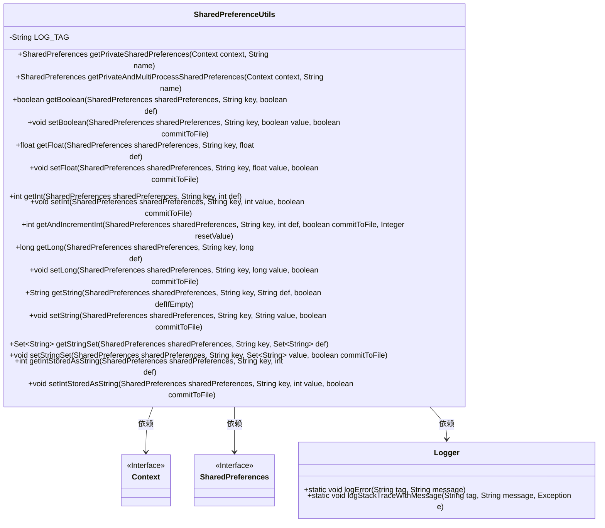

# 基础信息

|      |      |
|------|------|
| 名称 | SharedPreferenceUtils |
| 编码语言 | .java |
| 代码路径 | termux-app/termux-shared/src/main/java/com/termux/shared/settings/preferences/SharedPreferenceUtils.java |
| 包名 | com.termux.shared.settings.preferences |
| 依赖项 | ['android.annotation.SuppressLint', 'android.content.Context', 'android.content.SharedPreferences', 'com.termux.shared.logger.Logger', 'java.util.Set'] |
| 概述说明 | SharedPreferenceUtils提供SharedPreferences的读写工具方法，支持多种数据类型和进程模式。 |

# 说明

SharedPreferenceUtils是一个工具类，提供对SharedPreferences的便捷操作。它包含获取私有或支持多进程的SharedPreferences实例的方法，以及读取和写入各种数据类型（boolean、float、int、long、String、Set<String>）的方法。所有方法都包含错误处理，在异常时返回默认值。写入操作支持异步apply或同步commit模式，后者适用于多进程场景。还包括特殊方法如getAndIncrementInt用于原子递增操作，以及处理int存储为String的辅助方法。所有操作均记录日志以便调试。

# 类列表 Class Summary

| 名称   | 类型  | 说明 |
|-------|------|-------------|
| SharedPreferenceUtils | class | SharedPreferenceUtils提供获取和设置SharedPreferences的工具方法，支持多种数据类型和操作模式。 |

## 类 SharedPreferenceUtils

|      |      |
|------|------|
| 访问范围 | public |
| 类型 | class |
| 名称 | SharedPreferenceUtils |
| 说明 | SharedPreferenceUtils提供获取和设置SharedPreferences的工具方法，支持多种数据类型和操作模式。 |

### UML类图

SharedPreferenceUtils是一个Android工具类，封装了对SharedPreferences的常用操作，包括获取和设置各种类型的数据（如boolean、int、float、long、String和Set<String>），并支持多进程模式。该类通过静态方法提供功能，内部使用Logger记录错误信息，依赖于Android的Context和SharedPreferences接口。代码中处理了空指针和类型转换异常等边缘情况，确保健壮性。

### 内部方法调用关系图

```mermaid
graph TD
    A["类SharedPreferenceUtils"]
    B["常量: LOG_TAG"]
    C["方法: getPrivateSharedPreferences(Context, String)"]
    D["方法: getPrivateAndMultiProcessSharedPreferences(Context, String)"]
    E["方法: getBoolean(SharedPreferences, String, boolean)"]
    F["方法: setBoolean(SharedPreferences, String, boolean, boolean)"]
    G["方法: getFloat(SharedPreferences, String, float)"]
    H["方法: setFloat(SharedPreferences, String, float, boolean)"]
    I["方法: getInt(SharedPreferences, String, int)"]
    J["方法: setInt(SharedPreferences, String, int, boolean)"]
    K["方法: getAndIncrementInt(SharedPreferences, String, int, boolean, Integer)"]
    L["方法: getLong(SharedPreferences, String, long)"]
    M["方法: setLong(SharedPreferences, String, long, boolean)"]
    N["方法: getString(SharedPreferences, String, String, boolean)"]
    O["方法: setString(SharedPreferences, String, String, boolean)"]
    P["方法: getStringSet(SharedPreferences, String, Set<String>)"]
    Q["方法: setStringSet(SharedPreferences, String, Set<String>, boolean)"]
    R["方法: getIntStoredAsString(SharedPreferences, String, int)"]
    S["方法: setIntStoredAsString(SharedPreferences, String, int, boolean)"]

    A --> B
    A --> C
    A --> D
    A --> E
    A --> F
    A --> G
    A --> H
    A --> I
    A --> J
    A --> K
    A --> L
    A --> M
    A --> N
    A --> O
    A --> P
    A --> Q
    A --> R
    A --> S
```

这段代码是一个Android工具类SharedPreferenceUtils，提供了对SharedPreferences的各种操作封装。类中包含获取不同模式SharedPreferences实例的方法，以及针对boolean、float、int、long、String和Set<String>等数据类型的读写方法。所有方法都进行了空指针检查，并处理了类型转换异常，具有完善的错误日志记录功能。对于int类型还提供了原子递增操作，并支持将int以String形式存储的特殊方法。写入操作支持同步提交(commit)和异步应用(apply)两种模式。

### 字段列表 Field List

| 名称  | 类型  | 说明 |
|-------|-------|------|
| LOG_TAG = "SharedPreferenceUtils" | String | 私有静态常量LOG_TAG值为SharedPreferenceUtils |

### 方法列表 Method List

| 名称  | 类型  | 说明 |
|-------|-------|------|
| setInt | void | 保存整数值到SharedPreferences，支持立即提交或异步应用。 |
| getAndIncrementInt | int | 获取并递增SharedPreferences中的整数值，支持重置和错误处理。 |
| setString | void | 保存字符串到SharedPreferences，支持立即提交或异步应用。 |
| getInt | int | 从SharedPreferences获取整数值，异常时返回默认值。 |
| getPrivateAndMultiProcessSharedPreferences | SharedPreferences | 获取支持多进程的私有SharedPreferences实例。 |
| setLong | void | 静态方法设置长整型值到SharedPreferences，支持立即提交或异步应用。 |
| getFloat | float | 从SharedPreferences获取浮点值，异常时返回默认值并记录错误。 |
| getPrivateSharedPreferences | SharedPreferences | 获取应用的私有SharedPreferences实例。 |
| setBoolean | void | 设置布尔值到SharedPreferences，支持立即提交或异步应用。 |
| getBoolean | boolean | 从SharedPreferences获取布尔值，异常时返回默认值。 |
| getLong | long | 从SharedPreferences获取long值，异常时返回默认值并记录错误。 |
| getString | String | 从SharedPreferences获取字符串值，异常或空值返回默认值。 |
| setFloat | void | 保存浮点数到SharedPreferences，支持立即提交或异步应用。 |
| getStringSet | Set<String> | 从SharedPreferences获取字符串集合，异常时返回默认值。 |
| setStringSet | void | 保存字符串集合到SharedPreferences，支持立即提交或异步应用。 |
| getIntStoredAsString | int | 从SharedPreferences获取字符串存储的整数值，异常时返回默认值。 |
| setIntStoredAsString | void | 将整数以字符串形式存入SharedPreferences，支持立即提交或异步操作。 |

