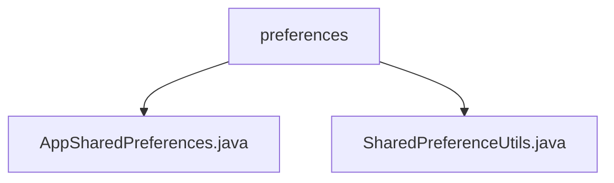

# 基础信息

|      |      |
|------|------|
| 名称 | preferences |
| 编码语言 | .java |
| 代码路径 | termux-app/termux-shared/src/main/java/com/termux/shared/settings/preferences |
| 包名 | termux-app.termux-shared.src.main.java.com.termux.shared.settings.preferences |
| 概述说明 | AppSharedPreferences封装SharedPreferences功能，支持多进程。SharedPreferenceUtils提供安全便捷的SharedPreferences操作，含错误处理和日志。 |

# 说明

```markdown
## 概述

该代码模块是一个基于Android SharedPreferences的偏好设置管理工具集，主要包含两个核心组件：
1. **AppSharedPreferences** - 封装SharedPreferences的基础功能，支持单进程和多进程场景
2. **SharedPreferenceUtils** - 提供对SharedPreferences的增强工具方法，包含类型安全操作和原子性支持

模块采用分层设计，通过AppSharedPreferences提供基础实例管理，SharedPreferenceUtils提供丰富的操作API，所有操作均包含错误处理和日志记录机制。

## 主要业务场景

1. **跨进程配置共享**：
   - 通过mMultiProcessSharedPreferences支持多进程间的配置同步
   - 使用commit()保证多进程写入的即时性

2. **安全配置管理**：
   - 通过封装私有模式SharedPreferences(MODE_PRIVATE)确保数据安全
   - 所有读写操作均包含异常捕获和默认值返回

3. **原子性操作**：
   - 提供getAndIncrementInt等原子操作方法
   - 支持将int值以String形式存储的特殊处理

4. **调试支持**：
   - 所有操作均记录详细日志
   - 包含同步/异步写入模式选择(apply/commit)

5. **数据类型支持**：
   - 支持boolean/float/int/long/String/Set<String>等基础类型
   - 提供类型转换辅助方法
```


### 包内部结构视图



该流程图展示了Termux应用中共享设置模块的偏好设置目录结构。顶层节点为preferences文件夹，包含两个Java类文件：AppSharedPreferences.java处理应用共享偏好设置，SharedPreferenceUtils.java提供共享偏好设置的通用工具方法。这种结构体现了典型的Android应用设置模块组织方式，将核心偏好设置类与工具类集中管理。

# 文件列表 File List

| 名称   | 类型  | 说明 |
|-------|------|-------------|
| [AppSharedPreferences.java](AppSharedPreferences.md) | file | AppSharedPreferences类封装了Context和SharedPreferences，支持多进程访问。 |
| [SharedPreferenceUtils.java](SharedPreferenceUtils.md) | file | SharedPreferenceUtils提供SharedPreferences的读写工具方法，支持多种数据类型和进程模式。 |


